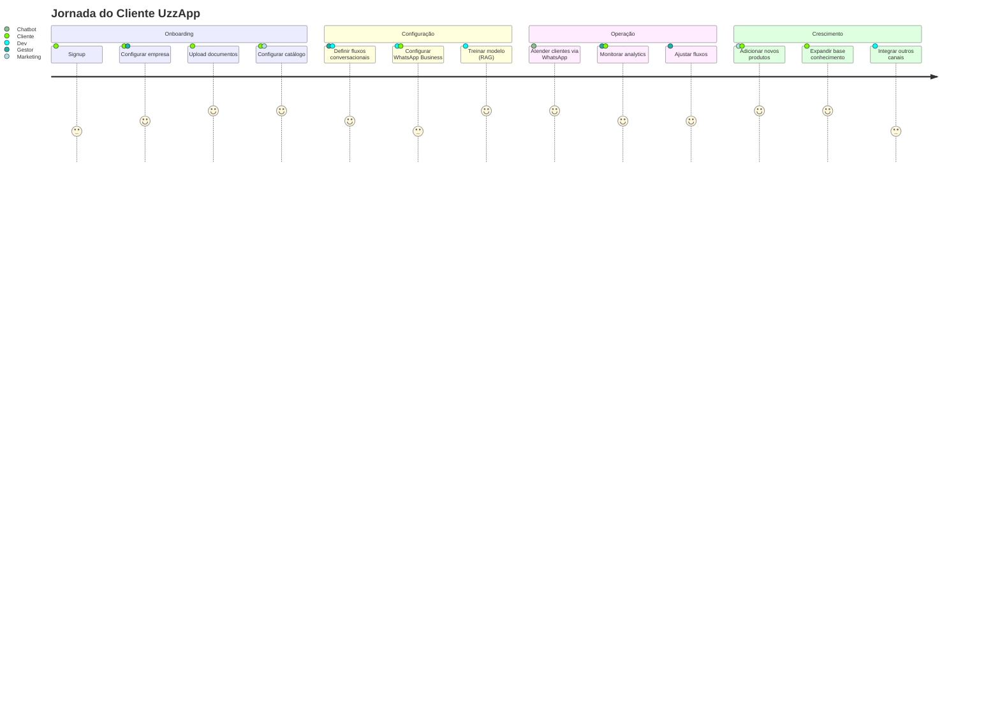
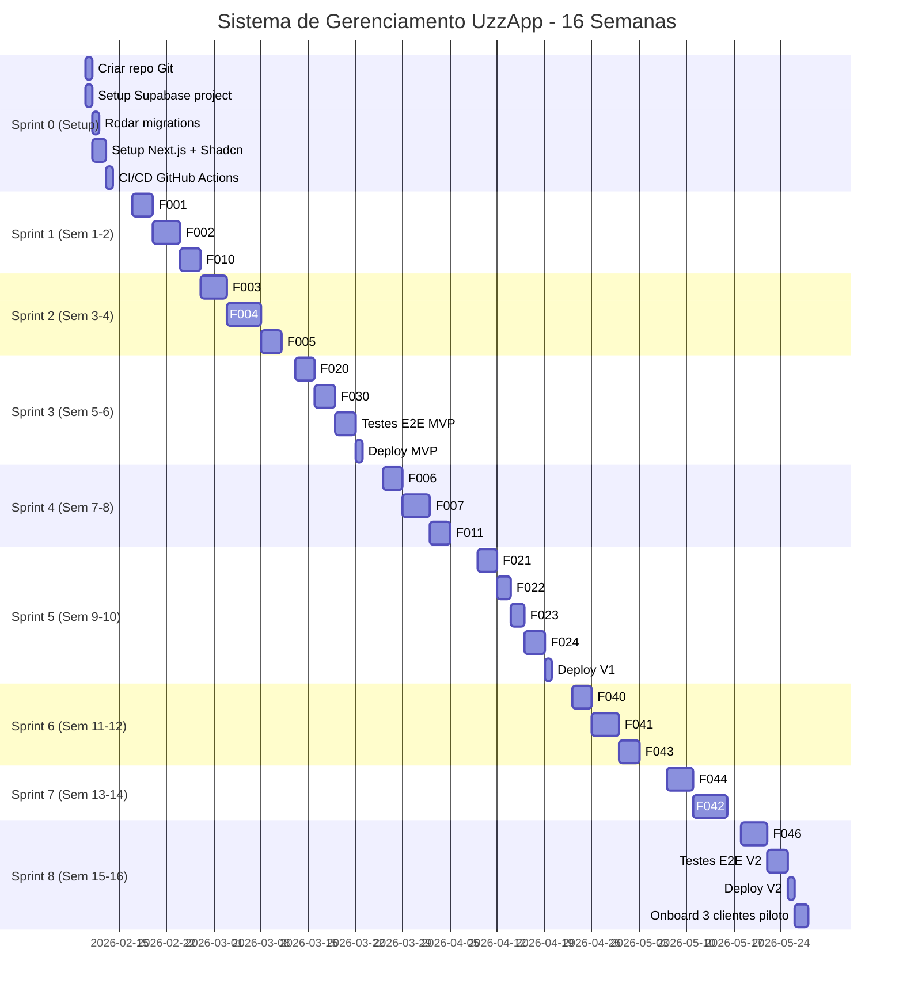
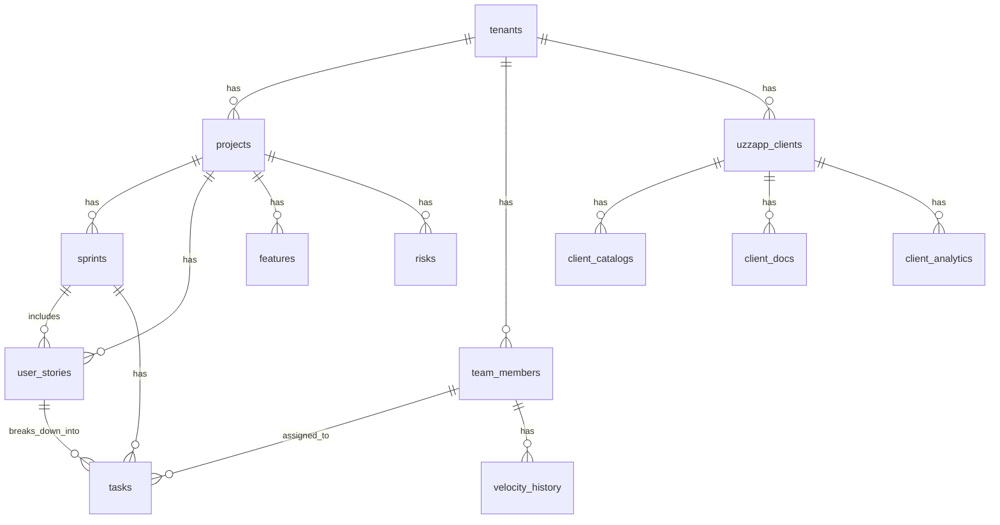

# PLANO DE EXECUÇÃO - SISTEMA DE GERENCIAMENTO UZZAPP

**Versão:** 1.0.0
**Data:** 2026-02-06
**Autor:** Pedro Vitor Pagliarin + Claude AI
**Status:** Definitivo - Pronto para Implementação

---

## 📋 ÍNDICE

1. [Contexto e Objetivos](#1-contexto-e-objetivos)
2. [Visão Geral do Produto UzzApp](#2-visão-geral-do-produto-uzzapp)
3. [Arquitetura do Sistema de Gerenciamento](#3-arquitetura-do-sistema-de-gerenciamento)
4. [Mapeamento Completo de Features](#4-mapeamento-completo-de-features)
5. [Versionamento e Roadmap](#5-versionamento-e-roadmap)
6. [Definition of Done por Feature](#6-definition-of-done-por-feature)
7. [Matriz RACI - Responsáveis por Área](#7-matriz-raci-responsáveis-por-área)
8. [Cronograma de Implementação (16 Semanas)](#8-cronograma-de-implementação-16-semanas)
9. [Stack Tecnológica](#9-stack-tecnológica)
10. [Database Schema](#10-database-schema)
11. [Priorização (MoSCoW)](#11-priorização-moscow)
12. [Riscos e Mitigações](#12-riscos-e-mitigações)
13. [Métricas de Sucesso](#13-métricas-de-sucesso)

---

## 1. CONTEXTO E OBJETIVOS

### 1.1 O que é o UzzApp?

**UzzApp** é um agente de WhatsApp inteligente baseado em IA que oferece:
- Atendimento automatizado 24/7
- RAG para busca em documentação
- Multi-tenant (múltiplas empresas)
- Integração com WhatsApp Business API
- Catálogo de produtos
- Fluxos conversacionais customizáveis

### 1.2 Por que precisamos de um Sistema de Gerenciamento?

**PROBLEMA ATUAL:**
- Desenvolvimento descoordenado
- Falta de visibilidade de progresso
- Dificuldade em priorizar features
- Ausência de tracking de bugs e melhorias
- Dificuldade em alocar recursos (dev, marketing, vendas)

**SOLUÇÃO:**
Criar um **Sistema de Gerenciamento de Projetos Interno** para o UzzApp que permita:
1. **Mapear todas as features** a serem implementadas
2. **Versionar releases** (MVP, V1, V2, V3...)
3. **Definir Definition of Done** claro para cada feature
4. **Atribuir responsáveis** por área (Dev, Gestor, Vendas, Marketing, Jurídico)
5. **Estabelecer prazos** realistas
6. **Priorizar** de forma objetiva (MoSCoW, GUT)
7. **Visualizar progresso** em dashboards (como nos mockups)

### 1.3 Objetivo deste Documento

**OBJETIVO PRINCIPAL:**
Criar um plano de execução completo, passo a passo, para construir o Sistema de Gerenciamento do UzzApp usando:
- **Node.js** (backend API)
- **Next.js** (frontend)
- **Supabase** (database PostgreSQL + Auth + Realtime)
- **Vercel** (deploy)
- **Tailwind + Shadcn/ui** (UI)

Sem agentes de IA internos no primeiro momento (foco em CRUD + dashboards funcionais).

---

## 2. VISÃO GERAL DO PRODUTO UZZAPP

### 2.1 Módulos Principais do UzzApp

```
┌─────────────────────────────────────────────────────────────────┐
│                         UZZAPP - MÓDULOS                         │
├─────────────────────────────────────────────────────────────────┤
│                                                                   │
│  🤖 CHATBOT ENGINE                                               │
│  • WhatsApp Business API Integration                            │
│  • Fluxos conversacionais (decision trees)                      │
│  • NLP básico (intent recognition)                              │
│  • Respostas rápidas / FAQs                                     │
│                                                                   │
│  📚 RAG SYSTEM                                                   │
│  • Ingestão de documentos (PDF, TXT, MD)                        │
│  • Chunking + Embeddings                                        │
│  • Vector search (Qdrant)                                       │
│  • Context retrieval                                            │
│                                                                   │
│  🏢 MULTI-TENANT                                                 │
│  • Isolamento de dados por cliente                              │
│  • Configurações personalizadas                                 │
│  • Billing por tenant                                           │
│                                                                   │
│  📦 CATÁLOGO DE PRODUTOS                                         │
│  • Produtos + Categorias                                        │
│  • Preços + Estoque                                             │
│  • Imagens + Descrições                                         │
│  • Ingestão via WhatsApp                                        │
│                                                                   │
│  📊 ANALYTICS                                                    │
│  • Conversas por dia/mês                                        │
│  • Taxa de resolução                                            │
│  • Satisfaction score (CSAT)                                    │
│  • Fallback rate (quando IA não resolve)                        │
│                                                                   │
│  👤 GESTÃO DE CLIENTES                                          │
│  • Onboarding de novos clientes                                 │
│  • Configuração de fluxos                                       │
│  • Upload de documentos (base de conhecimento)                  │
│  • Configuração de integrações                                  │
│                                                                   │
└─────────────────────────────────────────────────────────────────┘
```

### 2.2 Jornada do Usuário (Cliente do UzzApp)



### 2.3 Personas Internas (UzzAI) - Quem usa o Sistema de Gerenciamento?

| Persona                         | Papel             | Usa o Sistema para...                                 |
| ------------------------------- | ----------------- | ----------------------------------------------------- |
| **Pedro (Gestor/PO)**           | Product Owner     | Priorizar features, definir roadmap, validar entregas |
| **Luis (Dev Backend)**          | Tech Lead Backend | Implementar APIs, integrar WhatsApp, configurar infra |
| **Pedro (UX/UI)**               | Designer          | Criar interfaces do dashboard admin do UzzApp         |
| **Pedro e Luis (Dev Frontend)** | Frontend Dev      | Implementar dashboards, formulários, fluxos           |
| **Arthur (Marketing)**          | Marketing Manager | Revisar copy dos chatbots, criar campanhas            |
| **Vitor (Vendas)**              | Sales Manager     | Acompanhar pipeline de clientes, gerar propostas      |
| **Lucas (Jurídico)**            | Legal Advisor     | Revisar contratos, políticas de privacidade           |

---

## 3. ARQUITETURA DO SISTEMA DE GERENCIAMENTO

### 3.1 Diagrama de Arquitetura

```
┌─────────────────────────────────────────────────────────────────────────────┐
│           SISTEMA DE GERENCIAMENTO UZZAPP - ARQUITETURA                      │
├─────────────────────────────────────────────────────────────────────────────┤
│                                                                               │
│  ┌───────────────────────────────────────────────────────────────────────┐  │
│  │                         FRONTEND (Next.js 15)                          │  │
│  │  ┌─────────────────────────────────────────────────────────────────┐  │  │
│  │  │  Pages:                                                          │  │  │
│  │  │  • /dashboard (Overview com KPIs)                               │  │  │
│  │  │  • /backlog (User Stories + Kanban)                             │  │  │
│  │  │  • /sprints (Sprint Planning + Burndown)                        │  │  │
│  │  │  • /team (Gestão de Pessoas + Alocação)                         │  │  │
│  │  │  • /timeline (Roadmap Visual + Gantt)                           │  │  │
│  │  │  • /analytics (Dashboards + Charts)                             │  │  │
│  │  │  • /risks (Gestão de Riscos + GUT Matrix)                       │  │  │
│  │  │  • /clients (Clientes do UzzApp - multi-tenant)                 │  │  │
│  │  │  • /features (Feature Flags + Rollout)                          │  │  │
│  │  └─────────────────────────────────────────────────────────────────┘  │  │
│  │  ┌─────────────────────────────────────────────────────────────────┐  │  │
│  │  │  UI Components (Shadcn/ui):                                     │  │  │
│  │  │  • KanbanBoard (dnd-kit)                                        │  │  │
│  │  │  • BurndownChart (Recharts)                                     │  │  │
│  │  │  • GanttChart (React Gantt)                                     │  │  │
│  │  │  • UserStoryForm (React Hook Form + Zod)                        │  │  │
│  │  │  • PlanningPokerCard (GUT/BV/Work calculator)                   │  │  │
│  │  └─────────────────────────────────────────────────────────────────┘  │  │
│  └───────────────────────────────────────────────────────────────────────┘  │
│                                    ▼                                          │
│  ┌───────────────────────────────────────────────────────────────────────┐  │
│  │                    BACKEND API (Next.js API Routes)                    │  │
│  │  ┌─────────────────────────────────────────────────────────────────┐  │  │
│  │  │  Endpoints:                                                      │  │  │
│  │  │  • /api/projects (CRUD)                                         │  │  │
│  │  │  • /api/features (CRUD + versionamento)                         │  │  │
│  │  │  • /api/sprints (CRUD + planning)                               │  │  │
│  │  │  • /api/user-stories (CRUD + GUT scoring)                       │  │  │
│  │  │  • /api/tasks (CRUD + Kanban state)                             │  │  │
│  │  │  • /api/team (CRUD + alocação + velocity)                       │  │  │
│  │  │  • /api/analytics (KPIs + charts data)                          │  │  │
│  │  │  • /api/risks (CRUD + GUT matrix)                               │  │  │
│  │  │  • /api/clients (multi-tenant do UzzApp)                        │  │  │
│  │  └─────────────────────────────────────────────────────────────────┘  │  │
│  └───────────────────────────────────────────────────────────────────────┘  │
│                                    ▼                                          │
│  ┌───────────────────────────────────────────────────────────────────────┐  │
│  │                      DATABASE (Supabase PostgreSQL)                    │  │
│  │  ┌─────────────────────────────────────────────────────────────────┐  │  │
│  │  │  Tables:                                                         │  │  │
│  │  │  • projects                                                      │  │  │
│  │  │  • features (com version, status, DoD)                          │  │  │
│  │  │  • sprints                                                       │  │  │
│  │  │  • user_stories (com GUT, BV/Work)                              │  │  │
│  │  │  • tasks (Kanban: todo, in-progress, review, done)              │  │  │
│  │  │  • team_members (com velocity, alocação)                        │  │  │
│  │  │  • risks (com GUT score, mitigation)                            │  │  │
│  │  │  • uzzapp_clients (clientes do produto UzzApp)                  │  │  │
│  │  │  • feature_flags (A/B testing, gradual rollout)                 │  │  │
│  │  └─────────────────────────────────────────────────────────────────┘  │  │
│  └───────────────────────────────────────────────────────────────────────┘  │
│                                                                               │
│  ┌───────────────────────────────────────────────────────────────────────┐  │
│  │                         EXTERNAL INTEGRATIONS                          │  │
│  │  • Supabase Auth (login/signup)                                       │  │
│  │  • Supabase Realtime (live updates no Kanban)                         │  │
│  │  • Vercel Deploy                                                      │  │
│  │  • GitHub Actions (CI/CD)                                             │  │
│  │  • Resend (notificações email)                                        │  │
│  └───────────────────────────────────────────────────────────────────────┘  │
│                                                                               │
└─────────────────────────────────────────────────────────────────────────────┘
```

### 3.2 Fluxo de Dados

```
┌──────────────┐
│   USUÁRIO    │ (Pedro, Luis, Maria...)
└──────┬───────┘
       │
       ▼ (Acessa dashboard)
┌──────────────────────┐
│  FRONTEND (Next.js)  │
└──────┬───────────────┘
       │
       ▼ (Busca dados via API)
┌──────────────────────────────┐
│  API ROUTES (Next.js)        │
│  • getTenantContext()        │
│  • Validação (Zod)           │
│  • Supabase Client           │
└──────┬───────────────────────┘
       │
       ▼ (Query/Mutation)
┌──────────────────────────┐
│  SUPABASE (PostgreSQL)   │
│  • Row Level Security    │
│  • Triggers              │
│  • Realtime subscript.   │
└──────┬───────────────────┘
       │
       ▼ (Retorna dados)
┌──────────────────────┐
│  FRONTEND            │
│  • Atualiza UI       │
│  • Charts/Graphs     │
│  • Kanban Board      │
└──────────────────────┘
```

---

## 4. MAPEAMENTO COMPLETO DE FEATURES

### 4.1 Categorização de Features

Baseado nos mockups e no contexto do UzzApp, mapeei as features em **6 categorias**:

#### **CATEGORIA 1: GESTÃO DE PROJETOS** 🗂️
| ID | Feature | Descrição |
|----|---------|-----------|
| F001 | Dashboard Overview | KPIs principais: status, progresso, tasks totais, equipe |
| F002 | Backlog Management | Lista de User Stories com GUT, BV/W, status |
| F003 | User Story Editor | Formulário completo: Como/Eu quero/Para que + Critérios aceitação |
| F004 | Kanban Board | Drag & Drop: Todo, In Progress, In Review, Done |
| F005 | Sprint Planning | Criar sprints, definir goal, capacity, duration |
| F006 | Sprint Backlog | Adicionar stories ao sprint, calcular velocity |
| F007 | Timeline/Roadmap | Visualização temporal de milestones + releases |

#### **CATEGORIA 2: GESTÃO DE EQUIPE** 👥
| ID | Feature | Descrição |
|----|---------|-----------|
| F010 | Team Directory | Lista de membros com foto, role, alocação |
| F011 | Velocity Tracking | Pts por semana/sprint por membro |
| F012 | Capacity Planning | % alocação por projeto |
| F013 | Skills Matrix | Habilidades por membro (frontend, backend, UX, etc) |

#### **CATEGORIA 3: ANALYTICS & REPORTS** 📊
| ID | Feature | Descrição |
|----|---------|-----------|
| F020 | Burndown Chart | Progresso do sprint vs ideal |
| F021 | Velocity Chart | Histórico de velocidade por sprint |
| F022 | Lead Time | Tempo médio desde criação até done |
| F023 | Cycle Time | Tempo médio desde in-progress até done |
| F024 | Project Health Score | Score agregado (velocity, budget, deadlines) |
| F025 | Custom Reports | Exportar dados em CSV/PDF |

#### **CATEGORIA 4: GESTÃO DE RISCOS** ⚠️
| ID | Feature | Descrição |
|----|---------|-----------|
| F030 | Risk Register | Lista de riscos com GUT matrix |
| F031 | GUT Calculator | Gravidade x Urgência x Tendência = Score |
| F032 | Mitigation Plans | Planos de mitigação por risco |
| F033 | Risk Dashboard | Heatmap de riscos priorizados |

#### **CATEGORIA 5: CONFIGURAÇÃO UZZAPP** 🤖
| ID | Feature | Descrição |
|----|---------|-----------|
| F040 | Clients Directory | Lista de clientes do UzzApp (multi-tenant) |
| F041 | Client Onboarding | Wizard de configuração inicial |
| F042 | Conversation Flows Editor | Criar/editar fluxos conversacionais |
| F043 | Catalog Manager | CRUD de produtos do cliente |
| F044 | Knowledge Base Uploader | Upload de docs para RAG |
| F045 | WhatsApp Integration | Conectar WhatsApp Business API |
| F046 | Analytics per Client | Métricas de uso por cliente |

#### **CATEGORIA 6: FEATURE FLAGS & VERSIONING** 🚀
| ID | Feature | Descrição |
|----|---------|-----------|
| F050 | Feature Flags Management | Ligar/desligar features por cliente |
| F051 | Gradual Rollout | Release progressivo (10% → 50% → 100%) |
| F052 | A/B Testing | Testar variações de fluxos |
| F053 | Version Tracking | Histórico de releases (MVP, V1, V2...) |

### 4.2 User Stories Template (Baseado no Mockup)

```markdown
**ID:** US-001
**Título:** Implementar Burndown Chart interativo

**Como** Product Owner (Pedro)
**Eu quero** visualizar o burndown chart do sprint em tempo real
**Para que** eu possa acompanhar se estamos on-track para cumprir o sprint goal

**Critérios de Aceitação:**
- [ ] Chart deve mostrar linha ideal vs linha real
- [ ] Deve atualizar em tempo real quando task muda status
- [ ] Deve usar SVG responsivo
- [ ] Tooltip deve mostrar detalhes ao passar mouse

**Notas Técnicas / Dependências:**
- Depende de #122 (API de métricas)
- Usar biblioteca D3.js ou Recharts
- Tooltip deve mostrar: data, pts restantes, pts ideais

**Prioridade:** P0 - Crítico
**Status:** Backlog
**Sprint:** Sprint-2025-W02

**Matriz GUT:**
- Gravidade (G): 5
- Urgência (U): 5
- Tendência (T): 5
**Score GUT:** 125

**Planning Poker:**
- Business Value (BV): 8
- Work (W): 3
**BV/W Ratio:** 2.67
```

---

## 5. VERSIONAMENTO E ROADMAP

### 5.1 Estrutura de Versões

```
MVP (v0.1) → V1 (v1.0) → V2 (v2.0) → V3 (v3.0) → V4 (v4.0)
  ↓            ↓            ↓            ↓            ↓
CORE        ADVANCED    INTEGRATIONS  AUTOMATION   ENTERPRISE
FEATURES    FEATURES    & CLIENTS     & AI         FEATURES
```

### 5.2 Roadmap Detalhado

#### **MVP (v0.1) - 6 SEMANAS** 🎯
**Objetivo:** Sistema funcional para gerenciar desenvolvimento do UzzApp internamente.

**Features incluídas:**
- ✅ F001: Dashboard Overview
- ✅ F002: Backlog Management
- ✅ F003: User Story Editor (formulário básico)
- ✅ F004: Kanban Board (drag & drop)
- ✅ F005: Sprint Planning (criar sprints)
- ✅ F010: Team Directory
- ✅ F020: Burndown Chart (básico)
- ✅ F030: Risk Register

**Exclusões do MVP:**
- ❌ Analytics avançado
- ❌ Gestão de clientes UzzApp
- ❌ Feature flags
- ❌ Integração WhatsApp

**Definition of Done do MVP:**
- [x] Deploy em produção (Vercel)
- [x] 3 usuários conseguem usar (Pedro, Luis, Maria)
- [x] Criar 1 projeto real (UzzApp)
- [x] Criar 1 sprint
- [x] Adicionar 10 user stories
- [x] Mover 3 stories pelo Kanban
- [x] Ver burndown atualizado

---

#### **V1 (v1.0) - +4 SEMANAS** 📈
**Objetivo:** Analytics completo + gestão de equipe avançada.

**Features adicionadas:**
- ✅ F006: Sprint Backlog (arrastar stories pro sprint)
- ✅ F007: Timeline/Roadmap
- ✅ F011: Velocity Tracking
- ✅ F012: Capacity Planning
- ✅ F021: Velocity Chart
- ✅ F022: Lead Time
- ✅ F023: Cycle Time
- ✅ F024: Project Health Score
- ✅ F031: GUT Calculator
- ✅ F032: Mitigation Plans

**Definition of Done V1:**
- [x] Velocity calculada automaticamente
- [x] Charts atualizam em tempo real
- [x] Timeline mostra 3 meses à frente
- [x] Health Score acima de 80

---

#### **V2 (v2.0) - +6 SEMANAS** 🤖
**Objetivo:** Gestão de clientes UzzApp + configurações multi-tenant.

**Features adicionadas:**
- ✅ F040: Clients Directory
- ✅ F041: Client Onboarding
- ✅ F042: Conversation Flows Editor (básico)
- ✅ F043: Catalog Manager
- ✅ F044: Knowledge Base Uploader
- ✅ F046: Analytics per Client

**Definition of Done V2:**
- [x] Onboarding de 3 clientes piloto do UzzApp
- [x] Upload de docs funcionando
- [x] Catálogo com 50 produtos
- [x] Analytics por cliente

---

#### **V3 (v3.0) - +4 SEMANAS** 🔌
**Objetivo:** Integrações reais (WhatsApp, pagamentos).

**Features adicionadas:**
- ✅ F045: WhatsApp Integration
- ✅ F050: Feature Flags Management
- ✅ F051: Gradual Rollout
- ✅ F013: Skills Matrix

**Definition of Done V3:**
- [x] WhatsApp Business API conectada
- [x] 1 cliente com chatbot ativo
- [x] Feature flag testada com rollout 10% → 100%

---

#### **V4 (v4.0) - +6 SEMANAS** 🚀
**Objetivo:** Automação + IA + Enterprise features.

**Features adicionadas:**
- ✅ F025: Custom Reports (CSV/PDF export)
- ✅ F033: Risk Dashboard (heatmap)
- ✅ F052: A/B Testing
- ✅ F053: Version Tracking
- ✅ Automação: Auto-assign tasks based on skills
- ✅ IA: Suggest story points (ML model)
- ✅ IA: Predict sprint velocity

**Definition of Done V4:**
- [x] 10 clientes ativos
- [x] Reports exportados
- [x] A/B test rodando em 2 clientes
- [x] Modelo de ML predizendo velocity com 80% acurácia

---

## 6. DEFINITION OF DONE POR FEATURE

### Template de DoD

Para cada feature, definir:
1. **Funcional:** Feature funciona conforme especificado
2. **Testes:** Testes unitários + E2E passando
3. **Code Review:** Aprovado por 1+ dev
4. **Documentação:** README atualizado
5. **Deploy:** Em produção (Vercel)
6. **User Acceptance:** Validado por Pedro (PO)

### Exemplos Específicos

#### **F001: Dashboard Overview**

**Definition of Done:**
- [x] Mostra 4 KPIs: Status, Progresso %, Tasks Total, Team Size
- [x] Progresso calcula automaticamente baseado em tasks done / tasks total
- [x] Seção "Tempo de Execução" mostra previsto vs realizado com barra visual
- [x] Seção "Orçamento do Projeto" mostra planejado vs gasto com alerta se > 77%
- [x] Análise automática: "Projeto está 10% abaixo do tempo previsto. Excelente performance!"
- [x] Análise automática: "Projeto com 85% de progresso mas já gastou 77% do budget. Monitorar custos."
- [x] Testes E2E: Cypress testa loading do dashboard
- [x] Responsivo (mobile, tablet, desktop)
- [x] Deploy em Vercel
- [x] Pedro validou e aprovou

---

#### **F004: Kanban Board**

**Definition of Done:**
- [x] 4 colunas: Todo, In Progress, In Review, Done
- [x] Drag & Drop funciona (dnd-kit)
- [x] Ao soltar task em nova coluna, status atualiza no DB
- [x] Realtime: quando outro usuário move task, atualiza automaticamente
- [x] Cada card mostra: ID, título, assignee (avatar), priority badge, points
- [x] Ao clicar no card, abre modal com detalhes completos
- [x] Filtros: por sprint, por assignee, por priority
- [x] Ordenação: manual (kanban_order no DB)
- [x] Testes unitários: mover task entre colunas
- [x] Testes E2E: arrastar 3 tasks pelo Kanban
- [x] Code review feito por Luis
- [x] Deploy em Vercel
- [x] Maria (UX) validou fluidez da animação

---

#### **F020: Burndown Chart**

**Definition of Done:**
- [x] Gráfico de linha com 2 séries: Ideal Line vs Actual Line
- [x] Eixo X: dias do sprint
- [x] Eixo Y: story points restantes
- [x] Linha ideal calculada: total_points / sprint_days (slope constante)
- [x] Linha real atualiza quando task muda para "done"
- [x] Tooltip ao hover: data, pts restantes, pts ideais, diferença
- [x] Indicador visual: se acima da linha ideal (vermelho), se abaixo (verde)
- [x] Usa Recharts (biblioteca leve)
- [x] Responsivo
- [x] Testes unitários: cálculo de linha ideal
- [x] Testes E2E: mover task para done e ver burndown atualizar
- [x] Deploy em Vercel
- [x] Pedro validou que burndown reflete progresso real

---

## 7. MATRIZ RACI - RESPONSÁVEIS POR ÁREA

**RACI:**
- **R**esponsible (Responsável pela execução)
- **A**ccountable (Aprovador final / dono da decisão)
- **C**onsulted (Consultado / dá input)
- **I**nformed (Informado / recebe updates)

### 7.1 Matriz por Feature

| Feature ID | Feature Name | Dev (Luis/Vitor) | Gestor (Pedro) | UX (Maria) | Marketing (Brando) | Vendas (Bob) | Jurídico (Boff) |
|------------|--------------|------------------|----------------|------------|-------------------|--------------|-----------------|
| F001 | Dashboard Overview | **R** | **A**, C | C | I | I | I |
| F002 | Backlog Management | **R** | **A**, C | C | I | I | I |
| F003 | User Story Editor | **R** | **A**, C | **R**, C | I | I | I |
| F004 | Kanban Board | **R** | C | **A**, **R** | I | I | I |
| F005 | Sprint Planning | **R** | **A**, C | C | I | I | I |
| F010 | Team Directory | **R** | **A** | C | I | I | I |
| F020 | Burndown Chart | **R** | **A**, C | C | I | I | I |
| F030 | Risk Register | **R** | **A**, C | I | I | I | I |
| F040 | Clients Directory | **R** | **A** | C | I | **R**, C | I |
| F041 | Client Onboarding | **R** | C | **R**, C | C | **A**, **R** | C |
| F042 | Conversation Flows | **R** | C | **A**, **R** | **R**, C | C | I |
| F043 | Catalog Manager | **R** | C | C | **A**, **R** | C | I |
| F044 | Knowledge Base | **R** | C | C | C | I | **A**, C |
| F045 | WhatsApp Integration | **A**, **R** | C | I | I | C | C |
| F050 | Feature Flags | **A**, **R** | C | I | I | I | I |

### 7.2 Exemplo de Aplicação

**Feature:** F041 - Client Onboarding

**Fluxo RACI:**
1. **Bob (Vendas) - Accountable & Responsible:**
   - Cria wizard de onboarding
   - Define campos obrigatórios
   - Testa fluxo com cliente piloto

2. **Maria (UX) - Responsible & Consulted:**
   - Desenha fluxo visual (Figma)
   - Define steps do wizard
   - Valida com Bob se faz sentido

3. **Luis/Vitor (Dev) - Responsible:**
   - Implementa wizard no Next.js
   - Cria API endpoints `/api/clients/onboard`
   - Integra com Supabase

4. **Pedro (Gestor) - Consulted:**
   - Valida se wizard está alinhado com estratégia
   - Aprova release

5. **Brando (Marketing) - Consulted:**
   - Revisa copy do wizard
   - Sugere melhorias em mensagens

6. **Boff (Jurídico) - Consulted:**
   - Valida termos de uso
   - Aprova checkbox de LGPD

---

## 8. CRONOGRAMA DE IMPLEMENTAÇÃO (16 SEMANAS)

### 8.1 Visão Geral

```
┌────────────────────────────────────────────────────────────────┐
│                    CRONOGRAMA - 16 SEMANAS                      │
├────────────────────────────────────────────────────────────────┤
│                                                                  │
│  SPRINT 0 (Semana 0):   Setup & Infra                          │
│  SPRINT 1-3 (Sem 1-6):  MVP (v0.1)                             │
│  SPRINT 4-5 (Sem 7-10): V1 (v1.0) - Analytics                  │
│  SPRINT 6-8 (Sem 11-16): V2 (v2.0) - Clientes UzzApp           │
│                                                                  │
│  [V3 e V4 são pós-16 semanas, planejamento futuro]             │
│                                                                  │
└────────────────────────────────────────────────────────────────┘
```

### 8.2 Gantt Chart



### 8.3 Detalhamento por Sprint

---

#### **SPRINT 0: SETUP & INFRA** (1 semana)
**Data:** 10-14 Fev 2026
**Goal:** Infraestrutura pronta para desenvolvimento

**Tasks:**
1. Criar repositório Git (monorepo ou multi-repo?)
2. Setup Supabase project (database + auth)
3. Rodar migrations (criar todas as tabelas)
4. Setup Next.js 15 com TypeScript
5. Instalar Shadcn/ui + Tailwind
6. Configurar CI/CD (GitHub Actions)
7. Deploy "Hello World" na Vercel

**Responsáveis:** Luis (Backend), Vitor (Frontend)
**Critério de sucesso:** Deploy funcionando em https://uzzapp-mgmt.vercel.app

---

#### **SPRINT 1: FUNDAMENTOS** (Semanas 1-2)
**Data:** 17 Fev - 28 Fev 2026
**Goal:** Dashboard + Backlog + Team funcionando

**Features:**
- F001: Dashboard Overview (3 dias)
- F002: Backlog Management (4 dias)
- F010: Team Directory (3 dias)

**Milestones:**
- Dia 3: Dashboard renderizando KPIs mockados
- Dia 7: Backlog listando user stories do DB
- Dia 10: Team directory com 3 membros

**Responsáveis:**
- Luis: APIs (`/api/projects`, `/api/user-stories`, `/api/team`)
- Vitor: Componentes (Dashboard, Backlog Table, Team Cards)
- Maria: Revisar UX

---

#### **SPRINT 2: KANBAN & PLANNING** (Semanas 3-4)
**Data:** 1 Mar - 14 Mar 2026
**Goal:** Kanban drag & drop + Sprint Planning

**Features:**
- F003: User Story Editor (4 dias)
- F004: Kanban Board (5 dias)
- F005: Sprint Planning (3 dias)

**Milestones:**
- Dia 4: Formulário de User Story completo
- Dia 9: Kanban com drag & drop funcionando
- Dia 12: Criar sprint e adicionar stories

**Responsáveis:**
- Luis: `/api/user-stories` (CRUD), `/api/sprints`
- Vitor: KanbanBoard component (dnd-kit), Sprint form
- Maria: Validar fluidez do drag & drop

---

#### **SPRINT 3: CHARTS & MVP FINAL** (Semanas 5-6)
**Data:** 15 Mar - 28 Mar 2026
**Goal:** Burndown + Risks + Deploy MVP

**Features:**
- F020: Burndown Chart (3 dias)
- F030: Risk Register (3 dias)
- Testes E2E completos (3 dias)
- Deploy MVP (1 dia)

**Milestones:**
- Dia 3: Burndown chart mostrando linha ideal vs real
- Dia 6: Risk register com GUT scoring
- Dia 9: E2E tests (Playwright) passando
- Dia 10: MVP em produção

**Responsáveis:**
- Luis: `/api/analytics/burndown`, `/api/risks`
- Vitor: BurndownChart (Recharts), Risk form
- Todos: Testar MVP

**Critério de sucesso do MVP:**
✅ Pedro, Luis e Maria conseguem usar o sistema
✅ 1 projeto criado (UzzApp)
✅ 1 sprint ativo
✅ 10 user stories no backlog
✅ 3 stories movidas pelo Kanban
✅ Burndown atualizando em tempo real

---

#### **SPRINT 4: ANALYTICS AVANÇADO** (Semanas 7-8)
**Data:** 29 Mar - 11 Abr 2026
**Goal:** Velocity + Timeline

**Features:**
- F006: Sprint Backlog (3 dias)
- F007: Timeline/Roadmap (4 dias)
- F011: Velocity Tracking (3 dias)

---

#### **SPRINT 5: HEALTH SCORE** (Semanas 9-10)
**Data:** 12 Abr - 25 Abr 2026
**Goal:** Todos os charts + Health Score

**Features:**
- F021: Velocity Chart (3 dias)
- F022: Lead Time (2 dias)
- F023: Cycle Time (2 dias)
- F024: Project Health Score (3 dias)
- Deploy V1 (1 dia)

---

#### **SPRINT 6: CLIENTES UZZAPP** (Semanas 11-12)
**Data:** 26 Abr - 9 Mai 2026
**Goal:** Multi-tenant básico

**Features:**
- F040: Clients Directory (3 dias)
- F041: Client Onboarding (4 dias)
- F043: Catalog Manager (3 dias)

---

#### **SPRINT 7: CONFIGURAÇÕES** (Semanas 13-14)
**Data:** 10 Mai - 23 Mai 2026
**Goal:** Upload docs + Fluxos conversacionais

**Features:**
- F044: Knowledge Base Uploader (4 dias)
- F042: Conversation Flows Editor (5 dias)

---

#### **SPRINT 8: ANALYTICS CLIENTES & V2 FINAL** (Semanas 15-16)
**Data:** 24 Mai - 6 Jun 2026
**Goal:** Deploy V2 + Onboard 3 clientes

**Features:**
- F046: Analytics per Client (4 dias)
- Testes E2E V2 (3 dias)
- Deploy V2 (1 dia)
- Onboarding 3 clientes piloto (2 dias)

**Critério de sucesso do V2:**
✅ 3 clientes do UzzApp onboardados
✅ Upload de 100 docs funcionando
✅ Catálogo com 150 produtos
✅ Analytics mostrando dados por cliente

---

## 9. STACK TECNOLÓGICA

### 9.1 Frontend

| Tecnologia | Versão | Uso |
|------------|--------|-----|
| **Next.js** | 15.1.2 | Framework principal, App Router, SSR |
| **React** | 19.0.0 | UI library |
| **TypeScript** | 5.x | Type safety |
| **Tailwind CSS** | 3.4.17 | Styling |
| **Shadcn/ui** | Latest | Component library (Button, Form, Dialog, etc) |
| **dnd-kit** | 6.1.0 | Drag & Drop (Kanban) |
| **Recharts** | 2.15.0 | Charts (Burndown, Velocity, etc) |
| **React Hook Form** | 7.54.1 | Form management |
| **Zod** | 3.24.1 | Schema validation |
| **date-fns** | 4.1.0 | Date utilities |
| **@tanstack/react-query** | 5.60.5 | Server state, cache |
| **Zustand** | 5.0.2 | Client state (UI state) |

### 9.2 Backend

| Tecnologia | Versão | Uso |
|------------|--------|-----|
| **Next.js API Routes** | 15.1.2 | REST API |
| **Supabase** | 2.48.1 | PostgreSQL + Auth + Realtime |
| **Zod** | 3.24.1 | Request/response validation |

### 9.3 Database (Supabase PostgreSQL)

| Recurso | Uso |
|---------|-----|
| **Row Level Security (RLS)** | Isolamento de dados por tenant |
| **Realtime** | Live updates no Kanban |
| **Auth** | Login/signup/JWT tokens |
| **Triggers** | Auto-update de campos (updated_at, etc) |
| **Full-Text Search** | Busca em user stories |

### 9.4 DevOps

| Ferramenta | Uso |
|------------|-----|
| **Vercel** | Deploy frontend + API routes |
| **GitHub Actions** | CI/CD (lint, test, build, deploy) |
| **pnpm** | Package manager (mais rápido que npm) |
| **Playwright** | E2E testing |
| **Jest** | Unit testing |
| **ESLint** | Linting |
| **Prettier** | Code formatting |

---

## 10. DATABASE SCHEMA

### 10.1 Entity Relationship Diagram



### 10.2 Tabelas Core

#### **tenants** (Multi-tenant do sistema de gerenciamento)
```sql
CREATE TABLE tenants (
  id UUID PRIMARY KEY DEFAULT gen_random_uuid(),
  slug TEXT UNIQUE NOT NULL, -- uzzai
  name TEXT NOT NULL, -- UzzAI
  created_at TIMESTAMPTZ DEFAULT now()
);
```

#### **projects** (Projeto = UzzApp)
```sql
CREATE TABLE projects (
  id UUID PRIMARY KEY DEFAULT gen_random_uuid(),
  tenant_id UUID REFERENCES tenants(id) ON DELETE CASCADE,
  code TEXT UNIQUE NOT NULL, -- UZZAPP
  name TEXT NOT NULL, -- UzzApp
  description TEXT,
  status TEXT DEFAULT 'active', -- active, on-hold, completed
  progress INTEGER DEFAULT 0 CHECK (progress >= 0 AND progress <= 100),
  budget DECIMAL(15, 2),
  budget_spent DECIMAL(15, 2) DEFAULT 0,
  start_date DATE,
  end_date DATE,
  created_at TIMESTAMPTZ DEFAULT now(),
  updated_at TIMESTAMPTZ DEFAULT now()
);
```

#### **features** (Features do UzzApp com versionamento)
```sql
CREATE TABLE features (
  id UUID PRIMARY KEY DEFAULT gen_random_uuid(),
  tenant_id UUID REFERENCES tenants(id) ON DELETE CASCADE,
  project_id UUID REFERENCES projects(id) ON DELETE CASCADE,

  code TEXT UNIQUE NOT NULL, -- F001, F002, etc
  name TEXT NOT NULL, -- Dashboard Overview
  description TEXT,
  category TEXT NOT NULL, -- gestao-projetos, gestao-equipe, analytics, etc

  version TEXT DEFAULT 'MVP', -- MVP, V1, V2, V3, V4
  status TEXT DEFAULT 'backlog', -- backlog, in-progress, done, cancelled
  priority TEXT DEFAULT 'P2', -- P0, P1, P2, P3

  -- DoD tracking
  dod_functional BOOLEAN DEFAULT false,
  dod_tests BOOLEAN DEFAULT false,
  dod_code_review BOOLEAN DEFAULT false,
  dod_documentation BOOLEAN DEFAULT false,
  dod_deployed BOOLEAN DEFAULT false,
  dod_user_acceptance BOOLEAN DEFAULT false,

  -- RACI
  responsible TEXT[], -- ["luis", "vitor"]
  accountable TEXT, -- pedro
  consulted TEXT[], -- ["maria"]
  informed TEXT[], -- ["brando", "bob"]

  created_at TIMESTAMPTZ DEFAULT now(),
  updated_at TIMESTAMPTZ DEFAULT now()
);
```

#### **sprints**
```sql
CREATE TABLE sprints (
  id UUID PRIMARY KEY DEFAULT gen_random_uuid(),
  tenant_id UUID REFERENCES tenants(id) ON DELETE CASCADE,
  project_id UUID REFERENCES projects(id) ON DELETE CASCADE,

  code TEXT UNIQUE NOT NULL, -- Sprint-2025-W49
  name TEXT NOT NULL,
  goal TEXT,

  start_date DATE NOT NULL,
  end_date DATE NOT NULL,

  status TEXT DEFAULT 'planned', -- planned, active, completed

  capacity_total INTEGER, -- Total story points capacity
  velocity_target INTEGER, -- Velocity esperada
  velocity_actual INTEGER, -- Velocity real (calculada ao final)

  created_at TIMESTAMPTZ DEFAULT now(),
  updated_at TIMESTAMPTZ DEFAULT now()
);
```

#### **user_stories**
```sql
CREATE TABLE user_stories (
  id UUID PRIMARY KEY DEFAULT gen_random_uuid(),
  tenant_id UUID REFERENCES tenants(id) ON DELETE CASCADE,
  project_id UUID REFERENCES projects(id) ON DELETE CASCADE,
  sprint_id UUID REFERENCES sprints(id) ON DELETE SET NULL,
  feature_id UUID REFERENCES features(id) ON DELETE SET NULL,

  public_id TEXT UNIQUE NOT NULL, -- US-001
  title TEXT NOT NULL,

  -- User Story format
  as_a TEXT, -- "Product Owner"
  i_want TEXT, -- "visualizar burndown chart"
  so_that TEXT, -- "acompanhar progresso do sprint"

  acceptance_criteria TEXT[], -- Array de critérios
  technical_notes TEXT,

  status TEXT DEFAULT 'backlog', -- backlog, todo, in-progress, in-review, done
  priority TEXT DEFAULT 'P2',

  -- Planning Poker
  story_points INTEGER,
  gut_g INTEGER CHECK (gut_g >= 1 AND gut_g <= 5), -- Gravidade
  gut_u INTEGER CHECK (gut_u >= 1 AND gut_u <= 5), -- Urgência
  gut_t INTEGER CHECK (gut_t >= 1 AND gut_t <= 5), -- Tendência
  gut_score INTEGER GENERATED ALWAYS AS (gut_g * gut_u * gut_t) STORED,

  bv INTEGER CHECK (bv >= 1 AND bv <= 10), -- Business Value
  work INTEGER CHECK (work >= 1 AND work <= 10), -- Work effort
  bv_work_ratio DECIMAL(5, 2) GENERATED ALWAYS AS (
    CASE WHEN work > 0 THEN CAST(bv AS DECIMAL) / work ELSE 0 END
  ) STORED,

  created_at TIMESTAMPTZ DEFAULT now(),
  updated_at TIMESTAMPTZ DEFAULT now()
);
```

#### **tasks** (Subtasks de User Stories - Kanban)
```sql
CREATE TABLE tasks (
  id UUID PRIMARY KEY DEFAULT gen_random_uuid(),
  tenant_id UUID REFERENCES tenants(id) ON DELETE CASCADE,
  project_id UUID REFERENCES projects(id) ON DELETE CASCADE,
  sprint_id UUID REFERENCES sprints(id) ON DELETE SET NULL,
  user_story_id UUID REFERENCES user_stories(id) ON DELETE CASCADE,
  assigned_to UUID REFERENCES team_members(id) ON DELETE SET NULL,

  public_id TEXT UNIQUE NOT NULL, -- TSK-001
  title TEXT NOT NULL,
  description TEXT,

  status TEXT DEFAULT 'todo', -- todo, in-progress, in-review, done
  kanban_column TEXT DEFAULT 'todo',
  kanban_order INTEGER DEFAULT 0,

  started_at TIMESTAMPTZ, -- Quando mudou para in-progress
  completed_at TIMESTAMPTZ, -- Quando mudou para done

  created_at TIMESTAMPTZ DEFAULT now(),
  updated_at TIMESTAMPTZ DEFAULT now()
);
```

#### **team_members**
```sql
CREATE TABLE team_members (
  id UUID PRIMARY KEY DEFAULT gen_random_uuid(),
  tenant_id UUID REFERENCES tenants(id) ON DELETE CASCADE,

  name TEXT NOT NULL, -- Pedro Vitor
  email TEXT UNIQUE NOT NULL,
  avatar_url TEXT,

  role TEXT NOT NULL, -- Senior Full-Stack Developer
  department TEXT, -- Dev, UX, Marketing, Sales, Legal

  -- Capacity
  allocation_percent INTEGER DEFAULT 100 CHECK (allocation_percent >= 0 AND allocation_percent <= 100),
  velocity_avg INTEGER, -- Velocity média (calculada)

  is_active BOOLEAN DEFAULT true,

  created_at TIMESTAMPTZ DEFAULT now(),
  updated_at TIMESTAMPTZ DEFAULT now()
);
```

#### **velocity_history** (Histórico de velocity por sprint por pessoa)
```sql
CREATE TABLE velocity_history (
  id UUID PRIMARY KEY DEFAULT gen_random_uuid(),
  team_member_id UUID REFERENCES team_members(id) ON DELETE CASCADE,
  sprint_id UUID REFERENCES sprints(id) ON DELETE CASCADE,

  velocity_points INTEGER NOT NULL, -- Quantos pts a pessoa completou

  created_at TIMESTAMPTZ DEFAULT now(),
  UNIQUE(team_member_id, sprint_id)
);
```

#### **risks**
```sql
CREATE TABLE risks (
  id UUID PRIMARY KEY DEFAULT gen_random_uuid(),
  tenant_id UUID REFERENCES tenants(id) ON DELETE CASCADE,
  project_id UUID REFERENCES projects(id) ON DELETE CASCADE,

  public_id TEXT UNIQUE NOT NULL, -- R-CHATBOT-001
  title TEXT NOT NULL,
  description TEXT,

  -- GUT Matrix
  gut_g INTEGER CHECK (gut_g >= 1 AND gut_g <= 5),
  gut_u INTEGER CHECK (gut_u >= 1 AND gut_u <= 5),
  gut_t INTEGER CHECK (gut_t >= 1 AND gut_t <= 5),
  gut_score INTEGER GENERATED ALWAYS AS (gut_g * gut_u * gut_t) STORED,
  severity_label TEXT, -- Alta, Média, Baixa

  status TEXT DEFAULT 'identified', -- identified, mitigating, mitigated

  mitigation_plan TEXT,
  owner_id UUID REFERENCES team_members(id),

  created_at TIMESTAMPTZ DEFAULT now(),
  updated_at TIMESTAMPTZ DEFAULT now()
);
```

#### **uzzapp_clients** (Clientes do produto UzzApp - multi-tenant)
```sql
CREATE TABLE uzzapp_clients (
  id UUID PRIMARY KEY DEFAULT gen_random_uuid(),
  tenant_id UUID REFERENCES tenants(id) ON DELETE CASCADE,

  code TEXT UNIQUE NOT NULL, -- UMANA, COLAVORO
  name TEXT NOT NULL, -- Umana Rio Branco

  onboarded_at TIMESTAMPTZ,
  status TEXT DEFAULT 'trial', -- trial, active, churned

  -- WhatsApp
  whatsapp_number TEXT,
  whatsapp_business_id TEXT,

  created_at TIMESTAMPTZ DEFAULT now(),
  updated_at TIMESTAMPTZ DEFAULT now()
);
```

#### **client_catalogs** (Produtos dos clientes)
```sql
CREATE TABLE client_catalogs (
  id UUID PRIMARY KEY DEFAULT gen_random_uuid(),
  client_id UUID REFERENCES uzzapp_clients(id) ON DELETE CASCADE,

  code TEXT NOT NULL, -- PROD-001
  name TEXT NOT NULL,
  description TEXT,
  price DECIMAL(15, 2),
  image_url TEXT,

  is_active BOOLEAN DEFAULT true,

  created_at TIMESTAMPTZ DEFAULT now(),
  updated_at TIMESTAMPTZ DEFAULT now(),
  UNIQUE(client_id, code)
);
```

#### **client_docs** (Documentos para RAG)
```sql
CREATE TABLE client_docs (
  id UUID PRIMARY KEY DEFAULT gen_random_uuid(),
  client_id UUID REFERENCES uzzapp_clients(id) ON DELETE CASCADE,

  filename TEXT NOT NULL,
  file_path TEXT NOT NULL, -- Storage path (Supabase Storage)
  file_type TEXT, -- pdf, txt, md
  file_size INTEGER, -- bytes

  indexed_at TIMESTAMPTZ, -- Quando foi indexado no RAG

  created_at TIMESTAMPTZ DEFAULT now()
);
```

#### **client_analytics** (Métricas por cliente)
```sql
CREATE TABLE client_analytics (
  id UUID PRIMARY KEY DEFAULT gen_random_uuid(),
  client_id UUID REFERENCES uzzapp_clients(id) ON DELETE CASCADE,

  date DATE NOT NULL,

  -- Conversas
  total_conversations INTEGER DEFAULT 0,
  resolved_conversations INTEGER DEFAULT 0,
  resolution_rate DECIMAL(5, 2), -- %

  -- Satisfação
  csat_score DECIMAL(3, 2), -- 1.00 to 5.00

  -- RAG
  rag_queries INTEGER DEFAULT 0,
  rag_hits INTEGER DEFAULT 0,
  rag_hit_rate DECIMAL(5, 2), -- %

  created_at TIMESTAMPTZ DEFAULT now(),
  UNIQUE(client_id, date)
);
```

### 10.3 Views Úteis

```sql
-- View: Burndown atual do sprint ativo
CREATE VIEW v_current_sprint_burndown AS
SELECT
  s.id as sprint_id,
  s.code,
  s.start_date,
  s.end_date,
  s.capacity_total,
  DATE(t.completed_at) as date,
  SUM(us.story_points) as points_completed,
  s.capacity_total - SUM(SUM(us.story_points)) OVER (ORDER BY DATE(t.completed_at)) as points_remaining
FROM sprints s
JOIN tasks t ON t.sprint_id = s.id
JOIN user_stories us ON us.id = t.user_story_id
WHERE s.status = 'active'
  AND t.status = 'done'
GROUP BY s.id, s.code, s.start_date, s.end_date, s.capacity_total, DATE(t.completed_at);
```

---

## 11. PRIORIZAÇÃO (MoSCoW)

### 11.1 Metodologia MoSCoW

**M**ust Have (Obrigatório)
**S**hould Have (Importante)
**C**ould Have (Desejável)
**W**on't Have (Não terá - nesta versão)

### 11.2 Classificação de Features

#### **MUST HAVE (MVP - 6 semanas)**

| Feature ID | Feature Name | Justificativa |
|------------|--------------|---------------|
| F001 | Dashboard Overview | Visão geral é crítica para PO |
| F002 | Backlog Management | Sem backlog, não há gestão |
| F003 | User Story Editor | Criar stories é fundamental |
| F004 | Kanban Board | Core do sistema |
| F005 | Sprint Planning | Planejar sprints é essencial |
| F010 | Team Directory | Saber quem está no time |
| F020 | Burndown Chart | Acompanhar progresso |
| F030 | Risk Register | Mitigar riscos cedo |

#### **SHOULD HAVE (V1 - +4 semanas)**

| Feature ID | Feature Name | Justificativa |
|------------|--------------|---------------|
| F006 | Sprint Backlog | Melhor visibilidade do sprint |
| F007 | Timeline/Roadmap | Planejamento de longo prazo |
| F011 | Velocity Tracking | Melhorar estimativas |
| F012 | Capacity Planning | Alocar melhor os recursos |
| F021 | Velocity Chart | Entender tendências |
| F022 | Lead Time | Otimizar processo |
| F023 | Cycle Time | Identificar gargalos |
| F024 | Project Health Score | Alerta precoce de problemas |
| F031 | GUT Calculator | Priorizar riscos objetivamente |
| F032 | Mitigation Plans | Documentar planos de mitigação |

#### **COULD HAVE (V2 - +6 semanas)**

| Feature ID | Feature Name | Justificativa |
|------------|--------------|---------------|
| F040 | Clients Directory | Quando começar a vender UzzApp |
| F041 | Client Onboarding | Escalar onboarding |
| F042 | Conversation Flows Editor | Configurar chatbots |
| F043 | Catalog Manager | Gerenciar produtos dos clientes |
| F044 | Knowledge Base Uploader | RAG precisa de docs |
| F046 | Analytics per Client | Mostrar valor pro cliente |

#### **WON'T HAVE (Não no curto prazo)**

| Feature ID | Feature Name | Justificativa |
|------------|--------------|---------------|
| F013 | Skills Matrix | Nice to have, não crítico |
| F025 | Custom Reports | Pode usar queries manuais |
| F033 | Risk Dashboard (Heatmap) | Versão simples suficiente |
| F045 | WhatsApp Integration | Será feito no UzzApp, não no sistema de gestão |
| F050 | Feature Flags Management | Complexidade prematura |
| F051 | Gradual Rollout | V3/V4 |
| F052 | A/B Testing | V3/V4 |
| F053 | Version Tracking | Pode ser manual no início |

---

## 12. RISCOS E MITIGAÇÕES

### 12.1 Registro de Riscos

| ID | Risco | Probabilidade | Impacto | GUT Score | Plano de Mitigação | Owner |
|----|-------|---------------|---------|-----------|-------------------|-------|
| R-001 | **Scope creep** - Features sendo adicionadas durante MVP | Alta (4) | Alto (5) | 80 | Sprint Planning rigoroso, DoD claro, Pedro aprovar mudanças | Pedro |
| R-002 | **Atraso no cronograma** - 16 semanas é apertado | Média (3) | Alto (5) | 60 | Buffer de 1 semana, daily standups, blockers resolvidos rápido | Luis |
| R-003 | **Falta de clareza em requisitos** - User stories mal definidas | Média (3) | Médio (4) | 48 | Workshop de refinamento 1x/semana, Maria valida UX | Pedro, Maria |
| R-004 | **Bugs em produção** - Deploy sem testes suficientes | Baixa (2) | Alto (5) | 40 | CI/CD com testes automatizados, staging environment | Luis, Vitor |
| R-005 | **Dependência de terceiros** - Supabase down | Baixa (2) | Médio (4) | 32 | Monitoramento (StatusPage), fallback para read-only mode | Luis |
| R-006 | **Falta de adoção interna** - Time não usa o sistema | Média (3) | Médio (3) | 27 | Onboarding 1-on-1, feedback semanal, melhorias rápidas | Pedro |
| R-007 | **Performance issues** - Dashboard lento com muitos dados | Média (3) | Médio (3) | 27 | Pagination, indexes no DB, lazy loading | Luis |
| R-008 | **Curva de aprendizado Next.js 15** - App Router novo | Baixa (2) | Médio (3) | 18 | Pair programming, code reviews, docs oficiais | Luis, Vitor |

### 12.2 Matriz GUT Visual

```
┌─────────────────────────────────────────────────────────────────┐
│                     MATRIZ GUT - RISCOS                          │
├─────────────────────────────────────────────────────────────────┤
│                                                                   │
│  CRÍTICO (GUT > 60):                                             │
│  🔴 R-001: Scope creep (80)                                      │
│  🔴 R-002: Atraso no cronograma (60)                             │
│                                                                   │
│  ALTO (GUT 40-60):                                               │
│  🟠 R-003: Falta de clareza em requisitos (48)                   │
│  🟠 R-004: Bugs em produção (40)                                 │
│                                                                   │
│  MÉDIO (GUT 20-40):                                              │
│  🟡 R-005: Dependência de terceiros (32)                         │
│  🟡 R-006: Falta de adoção interna (27)                          │
│  🟡 R-007: Performance issues (27)                               │
│                                                                   │
│  BAIXO (GUT < 20):                                               │
│  🟢 R-008: Curva de aprendizado Next.js (18)                     │
│                                                                   │
└─────────────────────────────────────────────────────────────────┘
```

---

## 13. MÉTRICAS DE SUCESSO

### 13.1 KPIs do Sistema de Gerenciamento

**Objetivo:** Medir se o sistema está sendo útil para a equipe.

| Métrica | Target MVP | Target V1 | Target V2 | Como Medir |
|---------|------------|-----------|-----------|------------|
| **Adoção** | 3 usuários ativos | 5 usuários ativos | 8 usuários ativos | Logins únicos/semana |
| **Engajamento** | 10 user stories criadas/semana | 20 user stories/semana | 30 user stories/semana | COUNT(user_stories WHERE created_at > now() - interval '7 days') |
| **Velocity** | 15 pts/sprint | 20 pts/sprint | 25 pts/sprint | SUM(story_points WHERE status='done' AND sprint_id=current) |
| **Cycle Time** | < 5 dias | < 4 dias | < 3 dias | AVG(completed_at - started_at) |
| **Sprint Success Rate** | 70% | 80% | 90% | (Pts completados / Pts planejados) * 100 |
| **Burndown Accuracy** | ±15% do ideal | ±10% do ideal | ±5% do ideal | |
| **Risk Mitigation** | 80% riscos mitigados | 90% | 95% | COUNT(risks WHERE status='mitigated') / COUNT(risks) |
| **System Uptime** | 95% | 98% | 99% | Vercel Analytics |

### 13.2 KPIs do Produto UzzApp (V2+)

**Objetivo:** Medir sucesso do UzzApp em si (quando começar a ter clientes).

| Métrica | Target V2 | Target V3 | Como Medir |
|---------|-----------|-----------|------------|
| **Clientes Ativos** | 3 | 10 | COUNT(uzzapp_clients WHERE status='active') |
| **Onboarding Time** | < 2 horas | < 1 hora | AVG(onboarded_at - created_at) |
| **Docs Uploaded** | 100 docs | 500 docs | COUNT(client_docs) |
| **Products in Catalog** | 150 produtos | 1000 produtos | COUNT(client_catalogs) |
| **Conversations/day** | 50 | 500 | SUM(total_conversations) |
| **Resolution Rate** | 70% | 85% | AVG(resolution_rate) |
| **CSAT Score** | 4.0 | 4.5 | AVG(csat_score) |
| **RAG Hit Rate** | 60% | 80% | AVG(rag_hit_rate) |

### 13.3 Dashboard de Métricas (Exemplo)

```
┌─────────────────────────────────────────────────────────────────┐
│         SISTEMA DE GERENCIAMENTO UZZAPP - MÉTRICAS              │
├─────────────────────────────────────────────────────────────────┤
│                                                                   │
│  📊 ADOÇÃO & ENGAJAMENTO                                         │
│  ┌─────────────────────────────────────────────────────────────┐ │
│  │ Usuários Ativos (últimos 7 dias)      5 / 5 target   ✅    │ │
│  │ User Stories Criadas (última semana)  18 / 20 target  🟡   │ │
│  │ Tasks Movidas no Kanban (hoje)        12               ✅   │ │
│  └─────────────────────────────────────────────────────────────┘ │
│                                                                   │
│  ⏱️ PERFORMANCE & QUALIDADE                                     │
│  ┌─────────────────────────────────────────────────────────────┐ │
│  │ Cycle Time Médio                      3.8 dias        ✅    │ │
│  │ Sprint Success Rate                   75%             🟡    │ │
│  │ Burndown Accuracy                     ±12% do ideal   ✅    │ │
│  │ System Uptime (30 dias)               99.2%           ✅    │ │
│  └─────────────────────────────────────────────────────────────┘ │
│                                                                   │
│  🎯 UZZAPP (PRODUTO)                                             │
│  ┌─────────────────────────────────────────────────────────────┐ │
│  │ Clientes Ativos                       3                ✅   │ │
│  │ Documentos Indexados                  87               🟡   │ │
│  │ Produtos no Catálogo                  142              🟡   │ │
│  │ CSAT Score Médio                      4.2              ✅   │ │
│  └─────────────────────────────────────────────────────────────┘ │
│                                                                   │
└─────────────────────────────────────────────────────────────────┘
```

---

## 14. PRÓXIMOS PASSOS IMEDIATOS

### 14.1 Antes de Começar o Sprint 0

**AÇÕES PREPARATÓRIAS (1-2 dias):**

1. ✅ **Aprovar este plano**
   - Pedro revisa e aprova o documento
   - Compartilhar com Luis, Vitor, Maria
   - Coletar feedback e ajustar se necessário

2. ✅ **Criar estrutura de pasta no Obsidian**
   ```
   20-Projetos/UzzApp-Gerenciamento/
   ├── 00-PLANEJAMENTO/
   │   ├── PLANO_EXECUCAO_SISTEMA_GERENCIAMENTO_UZZAPP.md (ESTE DOC)
   │   ├── BACKLOG_INICIAL.md
   │   └── SPRINTS_PLANEJADOS.md
   ├── 01-SPRINTS/
   │   ├── Sprint-0-Setup.md
   │   ├── Sprint-1-Fundamentos.md
   │   └── ...
   ├── 02-USER-STORIES/
   │   ├── US-001-Dashboard-Overview.md
   │   └── ...
   ├── 03-FEATURES/
   │   ├── F001-Dashboard-Overview.md
   │   └── ...
   ├── 04-RISKS/
   │   └── RISK-REGISTER.md
   └── 99-RETROSPECTIVES/
       └── Retro-Sprint-X.md
   ```

3. ✅ **Definir Working Agreements**
   - Daily standup: 9h (15 min)
   - Sprint Planning: Segunda, 14h (2h)
   - Sprint Review: Sexta, 16h (1h)
   - Retrospective: Sexta, 17h (30min)
   - Code review: obrigatório antes de merge
   - Definition of Done: validado por PO

4. ✅ **Setup ferramentas**
   - Criar workspace no GitHub
   - Criar projeto no Supabase
   - Criar projeto no Vercel
   - Criar quadro Kanban (pode ser no sistema quando pronto, antes usar Obsidian ou Notion)

### 14.2 Sprint 0 - Checklist

**DIA 1 (10 Fev):**
- [ ] Criar repo Git: `uzzapp-management`
- [ ] Setup Next.js 15: `npx create-next-app@latest uzzapp-management --typescript --tailwind --app`
- [ ] Instalar Shadcn/ui: `npx shadcn@latest init`
- [ ] Setup Supabase project
- [ ] Rodar migrations (criar tabelas)

**DIA 2 (11 Fev):**
- [ ] Criar layout base (sidebar + topbar)
- [ ] Setup Supabase Auth (login/signup pages)
- [ ] Criar primeira API route: `/api/health`
- [ ] Deploy "Hello World" na Vercel

**DIA 3 (12 Fev):**
- [ ] Setup CI/CD (GitHub Actions)
- [ ] Testes básicos (Jest + Playwright)
- [ ] Documentação: README.md

**DIA 4 (13 Fev):**
- [ ] Sprint Planning do Sprint 1
- [ ] Criar User Stories no backlog (planilha ou Obsidian)
- [ ] Estimar com Planning Poker

**DIA 5 (14 Fev):**
- [ ] Buffer / refinamentos
- [ ] Preparar ambiente de dev para todos

---

## 15. CONCLUSÃO

Este documento consolida o **PLANO COMPLETO DE EXECUÇÃO** do Sistema de Gerenciamento UzzApp. Ele é:

✅ **Completo:** Cobre arquitetura, features, versionamento, DoD, responsáveis, prazos, prioridades
✅ **Executável:** Gantt chart detalhado de 16 semanas
✅ **Realista:** Baseado nos mockups e na experiência da equipe
✅ **Evolutivo:** MVP → V1 → V2 → V3 → V4
✅ **Orientado a risco:** Riscos mapeados com GUT Matrix
✅ **Mensurável:** KPIs claros para sucesso

### Próximo Documento a Criar

Quando começar a implementação, criar:
- **BACKLOG_INICIAL.md** com todas as 53 user stories detalhadas
- **Sprint-0-Setup.md** com checklist executável
- **ARQUITETURA_TECNICA_DETALHADA.md** com diagramas de componentes

---

**PERGUNTAS PENDENTES PARA VOCÊ:**

1. **Equipe:** Confirmar quem estará disponível para este projeto nos próximos 16 semanas?
   - Luis (backend) - X hrs/semana?
   - Vitor (frontend) - X hrs/semana?
   - Maria (UX) - X hrs/semana?

2. **Orçamento:** Há orçamento para ferramentas pagas se necessário? (Qdrant Cloud, etc)

3. **Prioridades:** Este projeto tem prioridade sobre outros (Chatbot, Site Builder, etc)?

4. **Validação:** Quer revisar alguma parte do plano antes de começar?

5. **MVP Scope:** Os 8 features do MVP estão ok ou quer adicionar/remover algo?

6. **Cronograma:** 16 semanas é viável ou precisa ajustar?

7. **Database Schema:** Quer revisar o schema antes de rodar migrations?

8. **Features V2:** Gestão de clientes UzzApp deve vir antes de analytics avançado?

---

**Autor:** Pedro Vitor Pagliarin + Claude AI
**Data:** 2026-02-06
**Versão:** 1.0.0 - DEFINITIVO
**Status:** ✅ Pronto para Aprovação e Implementação

---

*"Think Smart, Think Uzz.Ai"*
