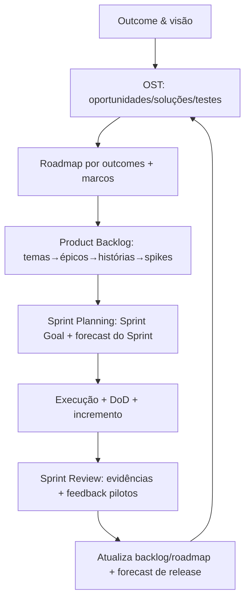
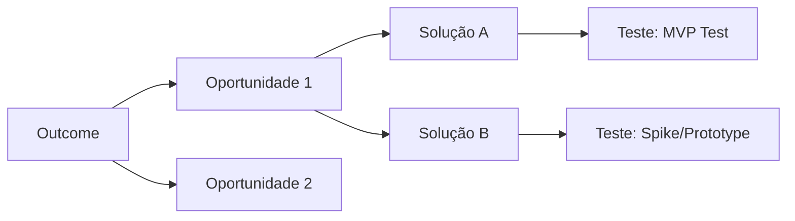
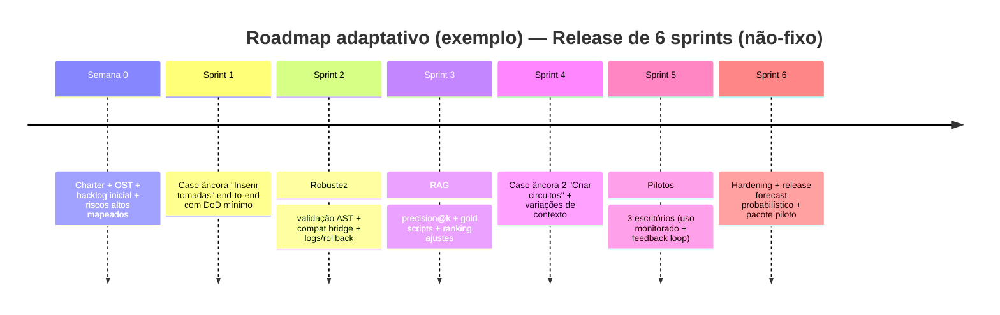
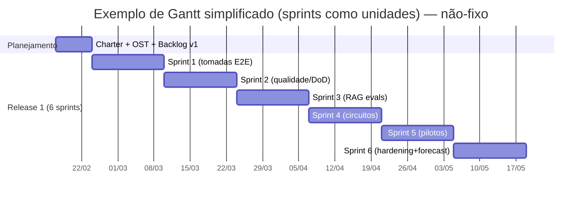

do deep research on UzzBIM (Scrum com sprints definidos)

# Documento operacional de cronograma profissional para o UzzBIM

## Sumário executivo e visão executiva

Este documento define um **sistema profissional, auditável e adaptativo** para você criar e operar o cronograma do UzzBIM via **Sprints** (Scrum), mantendo **planejamento por valor**, **redução ativa de riscos** e **rastreabilidade de mudanças**, sem cair em estimativas de “pessoas/hora”. A base é: planejamento como **processo iterativo de decisão** (não um plano fixo), ([ptgmedia.pearsoncmg.com](https://ptgmedia.pearsoncmg.com/images/0131479415/samplechapter/0131479415_ch01.pdf)) com cadência Scrum para inspeção/adaptação frequentes ([scrumguides.org](https://scrumguides.org/docs/scrumguide/v2020/2020-Scrum-Guide-PortugueseBR-3.0.pdf)), e disciplina de discovery orientado a hipóteses para evitar “roadmap de features travadas” antes de validação ([svpg.com](https://www.svpg.com/product-roadmaps/)).

Você vai operar com 3 eixos simultâneos:
1) **Direção (outcomes + hipóteses + roadmap adaptativo)**, privilegiando discovery e MVP tests quando há risco de valor/usabilidade/viabilidade/feasibilidade. ([svpg.com](https://www.svpg.com/product-risk-taxonomies/))  
2) **Entrega (Sprints com Sprint Goal, DoD e incrementos verificáveis)** para manter previsibilidade e governança. ([scrumguides.org](https://scrumguides.org/docs/scrumguide/v2020/2020-Scrum-Guide-PortugueseBR-3.0.pdf))  
3) **Previsão (forecast por dados)** via story points/velocity e evolução para Monte Carlo (probabilidades e ranges), evitando “data única”. ([observablehq.com](https://observablehq.com/%40troymagennis/introduction-to-monte-carlo-forecasting), [scrum.org](https://scrum.org-website-prod.s3.amazonaws.com/drupal/2024-05/Probabilistic%20Forecasting%20and%20Flow%20with%20Scrum%20-%20Whitepaper.pdf))

**Suposições operacionais (não-fixas, ajustáveis por evidência):** Sprint de 2 semanas; Release de referência com 6 sprints; piloto com 3 escritórios; sem estimativa por pessoa/hora (sem capacity por indivíduo). O Scrum incentiva sprints mais curtas quando o horizonte é longo ou o risco aumenta, para gerar mais ciclos de aprendizagem e limitar risco a períodos menores. ([scrumguides.org](https://scrumguides.org/docs/scrumguide/v2020/2020-Scrum-Guide-PortugueseBR-3.0.pdf))



## MVP orientado a hipóteses e critérios de sucesso mensuráveis

### Ponto de partida: planejamento serve para decidir “o que construir” (valor) e reduzir risco
Cohn descreve planejamento como “**quest for value**”: decidir iterativamente o que construir combinando features/agenda/decisões, reduzindo risco, incerteza e melhorando tomada de decisão. ([ptgmedia.pearsoncmg.com](https://ptgmedia.pearsoncmg.com/images/0131479415/samplechapter/0131479415_ch01.pdf))  
SVPG reforça que travar features cedo no roadmap **pula discovery**, quando você ainda não sabe se a solução será útil/usuável/viável. ([svpg.com](https://www.svpg.com/product-roadmaps/))

### Definição profissional de MVP para o UzzBIM: “MVP Test” + “mínimo de produto para piloto”
A SVPG evita confundir “experimento” com “produto”: trata MVP como **MVP Test** para testar uma hipótese específica e gerar evidência; só depois você converte em backlog de produto. ([svpg.com](https://svpg.pensocostud.io/minimum-viable-product/), [svpg.com](https://www.svpg.com/minimum-viable-product/))

Para UzzBIM, use um **MVP em duas camadas**:
- **MVP Test (discovery)**: validar rapidamente hipótese de valor/usabilidade (com protótipo/fluxo controlado). Em discovery você “build to learn”; em delivery “build to earn”. ([svpg.com](https://www.svpg.com/the-purpose-of-prototypes/), [svpg.com](https://www.svpg.com/discovery-vs-delivery/))  
- **MVP Piloto (delivery)**: versão mínima “operável” para 3 escritórios rodarem com segurança, logs e critérios de qualidade.

### Template de hipótese do MVP (copiar/colar)
```text
Hipótese: Se [perfil] usar [capability] para [job-to-be-done] em [contexto Revit],
então teremos [resultado mensurável], porque [mecanismo].
Critério de sucesso (métricas + thresholds):
- Qualidade: …
- Tempo: …
- Confiabilidade: …
- Adoção: …
Evidência mínima aceitável:
- …
Plano de teste (MVP Test):
- Como medir / onde logar / por quanto tempo / com quais usuários.
```

### Scorecard do MVP (métricas mínimas e como medir)
A recomendação é transformar cada hipótese em **critérios mensuráveis** (para o Sprint Review ser evidência, não opinião). No Scrum, a Sprint Review inspeciona o resultado e adapta o que vem depois; o Product Backlog pode ser ajustado para novas oportunidades. ([scrumguides.org](https://scrumguides.org/docs/scrumguide/v2020/2020-Scrum-Guide-PortugueseBR-3.0.pdf))

| Dimensão | Métrica | Como medir no UzzBIM | Exemplo de limite para “MVP Piloto OK” |
|---|---|---|---|
| Confiabilidade | Taxa de sucesso end‑to‑end (1ª tentativa e após retries) | logs de execução no Revit + status pipeline | ≥ X% no caso de uso âncora |
| Latência | Tempo total comando→execução | timestamps por etapa (parse/RAG/generate/validate/execute) | p95 ≤ limite |
| Qualidade RAG | Precision@k | avaliação offline/online por rotulagem + logs | ≥ alvo |
| Cobertura | coverage de command_types | contagem de comandos suportados com DoD | ≥ alvo |
| Base de conhecimento | # exemplos gold / verificados | inventário de scripts + marcação tier | ≥ alvo |
| Segurança | % execuções com rollback correto | simular falhas e verificar rollback | 100% nos casos testados |

## Backlog estruturado do UzzBIM com exemplos concretos

### Estrutura base: temas → épicos → histórias → spikes (e por que isso é “profissional”)
O Scrum trabalha com Product Backlog como lista ordenada emergente do que é necessário; refinement é contínuo. ([scrumguides.org](https://scrumguides.org/docs/scrumguide/v2020/2020-Scrum-Guide-PortugueseBR-3.0.pdf))  
Para escrever boas histórias, Cohn usa INVEST e reforça: histórias devem ser pequenas/testáveis/estimáveis; quando não der para estimar por incerteza técnica, faça **spike timeboxed** (experimento curto para aprender) e só então estime o trabalho real. ([mountaingoatsoftware.com](https://www.mountaingoatsoftware.com/uploads/articles/User-Stories-Applied-Mike-Cohn.pdf))

### Temas recomendados (diretamente alinhados à sua arquitetura)
Use temas como “pasta mãe” do roadmap/outcomes e para organizar releases:

1) **Execução confiável no Revit (safety + DoD)**  
2) **Geração de código (qualidade + compatibilidade IronPython)**  
3) **RAG/DB (recuperação + ranking + gold base)**  
4) **Cobertura de comandos (tomadas, circuitos, parâmetros etc.)**  
5) **Pilotos e adoção (UX, empacotamento, suporte)**  
6) **Governança e PI (patente/licenciamento, sigilo, evidências)**

### Exemplos de épicos e histórias (UzzBIM “de verdade”)
Abaixo, itens exemplares no formato recomendado. Eles já vêm com “DoD-aware”.

#### Tema: Execução confiável no Revit (safety + DoD)
**Épico:** “Loop de validação e execução confiável para comandos de inserção”  
**História:** Inserir tomadas (caso âncora)  
- *Como* projetista elétrico, *quero* inserir uma tomada a 0,30m do piso em uma parede selecionada, *para* reduzir tempo de modelagem repetitiva.  
- **Critérios de aceite (CoS):**  
  - Insere família correta, altura correta, host correto.  
  - Executa em transação válida e não deixa o modelo inconsistente.  
  - Log registra: comando original, schema, top‑k exemplos usados, código final, tempo por etapa, resultado.  
  - Se falhar, não deixa “meia alteração” (rollback ou transação abortada).  
- **Observação:** “tomada 220V/127V” vira parâmetro do schema → filtro RAG.  

**Spike:** “Investigar rollback e falhas típicas no sandbox PyRevit/IronPython” (timebox obrigatório)  
- Resultado esperado: lista de padrões de erro + estratégia de rollback/log.

#### Tema: Validação AST e estrutura de script
**Épico:** “Validador técnico mínimo (AST + estrutura + imports)”  
**História:** Validar script antes de executar  
- CoS: `ast.parse` ok; função `main()` existe; imports mínimos presentes; sem sintaxe não suportada no IronPython; transação obrigatória se houver escrita no modelo.  
- DoD da história inclui testes automatizados desses checks.

#### Tema: Ponte de compatibilidade IronPython 2.7
**Épico:** “Compat bridge Python 3.x → IronPython 2.7”  
**História:** Converter f‑strings para `.format()` e remover type hints  
- CoS: script gerado roda no interpretador alvo sem SyntaxError.  
- Prova: suíte de scripts “quebradores” passa.

#### Tema: RAG/DB e ranking
**Épico:** “Recuperação reprodutível com top‑k e deduplicação”  
**História:** Indexar e recuperar scripts gold  
- CoS: ingestion (chunking) + index; query retorna top‑k com metadados; dedup; e persistência de versões.

### Tabela comparativa: histórias vs spikes (uso correto no seu cronograma)
| Aspecto | História (delivery) | Spike (discovery técnico) |
|---|---|---|
| Objetivo | Entregar incremento de valor/comportamento | Reduzir incerteza e gerar conhecimento |
| Critério de “feito” | Atende CoS + DoD (incremento utilizável) ([scrumguides.org](https://scrumguides.org/docs/scrumguide/v2020/2020-Scrum-Guide-PortugueseBR-3.0.pdf)) | Responde pergunta + artefato (nota/POC/benchmark) |
| Estimabilidade | Deve ser estimável (INVEST) | Pode ser “não estimável”; vira timebox ([mountaingoatsoftware.com](https://www.mountaingoatsoftware.com/uploads/articles/User-Stories-Applied-Mike-Cohn.pdf)) |
| Saída típica | feature/capability testada | decisão: “faça / não faça / como fazer” |

## Plano de sprints detalhado: cadência, cerimônias, artefatos e I/O

### Cadência sugerida (ajustável)
- **Duração:** 2 semanas como default (não fixa). O Scrum recomenda sprints mais curtas quando horizonte longo aumenta risco e complexidade, para gerar mais ciclos de aprendizagem e limitar riscos a período menor. ([scrumguides.org](https://scrumguides.org/docs/scrumguide/v2020/2020-Scrum-Guide-PortugueseBR-3.0.pdf))  
- **Release de referência:** 6 sprints por release (não fixa); revisado por forecast e dados.

### Eventos (Scrum) com entradas e saídas operacionais
O Guia do Scrum define os eventos e descreve o propósito/timeboxes e como geram transparência, inspeção e adaptação. ([scrumguides.org](https://scrumguides.org/docs/scrumguide/v2020/2020-Scrum-Guide-PortugueseBR-3.0.pdf))

#### Sprint Planning (entrada → saída)
- **Propósito:** iniciar a sprint definindo trabalho; plano é criado colaborativamente pelo Scrum Team. ([scrumguides.org](https://scrumguides.org/docs/scrumguide/v2020/2020-Scrum-Guide-PortugueseBR-3.0.pdf))  
- **Entradas (mínimas):** Product Goal, top items refinados, Definition of Done, dados recentes (velocity ou throughput), riscos abertos.  
- **Saídas (obrigatórias):**  
  - **Sprint Goal** (por que é valiosa) ([scrumguides.org](https://scrumguides.org/docs/scrumguide/v2020/2020-Scrum-Guide-PortugueseBR-3.0.pdf))  
  - **Sprint Backlog** = Goal + itens selecionados + plano para entregar (o “como”). ([scrumguides.org](https://scrumguides.org/docs/scrumguide/v2020/2020-Scrum-Guide-PortugueseBR-3.0.pdf))  
- **Timebox:** até 8h para sprint de 1 mês; sprints menores têm evento menor. ([scrumguides.org](https://scrumguides.org/docs/scrumguide/v2020/2020-Scrum-Guide-PortugueseBR-3.0.pdf))

#### Daily Scrum (entrada → saída)
- **Propósito:** inspecionar progresso rumo à Sprint Goal e adaptar o Sprint Backlog. É evento de 15 minutos. ([scrumguides.org](https://scrumguides.org/docs/scrumguide/v2020/2020-Scrum-Guide-PortugueseBR-3.0.pdf))  
- **Saída:** plano acionável para o próximo dia.

#### Sprint Review (entrada → saída)
- **Propósito:** inspecionar resultado da sprint e determinar adaptações futuras; backlog pode ser ajustado para novas oportunidades. ([scrumguides.org](https://scrumguides.org/docs/scrumguide/v2020/2020-Scrum-Guide-PortugueseBR-3.0.pdf))  
- **Saídas:** evidências (métricas, demos, logs), decisões de roadmap/backlog, próximos experimentos/pilotos.

#### Sprint Retrospective
- **Propósito:** planejar maneiras de aumentar qualidade e eficácia. ([scrumguides.org](https://scrumguides.org/docs/scrumguide/v2020/2020-Scrum-Guide-PortugueseBR-3.0.pdf))  
- **Saída:** 1–3 melhorias com dono e verificação.

### Artefatos e “compromissos” (commitments)
O Scrum explicita compromissos: Product Backlog → Product Goal; Sprint Backlog → Sprint Goal; Incremento → Definition of Done. ([scrumguides.org](https://scrumguides.org/docs/scrumguide/v2020/2020-Scrum-Guide-PortugueseBR-3.0.pdf))

**Implicação direta para seu cronograma:** cada sprint tem um **compromisso verificável** (Sprint Goal + itens Done) e cada release tem uma narrativa por outcomes (Product Goal e milestones).

## Matriz de riscos técnicos e de produto com mitigação via spikes

### Taxonomia recomendada (SVPG) para não perder risco “não-técnico”
SVPG recomenda avaliar risco de **valor, usabilidade, viabilidade e viabilidade do negócio** (viability), e usar técnicas para testar ideias contra esses riscos antes de construir pesado. ([svpg.com](https://www.svpg.com/product-risk-taxonomies/), [svpg.com](https://www.svpg.com/four-big-risks/))  
No UzzBIM, **feasibility** é forte (Revit API + IronPython + execução segura); mas value/usability/viability podem matar piloto se ignorados.

### Matriz prática (risco → spike → critério de saída)
| Risco | Tipo | Sinal de alerta | Spike timeboxed (mitigação) | Critério de saída |
|---|---|---|---|---|
| Script gera, mas não executa por restrições do IronPython | Feasibility | SyntaxError, imports incompatíveis | “Mapa de incompatibilidades + regras de transformação” | suíte mínima de scripts “quebradores” passa |
| Alterações fora de transação / modelo inconsistente | Feasibility | erros de transação; alterações parciais | “Política de transação + rollback + auditoria” | falha simulada não deixa resíduo |
| RAG traz exemplos irrelevantes (alucinação guiada) | Feasibility/Value | baixa precision@k | “Benchmark retrieval + ajuste filtros/ranking” | precision@k ≥ alvo + logs reproduzíveis |
| Usuário não confia (medo de quebrar modelo) | Usabilidade/Viability | baixa adoção; feedback “arriscado” | “Teste de UX + modo dry-run + preview” | >N execuções seguras em piloto |
| Escritório não consegue instalar/operar | Viability | atrito de setup | “Pacote instalável + guia + suporte” | tempo de setup ≤ alvo e 0 blockers críticos |
| Divulgação pública antes de depósito prejudica patente | Business viability/legal | paper, feira, demo pública | Spike jurídico-operacional: “protocolo de divulgação + NDA + revisão NIT” | checklist IP cumprido antes de qualquer divulgação |

📌 Nota de rigor legal: o INPI explicita que, via de regra, **divulgação** pode colocar o invento no “estado da técnica” e impedir proteção; inclusive cita exemplos (venda, feira/evento, apresentação acadêmica, artigo). ([gov.br/inpi](https://www.gov.br/inpi/pt-br/servicos/patentes/guia-basico/ManualdePatentes20210706.pdf))

## Estimativa e forecast sem mensurar recursos

### Por que evitar horas: cone de incerteza e “probabilidade vs compromisso”
O cone de incerteza mostra que estimativas no início podem variar muito e vão estreitando conforme o projeto anda; além disso, o planejamento é difícil e planos erram. ([ptgmedia.pearsoncmg.com](https://ptgmedia.pearsoncmg.com/images/0131479415/samplechapter/0131479415_ch01.pdf))  
Phillip Armour formaliza a distinção: estimar gera probabilidade; compromisso decide uma data (com risco/ROI). ([bowringj.people.charleston.edu](https://bowringj.people.charleston.edu/docs/p15-armour.pdf))

### Estratégia recomendada em três níveis (você começa simples e evolui)
1) **Story points (tamanho relativo) + Planning Poker (consenso)**  
Planning Poker é técnica de consenso para estimar backlog e pode usar story points. ([mountaingoatsoftware.com](https://www.mountaingoatsoftware.com/topics/planning-poker%20))  
Story points estimam **esforço relativo** (não tempo absoluto) e ajudam planejamento por velocity. ([mountaingoatsoftware.com](https://www.mountaingoatsoftware.com/agile/agile-estimation-estimating-with-story-points))

2) **Velocity como dado empírico (sem capacity por pessoa)**  
Você mede “pontos Done por sprint”. Isso respeita o empirismo do Scrum: em ambientes complexos, o futuro é desconhecido; só o que aconteceu pode apoiar decisões futuras. ([scrumguides.org](https://scrumguides.org/docs/scrumguide/v2020/2020-Scrum-Guide-PortugueseBR-3.0.pdf))

3) **Monte Carlo para forecast probabilístico (range + probabilidade)**  
Monte Carlo produz muitos resultados (distribuição), não um único número; isso é exatamente o que você precisa para comunicar ranges. ([observablehq.com](https://observablehq.com/%40troymagennis/introduction-to-monte-carlo-forecasting))  
Scrum.org oferece whitepaper de forecast probabilístico com fluxo e exemplo prático. ([scrum.org](https://scrum.org-website-prod.s3.amazonaws.com/drupal/2024-05/Probabilistic%20Forecasting%20and%20Flow%20with%20Scrum%20-%20Whitepaper.pdf))

### Como aplicar “sem mensurar recursos” (operacional)
- Você **não** estima “quantas horas” nem “quantas pessoas”.  
- Você estima **tamanho relativo** do que entrega (histórias) e mede **resultado real** por sprint (velocity). ([mountaingoatsoftware.com](https://www.mountaingoatsoftware.com/agile/agile-estimation-estimating-with-story-points))  
- Para iterações e release, você comunica: **range de itens concluídos até data X com probabilidade Y** (Monte Carlo), em vez de prometer data única.

### Template: input de Release Forecast (Monte Carlo)
```yaml
forecast:
  unit: "story_points"  # ou "items" (throughput)
  history_window: "últimos N sprints"
  samples: 10000
  backlog_scope:
    - epic: "Execução confiável"
      remaining_points: __
    - epic: "Inserir tomadas + circuitos"
      remaining_points: __
  output:
    - confidence_levels: [0.5, 0.8, 0.9]
    - report: "data provável por nível + range"
assumptions:
  - sprint_length_days: 10  # não-fixo
  - definition_of_done_stable: true
```

## Métricas, KPIs e validação com pilotos

### KPIs por sprint vs por release
A Sprint Review precisa de evidência; Scrum descreve review como sessão de trabalho onde backlog pode ser ajustado e progresso rumo à meta do produto é discutido. ([scrumguides.org](https://scrumguides.org/docs/scrumguide/v2020/2020-Scrum-Guide-PortugueseBR-3.0.pdf))

**KPIs por sprint (leading indicators):**
- Taxa de sucesso por caso de uso âncora (1ª tentativa e final)  
- Tempo por etapa (parse/RAG/generate/validate/execute)  
- Top erros (categorias) e taxa de regressão  
- Coverage incremental (novos command_types DoD-ready)

**KPIs por release (lagging indicators):**
- Adoção em piloto (usuários ativos/semana; # execuções)  
- Redução de tempo em tarefas-alvo (antes/depois)  
- Qualidade RAG agregada (precision@k, drift de retrieval)  
- Crescimento da base gold + taxa de reutilização

### Plano de validação com 3 escritórios (piloto profissional)
SVPG enfatiza que discovery exige colocar ideias cedo diante de usuários; delivery exige engenharia para produção com confiança. ([svpg.com](https://www.svpg.com/discovery-vs-delivery/))

**Estrutura do piloto (3 escritórios, 3 fases):**
1) **Onboarding controlado (semana 0 / início do release):** instalação + comando “Hello World” + checklist IP (abaixo).  
2) **Uso guiado (Sprints 1–2):** 1 caso âncora (tomadas) com scripts gold e supervisão; coleta logs e feedback estruturado.  
3) **Expansão (Sprints 3–6):** adicionar circuitos, variações de contexto e casos edge; medir autonomia do usuário.

**Critérios de sucesso do piloto (exemplo operacional):**
- ≥ N execuções completas por escritório/semana  
- ≤ X% execuções com rollback acionado (idealmente baixo, mas “rollback funciona” é obrigatório)  
- Feedback qualitativo: confiança + redução de retrabalho  
- Zero incidentes de “modelo corrompido” (gate de segurança)

## Governança de mudanças, PI/patentes, ferramentas e cronograma em camadas

### Processo de documentação viva (OST + ADR + Decision Log + Changelog)
Um bom cronograma pressupõe mudanças, mas exige rastreabilidade (por que mudou). Cohn alerta que planejamento deve reduzir risco/incerteza e que decisões de investimento/schedule/features são reavaliadas periodicamente. ([ptgmedia.pearsoncmg.com](https://ptgmedia.pearsoncmg.com/images/0131479415/samplechapter/0131479415_ch01.pdf))  
OST é um mecanismo explícito de “caminhos possíveis” para outcomes. ([producttalk.org](https://www.producttalk.org/tag/opportunity-solution-tree/))



**Regras operacionais:**
- Toda mudança de direção relevante gera 1 entrada no **Decision Log** (o que mudou + evidência + impacto).  
- Toda mudança de arquitetura que cria lock‑in, custo ou risco gera 1 **ADR**.  
- Changelog é “o que mudou no produto”, não no processo.

### Checklist DoD e critérios de aceite técnicos (gates por item)
No Scrum, trabalho só é parte do incremento se atender à Definição de Pronto; se não atender, volta ao Product Backlog. ([scrumguides.org](https://scrumguides.org/docs/scrumguide/v2020/2020-Scrum-Guide-PortugueseBR-3.0.pdf))  
Logo, seu DoD precisa ser “executável” e alinhado ao domínio Revit.

**DoD técnico mínimo (para qualquer item que execute script):**
- ✅ `ast.parse` passa  
- ✅ `main()` existe e é chamado corretamente  
- ✅ Imports obrigatórios presentes e resolvidos  
- ✅ Sem sintaxe incompatível com IronPython (ex.: f-string)  
- ✅ Operações de escrita no modelo dentro de Transaction wrapper  
- ✅ Logs mínimos emitidos (com IDs, tempos, erros)  
- ✅ Rollback/abort em falha testado

### Governança de patentes/licenciamento durante sprints
A Lei 10.973/2004 estabelece medidas de incentivo à inovação e pesquisa no ambiente produtivo, e foi alterada pela Lei 13.243/2016 (Marco Legal). ([planalto.gov.br](https://www.planalto.gov.br/ccivil_03/_Ato2004-2006/2004/Lei/L10.973.htm), [planalto.gov.br](https://www.planalto.gov.br/ccivil_03/_Ato2015-2018/2016/Lei/L13243.htm))  
Para proteção efetiva, o INPI define que a divulgação pode colocar a tecnologia no estado da técnica e impedir patente; cita exemplos de divulgação (venda, feiras/eventos, apresentação acadêmica, artigo científico). ([gov.br/inpi](https://www.gov.br/inpi/pt-br/servicos/patentes/guia-basico/ManualdePatentes20210706.pdf))  
Após depósito, o pedido inicialmente é sigiloso e a publicação ocorre após 18 meses (com possibilidade de publicação antecipada). ([gov.br/inpi](https://www.gov.br/inpi/pt-br/servicos/patentes/guias-rapidos-de-patentes/guias-em-pdf/publicacao-do-pedido-1.pdf))

**Política prática (coloque no seu Definition of Workflow do projeto):**
- “Não divulgar antes do depósito”: o próprio Manual do INPI recomenda isso especialmente se houver intenção de depositar em outros países. ([gov.br/inpi](https://www.gov.br/inpi/pt-br/servicos/patentes/guia-basico/ManualdePatentes20210706.pdf))  
- Todo material público (repo aberto, paper, demo em evento) passa por gate “IP OK?”.  
- Evidências de autoria e evolução: versionamento + ADRs + logs de experimentos (para discussão com NIT/SEDETEC).

### Ferramentas e estrutura de artefatos (sem travar stack)
Você disse que tem todas as ferramentas; aqui vai uma configuração “mínima e forte”, com fontes oficiais onde possível:

- **Issue tracker + board + roadmap:** GitHub Projects (table/board/roadmap integrado a issues/PRs). ([docs.github.com](https://docs.github.com/en/issues/planning-and-tracking-with-projects/learning-about-projects/about-projects))  
- **CI/CD:** GitHub Actions (plataforma CI/CD com workflows no repositório; docs em PT). ([docs.github.com](https://docs.github.com/pt/actions), [docs.github.com](https://docs.github.com/pt/actions/get-started/quickstart))  
- **Observabilidade:** OpenTelemetry para traces/métricas/logs (framework vendor‑neutral). ([opentelemetry.io](https://opentelemetry.io/docs/))  
- **Experiment tracking (LLM/RAG/DOE):** MLflow Tracking para logar parâmetros, versões de código, métricas e artefatos. ([mlflow.org](https://mlflow.org/docs/latest/ml/tracking/))

**Estrutura recomendada de diretórios (acoplada ao que você já tem):**
```
docs/
  charter.md
  ost.md
  adr/
  decision-log.md
  sprint/
    sprint-XX-plan.md
    sprint-XX-review.md
metrics/
  sprint/
  release/
experiments/
  doe/
  rag-evals/
  llm-evals/
```

### Cronograma modelo em camadas com Mermaid (exemplo não-fixo)

#### Timeline por releases (outcomes e marcos, não features)


#### Gantt simplificado (marcos técnicos + validação)


### Plano de comunicação com stakeholders (templates)
A Sprint Review deve ser uma sessão de trabalho com inspeção e adaptação; evitar virar apresentação sem decisões. ([scrumguides.org](https://scrumguides.org/docs/scrumguide/v2020/2020-Scrum-Guide-PortugueseBR-3.0.pdf))  

**Template: pauta de Sprint Review (45–60 min)**
```text
1) Sprint Goal e o que foi Done (evidência: demo + métricas)
2) O que não foi Done e por quê (risco/decisão, sem desculpas)
3) Aprendizados (spikes / pilotos / dados)
4) Decisões (backlog/roadmap/hipóteses)
5) Próximos passos (proposta de Sprint Goal seguinte)
```

## Templates obrigatórios (copiar/colar)

### Product Charter (1 página)
```markdown
# Product Charter — UzzBIM (1p)
## Visão/Outcome principal
## Usuários-alvo e contextos (Revit/pilotos)
## Hipóteses críticas (Valor/Usabilidade/Feasibilidade/Viabilidade)
## Casos âncora do MVP (3)
## Métricas de sucesso (scorecard)
## Restrições não-negociáveis (segurança, logs, rollback, compat)
## Riscos top-10 e estratégia de mitigação (spikes)
## Regras de IP/divulgação (gate)
```

### Sprint Plan
```markdown
# Sprint XX — Sprint Plan
## Sprint Goal (por que é valiosa)
## Itens selecionados (histórias/spikes) e por quê (valor/risco)
## Definition of Done aplicada
## Plano de validação (testes, métricas, evidências na review)
## Riscos do Sprint + mitigação
## Dependências e decisões pendentes
```

### Sprint Backlog (enxuto)
```markdown
| Item | Tipo | Critério de aceite | Evidência esperada na Review | Status |
|---|---|---|---|---|
```

### Spike template
```markdown
# Spike — [título]
Pergunta que precisa ser respondida:
Hipótese técnica:
Timebox:
Método (experimento/benchmark/protótipo):
Dados coletados:
Decisão (go/no-go/como):
Impacto no backlog:
Links (código, logs, ADR se necessário):
```

### ADR template
```markdown
# ADR-XXX — [Decisão]
Contexto:
Decisão:
Alternativas consideradas:
Trade-offs:
Consequências:
Como reavaliar (gatilhos):
```

### Decision Log
```markdown
| Data | Decisão | Evidência | Impacto no roadmap | Quem | Link (ADR/Spike) |
|---|---|---|---|---|---|
```

### Release Forecast (Monte Carlo inputs)
*(ver template YAML acima)*

## Leituras e fontes prioritárias

Priorize na ordem abaixo (mais “carregadoras” para o seu objetivo):

1) **Guia do Scrum (PT‑BR, oficial)** — eventos, artefatos, DoD, empirismo e ciclos. ([scrumguides.org](https://scrumguides.org/docs/scrumguide/v2020/2020-Scrum-Guide-PortugueseBR-3.0.pdf))  
2) **Agile Estimating & Planning (Cohn) — amostra oficial** — cone de incerteza, planejamento como busca de valor e redução de risco. ([ptgmedia.pearsoncmg.com](https://ptgmedia.pearsoncmg.com/images/0131479415/samplechapter/0131479415_ch01.pdf))  
3) **User Stories Applied (Cohn) — amostra oficial** — INVEST, spikes timeboxed, split de épicos e complexidade. ([mountaingoatsoftware.com](https://www.mountaingoatsoftware.com/uploads/articles/User-Stories-Applied-Mike-Cohn.pdf))  
4) **SVPG (Cagan) — roadmap/discovery/risks** — evita feature factory e dá taxonomia de riscos. ([svpg.com](https://www.svpg.com/product-roadmaps/), [svpg.com](https://www.svpg.com/product-risk-taxonomies/), [svpg.com](https://www.svpg.com/discovery-vs-delivery/))  
5) **Forecast probabilístico / Monte Carlo** — técnica para ranges com probabilidade. ([observablehq.com](https://observablehq.com/%40troymagennis/introduction-to-monte-carlo-forecasting), [scrum.org](https://scrum.org-website-prod.s3.amazonaws.com/drupal/2024-05/Probabilistic%20Forecasting%20and%20Flow%20with%20Scrum%20-%20Whitepaper.pdf))  
6) **INPI (PT‑BR, oficial)** — governança de sigilo, divulgação, estado da técnica, período de graça, publicação 18 meses. ([gov.br/inpi](https://www.gov.br/inpi/pt-br/servicos/patentes/guia-basico/ManualdePatentes20210706.pdf), [gov.br/inpi](https://www.gov.br/inpi/pt-br/servicos/patentes/guias-rapidos-de-patentes/guias-em-pdf/publicacao-do-pedido-1.pdf))  

✅ **Assunções explicitadas (não-fixas):** Sprint = 2 semanas; release = 6 sprints; pilotos = 3 escritórios; todo item que executa no Revit carrega DoD técnico mínimo; descoberta de produto roda paralela (spikes e MVP tests).