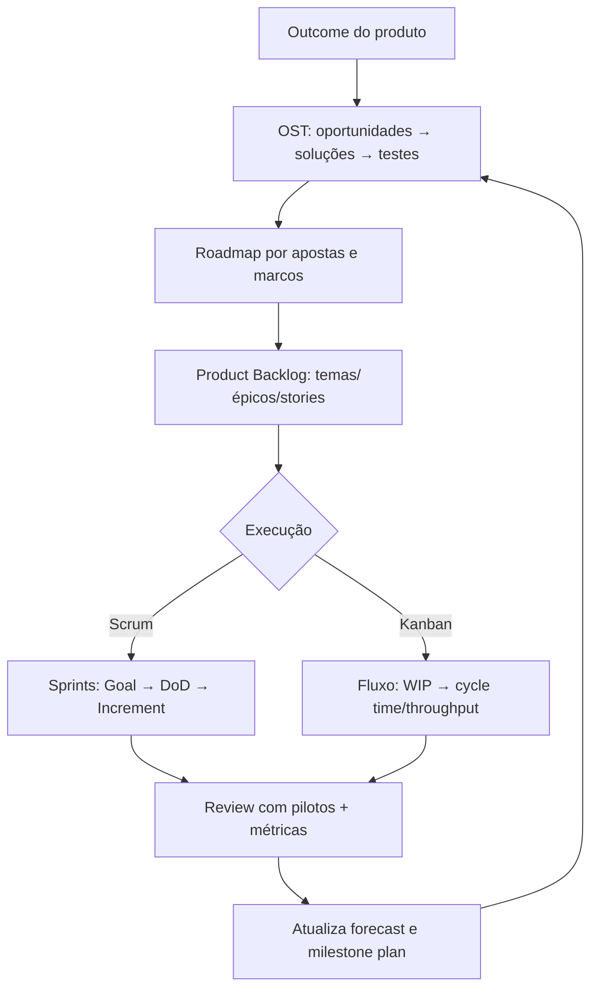

# Playbook profissional de cronograma para o UzzBIM

Você já tem a parte mais rara: um **núcleo técnico claro** (pipeline multi‑agente + RAG + validação/auto‑correção + execução no Revit) e evidência experimental de que o sistema funciona em boa taxa de sucesso. O que falta agora é um “sistema operacional” de produto/engenharia que te dê **roadmap + MVP + previsibilidade**, sem engessar — ou seja: **planejar para aprender** e atualizar o plano conforme você elimina incerteza (cone de incerteza) e troca suposições por dados. citeturn9view0turn13view0

A melhor forma “state‑of‑the‑art” para isso é combinar: **(i) Product Discovery forte (Inspired/SVPG)** para não travar “features” cedo demais e manter o roadmap orientado a objetivos, citeturn5view1turn14search6turn3search13 com **(ii) Planejamento ágil baseado em valor + estimativa relativa + forecast** (Mike Cohn/Mountain Goat), citeturn9view0turn7view2turn7view0turn7view1 executado com **Scrum** (se você quer cadência + checkpoints fixos) citeturn6view0 ou **Kanban** (se você quer fluxo contínuo + métricas de fluxo) citeturn5view3 — e, quando maturar, **forecast probabilístico (Monte Carlo)** para previsibilidade sem autoengano. citeturn4search10turn4search2turn4search5

## 🗺️ Mapa rápido do documento
✅ Como transformar teu sistema (UzzBIM) em **backlog de produto** (temas → épicos → histórias) sem cair em “Gantt por atividade”. citeturn9view0turn6view0turn8view0  
✅ Como definir **MVP (como teste)** + **roadmap por outcomes** (não por lista de features fechadas). citeturn5view1turn5view2turn14search6  
✅ Como estimar com **Planning Poker + story points** e gerar previsibilidade via **velocity** (ou via fluxo no Kanban). citeturn7view0turn7view1turn5view3  
✅ Como montar o **cronograma em camadas** (dia → sprint → milestone → produto), e como atualizar sem perder rastreabilidade (ADR/Decision log). citeturn7view2turn6view0turn13view0  

## Princípios que tornam o cronograma “profissional” em produto de alta incerteza

Um cronograma profissional aqui não é “data cravada”, e sim um **mecanismo contínuo de decisão** que mantém previsibilidade suficiente para gerir stakeholders sem destruir aprendizado. Isso é coerente com: (a) o **cone de incerteza** — no início a variação típica é grande e vai estreitando conforme o projeto avança; citeturn9view0turn9view1 (b) o princípio de que **estimativa gera probabilidade; compromisso é uma decisão de data/escopo** baseada em risco/ROI; citeturn13view0 e (c) a ideia de que planejamento bom é “quest for value” (o que construir e quando) reavaliado iterativamente, não um documento estático. citeturn9view0turn7view2

Em produto com muita descoberta (teu caso), o roadmap não deve “travar features” cedo. A SVPG é explícita: fechar features no roadmap **pula discovery**, quando você ainda não sabe se a solução será útil/usuável/viável. citeturn5view1turn3search1 Na prática: **roadmap vira um conjunto de resultados e apostas** (outcomes, hipóteses, milestones), e o backlog vira o lugar onde as opções viram itens implementáveis.

Para manter adaptabilidade sem virar caos, você precisa de **camadas de planejamento**. Scrum formaliza isso com ciclos (Sprint como “heartbeat”) e eventos de inspeção/adaptação dentro de cada Sprint. citeturn6view0 Mountain Goat (Cohn) descreve essa multilayer planning como “planning onion” (dia → sprint → milestone → produto e além). citeturn7view2 Kanban, por outro lado, te dá governança por **definição/visualização do workflow**, **gestão ativa** (WIP) e **melhoria contínua**, medindo saúde do sistema via métricas obrigatórias de fluxo (WIP, throughput, cycle time, work item age). citeturn5view3

📌 **Regra de ouro** (pra você usar sempre que o cronograma “quebrar”): quando aparecer uma ideia melhor durante execução, você não “quebra o plano”; você executa **inspect & adapt** e atualiza a previsão com base em dados novos (velocity/fluxo), mantendo histórico claro do porquê a mudança foi feita. citeturn6view0turn7view2turn13view0

## MVP e roadmap para UzzBIM orientados a outcomes e riscos

### MVP no seu caso não é “versão pequena”, é “teste que prova algo”
A SVPG diferencia discovery vs delivery: discovery é colocar ideias cedo diante de usuários e aprender; delivery é engenharia para software de produção com confiança. citeturn14search6turn5view0 E a SVPG trata MVP como **MVP Test** (um experimento para convergir para product/market fit), não necessariamente um “produto mínimo” vendável. citeturn5view2turn3search2

**Como isso vira definição de MVP do UzzBIM (modelo prático):** você define 1 outcome principal (ex.: “reduzir tempo de tarefa repetitiva X em Y% mantendo taxa de sucesso ≥ Z e sem exigir programação”), escolhe **1 a 3 tarefas‑âncora** (use-cases) e constrói o mínimo necessário para rodar esses casos com segurança, métricas e auditabilidade.

✅ No seu domínio (Revit + automação), “MVP de verdade” normalmente precisa incluir: instalação/execução confiável no ambiente do usuário, rastreio de logs, capacidade de repetir, e critérios claros de “feito” (DoD). Scrum é muito claro: trabalho só conta como incremento se atende Definition of Done; caso contrário volta ao backlog. citeturn6view0turn1search11

### Roadmap que não te engessa: outcomes → apostas → marcos
SVPG alerta que “roadmap de features” vira armadilha; o correto é representar objetivos e **teorias** de como gerar valor, deixando o discovery validar a melhor solução. citeturn5view1turn3search1  
Então, em vez de um roadmap com “implementar Agent X / Feature Y”, use um roadmap em **3 níveis**:

**Nível de estratégia (Outcome/Bet):** “Automação de elétrica predial no Revit para escritórios piloto X.”  
**Nível de aposta (Hypothesis):** “Se suportarmos tarefa A+B com taxa de sucesso ≥ 90% e tempo ≤ 15s, teremos adoção semanal.”  
**Nível de entrega (Milestone):** “Piloto roda 3 comandos com logs, rollback e critérios de qualidade.”

Para você visualizar caminhos, use uma ferramenta de discovery que explicita alternativas. Uma opção extremamente boa é **Opportunity Solution Tree (OST)**: começa no outcome, mapeia oportunidades (dores/necessidades), gera soluções candidatas e testa as suposições mais arriscadas. citeturn14search0 Isso vira o seu “mapa vivo” de “caminhos que posso seguir”.

## Backlog profissional: temas → épicos → user stories com qualidade e critérios de aceite

### Estrutura recomendada para UzzBIM
Um backlog profissional equilibra: (1) linguagem de usuário (valor), (2) linguagem técnica (risco/arquitetura), (3) previsibilidade (tamanho comparável). O Scrum Guide define Product Backlog como lista ordenada emergente do que é necessário para melhorar o produto; e refinement como atividade contínua para adicionar detalhe/clareza e tornar selecionável. citeturn6view0

Use este padrão:

**Tema (Outcome / Bet):** “Confiabilidade e previsibilidade de execução no Revit”  
**Épico:** “Executar comandos de inserção com rollback + logs + validação automática”  
**Capabilities:** “validador AST + compat bridge + parser + RAG retrieval + executor”  
**User stories (entregáveis):** “Como projetista, quero digitar ‘Inserir tomada 220V a 0,30m’ e o sistema executar com log e desfazer em caso de erro.”

### User stories “do jeito certo” (INVEST + spikes timebox)
O capítulo de *User Stories Applied* (amostra do próprio autor) lista os 6 atributos de história boa (INVEST): independente, negociável, valiosa, estimável, pequena e testável. citeturn8view0  
E ele dá um ponto crucial pro teu caso: quando uma história não é estimável por falta de conhecimento técnico, você cria um **spike timeboxed** (experimento curto para aprender) e só então estima o trabalho real. citeturn8view0 Isso casa perfeitamente com decisões de LLM, RAG, compatibilidade IronPython e avaliação de qualidade.

### Definition of Done vs critérios de aceite
Para manter previsibilidade, separe dois níveis:

**Definition of Done (DoD)**: padrão de qualidade que vale para todo incremento. Scrum define DoD como descrição formal do estado do incremento quando atende medidas de qualidade necessárias; o item que não atende DoD não pode ser liberado nem apresentado como incremento. citeturn6view0  
**Conditions of Satisfaction / Acceptance criteria**: critérios específicos por item (história). Mike Cohn explica que DoD é global do time, enquanto conditions of satisfaction (muitas vezes “acceptance criteria”) são específicas de cada item e normalmente escritas pelo PO. citeturn7view3

📌 **DoD sugerido (base para seu cronograma):** “executa no Revit sem quebrar DoD” significa: roda end‑to‑end, gera logs mínimos, tem estratégia de tratamento de erro, e passa checks definidos (inclusive segurança do que pode executar). Você pode deixar isso como “rubber stamp” (no sentido do Cohn). citeturn7view3

## Estimativas e previsibilidade: Planning Poker, story points e forecasts que não mentem

### Estimar do jeito que escala: consenso e relativo
Planning Poker é descrito pela Mountain Goat como técnica de estimativa por consenso, usada para estimar backlog; pode usar story points (ou ideal days). citeturn7view0turn7view0  
Story points são recomendados como estimativa de esforço **relativo** (não tempo absoluto) aplicada ao backlog; e ajudam no planejamento orientado por velocity. citeturn7view1

**Por que isso vira previsibilidade real?** Porque você não tenta “adivinhar horas”. Você cria uma escala interna consistente, mede o que foi entregue por iteração (velocity) e transforma isso em previsão. Isso é coerente com a visão do Cohn de que planejamento é iterativo e deve reduzir risco/incerteza ao longo do tempo. citeturn9view0turn7view2

### Passo a passo: montar seu sistema de estimativa (profissional)
✅ **Checkpoint de setup**
1) Defina a unidade: **story points** para itens de backlog que geram valor (histórias). citeturn7view1  
2) Defina “tamanho-alvo” de história: pequeno o suficiente para caber bem em um ciclo curto e ser “testável”. INVEST pede “Small” e “Testable”. citeturn8view0  
3) Defina DoD e o que conta como “Done” (sem “quase pronto”). Scrum reforça: sem DoD, não é incremento. citeturn6view0

✅ **Checkpoint de calibração**
4) Escolha 5–8 histórias “âncora” e estime com Planning Poker (Fibonacci modificado). citeturn7view0  
5) Rode 2–3 ciclos curtos e meça velocity observada (quantos pontos realmente “Done”).

✅ **Checkpoint de forecast**
6) Para previsões de médio prazo, você pode usar velocity (com intervalo de confiança, não um número único). A própria abordagem de planejamento ágil defende marcos como “range de itens até uma data”, revisados ao final de cada ciclo. citeturn7view2  
7) Para previsões mais maduras, migre para **forecast probabilístico** (Monte Carlo) — especialmente se você estiver em Kanban ou combinando fluxo + Scrum. citeturn4search10turn4search14turn4search2

### Por que “forecast probabilístico” é o padrão mais profissional quando o produto muda
O artigo clássico do Phillip Armour (republicado em PDF) é direto: estimar produz uma probabilidade; compromisso é escolher uma data com base em objetivos/ROI/risco. citeturn13view0  
Monte Carlo faz exatamente isso de forma operacional: usa histórico (velocity/throughput) para gerar uma distribuição de resultados prováveis em vez de uma promessa frágil. citeturn4search2turn4search10turn4search4

## Como construir o cronograma na prática

### Arquitetura do cronograma: quatro camadas que nunca quebram
Use o conceito de “planning onion” (camadas interligadas) — ele é uma boa síntese prática do que o Cohn defende: planejamento frequente e em múltiplos horizontes. citeturn7view2

**Camada diária (operacional):** foco em remover bloqueios e ajustar o plano imediato. Scrum formaliza isso no Daily Scrum como inspeção do progresso e adaptação do Sprint Backlog. citeturn6view0  
**Camada de iteração (execução):** objetivo claro (Sprint Goal), seleção de itens, decomposição e entrega de incremento. citeturn6view0  
**Camada de milestone (previsibilidade):** “o que dá para entregar até data X” como *range*; revisa no review e com dados novos. citeturn7view2turn6view0  
**Camada de produto (direção):** backlog completo ordenado e roadmap orientado a outcomes/discovery (não lista fixa de features). citeturn6view0turn5view1turn14search6

### Forma A: Scrum para UzzBIM (quando você quer cadência forte + checkpoints)
Scrum é apropriado quando você precisa de uma cadência estável para: alinhar, inspecionar e adaptar, e entregar incrementos “potencialmente liberáveis”. citeturn6view0  
O “cronograma” no Scrum nasce do encadeamento de Sprints e milestones:

**Sprint Planning** define Sprint Goal (por que é valioso), o que cabe e como será feito, usando capacidade e performance passada para aumentar confiança. citeturn6view0  
**Sprint Review** vira teu checkpoint com stakeholders/pilotos para ajustar Product Backlog e reapontar o milestone. citeturn6view0  
**Retrospective** é onde você melhora o processo e pode até adaptar DoD se fizer sentido. citeturn6view0turn0search9

✅ **Entrega profissional no Scrum =** DoD forte + backlog refinado + review com evidência + ajustes sem drama.

### Forma B: Kanban para UzzBIM (quando o trabalho é fluxo contínuo + suporte + muitos itens pequenos)
O Kanban Guide define Kanban como estratégia para otimizar fluxo de valor com três práticas: definir/visualizar workflow, gerenciar itens ativamente e melhorar workflow. citeturn5view3  
E ele exige um mínimo de métricas de fluxo: WIP, throughput, work item age e cycle time. citeturn5view3

No Kanban, o cronograma nasce de:  
1) **WIP controlado** (limitar trabalho em progresso), o que tende a melhorar foco e colaboração; citeturn5view3  
2) **previsibilidade via cycle time/throughput** (e SLEs, se você quiser); citeturn5view3  
3) **forecast probabilístico** com base em dados reais do fluxo. citeturn4search14turn4search5

### Tabela de decisão: Scrum vs Kanban no seu caso
| Situação real no UzzBIM | Melhor escolha | Por quê (critério profissional) |
|---|---|---|
| Você quer ciclos claros de “descobrir → entregar → validar com piloto” | Scrum (com discovery paralelo) | Scrum tem eventos e artefatos explícitos para inspeção/adaptação dentro de Sprints, e compromisso via Sprint Goal/DoD. citeturn6view0turn14search6 |
| Você tem muitos itens pequenos, bugs, melhorias contínuas, integrações, suporte a pilotos | Kanban | Kanban dá governança por workflow + WIP e mede previsibilidade por métricas de fluxo obrigatórias. citeturn5view3 |
| Você quer o melhor dos dois (muito comum) | Scrum + práticas de fluxo (Kanban) | Scrum é “container”, e práticas de fluxo ajudam previsibilidade e priorização por dados. citeturn6view0turn4search14 |

## Documentação e controle de mudança sem burocracia

A SVPG é clara: discovery e delivery são trabalhos diferentes; discovery precisa colocar ideias cedo diante de usuários e aprender; delivery precisa de engenharia para “production-quality”. citeturn14search6turn5view0 Se você quer que o cronograma sobreviva às mudanças, você precisa de um **sistema de documentação de decisões** que torne mudanças rastreáveis e revisáveis.

### Artefatos mínimos que te dão “norte” e registram caminhos
✅ **Product Charter (1 página)**  
- Outcome principal + métricas (ex.: adoção no piloto, taxa de sucesso, tempo, custo por execução)  
- Restrições não-negociáveis (ex.: segurança, compatibilidade, auditabilidade)

✅ **Opportunity Solution Tree (mapa de caminhos)**  
- Outcome no topo → oportunidades → soluções → suposições → testes (MVP tests). citeturn14search0turn5view2  
Isso vira literalmente o teu “quadro de caminhos possíveis”.

✅ **ADR (Architecture Decision Records) de 1–2 páginas cada**  
- Contexto → decisão → alternativas consideradas → trade-offs → consequências → como reavaliar  
Isso é o que evita “a gente mudou, mas ninguém lembra por quê”.

✅ **Decision Log do cronograma** (curto e brutal)  
- Data  
- Mudança no plano (o que saiu/entrou)  
- Evidência (resultado de teste, feedback de piloto, métrica)  
- Impacto no milestone (movido? escopo ajustado?)  
Aqui você implementa o princípio: “estimativa é probabilidade; compromisso é decisão” com rastreabilidade. citeturn13view0

### Rotina de atualização do cronograma (profissional)
Use uma cadência em que o plano é revisado baseado em evidência — não “feeling”:

- **Diário:** ajuste operacional (Scrum Daily ou equivalente). citeturn6view0  
- **Semanal:** discovery review (o que aprendemos? quais hipóteses caíram?). citeturn14search6turn14search0  
- **A cada Sprint (ou quinzenal):** review com pilotos + atualização do milestone plan (range). citeturn6view0turn7view2turn5view1  
- **Mensal/Trimestral:** roadmap review por outcomes (não features), re-balanceando apostas conforme dados. citeturn5view1turn3search13  

📌 Se você tiver que escolher 1 métrica “guia” para previsibilidade:  
- em Scrum: mantenha histórico de **velocity Done** e não aceite “semi-feito”. citeturn6view0turn7view2  
- em Kanban: foque em **cycle time + throughput + WIP** e faça forecast probabilístico. citeturn5view3turn4search5turn4search10  

### Mini-diagrama do seu “sistema operacional” de cronograma

## Leituras recomendadas para o seu objetivo específico

Você já escolheu muito bem o “núcleo” de previsibilidade: *Agile Estimating and Planning* te dá base forte de cone de incerteza, planejamento como busca de valor, e replanejamento recorrente; citeturn9view0turn7view2 e *User Stories Applied* te dá o “motor” de backlog em histórias com INVEST e spikes timeboxed pra lidar com incerteza técnica. citeturn8view0

Para completar o triângulo “produto + discovery + roadmap” numa linha bem profissional, **Inspired/SVPG** entra para impedir o erro clássico de “roadmap de features” e para separar discovery vs delivery. citeturn5view1turn14search6turn3search13

Se eu tivesse que adicionar só mais dois materiais para você ficar “imparável” em cronograma adaptativo:
- **Scrum Guide** (para governança mínima e cadência de inspeção/adaptação + DoD/artefatos). citeturn6view0  
- **The Kanban Guide (May 2025)** (para fluxo e previsibilidade por métricas obrigatórias). citeturn5view3  

E, se seu foco for previsibilidade de alto nível sem brigar com mudança:
- **Forecast probabilístico / Monte Carlo** (Scrum.org + Troy Magennis). citeturn4search10turn4search2  

---

✅ **Assumi que:**  
- Você quer um cronograma que funcione tanto para **desenvolvimento** quanto para **pilotos B2B** (stakeholders pedindo previsão), e que você aceita previsões como **faixas com probabilidade**, não “data única”. citeturn9view0turn13view0  
- Você pretende manter discovery ativo durante delivery (dual-track), em vez de “descobrir tudo antes”. citeturn14search6turn14search1  

⚠️ Se você responder 1 coisa, eu deixo o playbook ainda mais afiado (sem te fazer 20 perguntas):  
**Você vai rodar com cadência fixa (Sprints) ou com fluxo contínuo (Kanban) nos próximos 60 dias?**