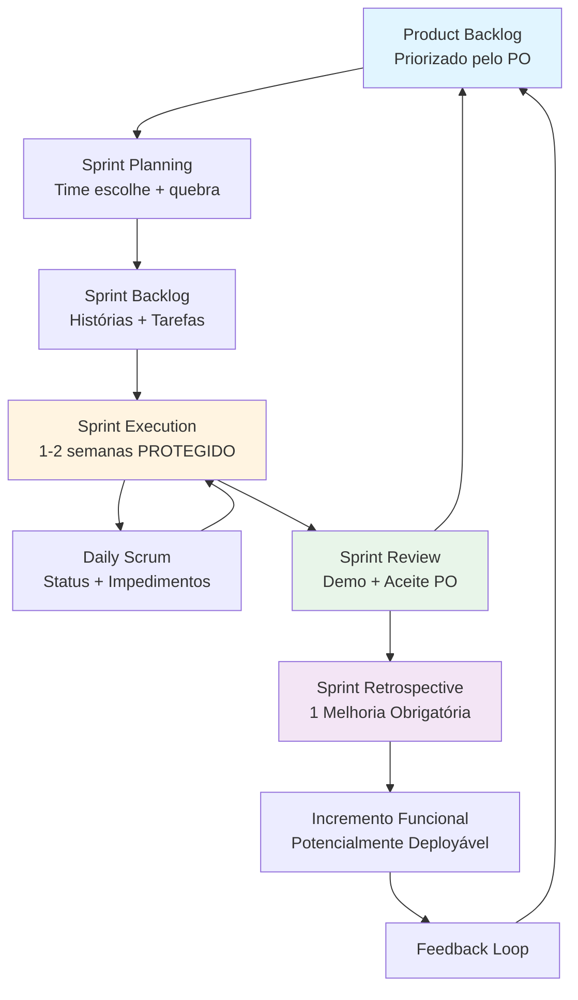
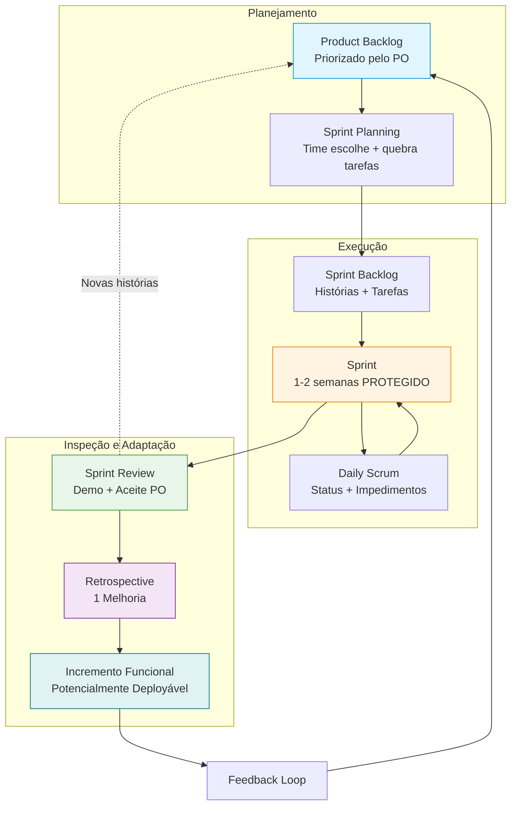
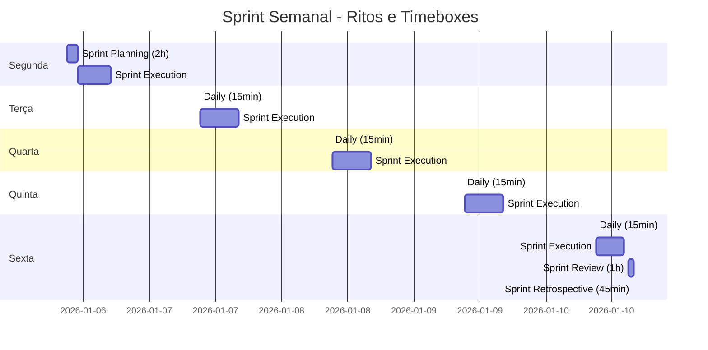
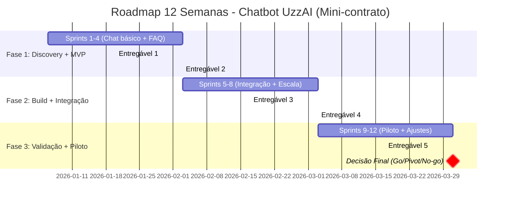
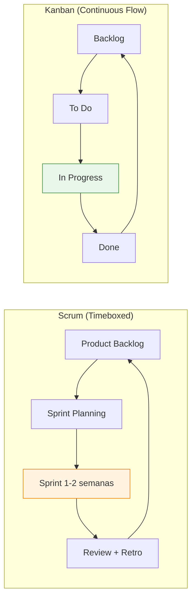

# GUIA SCRUM UzzAI

> **Guia prático e operacional de Scrum adaptado para UzzAI**
> Baseado em: Cesar Brod + Extreme Programming + Manifesto Ágil + práticas de mercado

---

## Resumo Executivo

Este guia estabelece o framework Scrum adaptado para a realidade da UzzAI, combinando gestão empírica (Scrum), práticas de engenharia (XP) e princípios ágeis fundamentais.

**Por que Scrum na UzzAI?** Porque sistemas complexos não podem ser completamente especificados no início. Requisitos emergem através de iteração, modelagem e uso real. O Scrum nos permite navegar a incerteza com ciclos curtos de feedback, protótipos funcionais e ajustes contínuos.

**O que muda?** Substituímos "contratos de escopo fechado" por mini-contratos baseados em tempo (4-12 semanas). Priorizamos protótipos experimentáveis sobre documentação perfeita. Adotamos cadência fixa com cerimônias obrigatórias. Acoplamos práticas de engenharia (TDD, Pair, Standards) ao fluxo Scrum para manter qualidade e velocidade.

**Principais regras:**
- Sprint protege o foco: mudanças entram só no próximo ciclo
- PO tem poder real de aceite (Review não é teatro)
- Histórias cabem em 1 dia (complexidade controlada)
- DoD técnico + DoD de valor (cliente/negócio)
- Nenhuma regra/processo fica sem revisão periódica (anti-sentinela)

**Benefícios esperados:** Redução de retrabalho, descoberta rápida de requisitos reais, entrega contínua de valor, time auto-organizado, métricas honestas, e capacidade de pivotar sem custo proibitivo.

---

## Como Usar Este Guia

### 👔 CEO/Fundadores
**Leia:** Seções 1, 2, 3, 4 + Templates de Mini-contratos
**Use para:** Entender o modelo comercial (timebox vs escopo fechado), acompanhar métricas de portfólio, e remover impedimentos organizacionais.

### 🎯 Product Owners
**Leia:** Seções 2, 3, 4, 5 + Templates de User Stories e Planning
**Use para:** Priorizar backlog, escrever histórias com critérios de aceite, conduzir Reviews, e medir valor entregue.

### 🛡️ Scrum Masters
**Leia:** Todo o documento
**Use para:** Facilitar cerimônias, proteger o Sprint, remover impedimentos, educar o time, e ajustar o processo via Retro.

### 💻 Time Técnico
**Leia:** Seções 3, 4, 5 (Scrum+XP) + DoD + Checklists
**Use para:** Executar Sprints, aplicar práticas de engenharia, estimar histórias, e manter qualidade técnica.

---

## Mapa Mental do Sistema



---

## Índice

1. [Fundamentos Ágeis: Navegação e Empirismo](#1-fundamentos-ágeis-navegação-e-empirismo)
2. [Manifesto Ágil Adaptado UzzAI](#2-manifesto-ágil-adaptado-uzzai)
3. [Scrum Base: Estrutura e Ritos](#3-scrum-base-estrutura-e-ritos)
4. [Scrum + XP: Práticas de Engenharia](#4-scrum--xp-práticas-de-engenharia)
5. [Scrum UzzAI: Framework Operacional](#5-scrum-uzzai-framework-operacional)
6. [Templates Copiáveis](#6-templates-copiáveis)
7. [Exemplos Práticos Completos](#7-exemplos-práticos-completos)
8. [Diagramas e Roadmaps](#8-diagramas-e-roadmaps)
9. [Tabelas de Decisão](#9-tabelas-de-decisão)
10. [Checklists Operacionais](#10-checklists-operacionais)
11. [Erros Comuns e Anti-padrões](#11-erros-comuns-e-anti-padrões)

---

# 1. Fundamentos Ágeis: Navegação e Empirismo

## 1.1 Projeto como Espaço de Navegação (Não Trilho Fixo)

✅ **Princípio Central:** Projeto de software é navegar território desconhecido, não seguir trilho de trem.

Tecnologia muda. Requisitos mudam. Contexto de negócio muda. O plano precisa absorver desvio como característica, não exceção.

**Implicação prática:**
- Planejamento existe como bússola (direção), não como trilho (caminho fixo)
- Toda Review responde: "o rumo mudou?"
- Sprint Goal pode mudar a cada ciclo, mas com coerência ao objetivo maior (mini-contrato)

📌 **Regra UzzAI:** Aceitar que "plano perfeito" é ilusão. Investir em capacidade de mudar rápido é mais valioso que tentar prever tudo.

---

## 1.2 Por Que "Requisitos Completos no Início" Falham

✅ **Insight-chave:** Sistema complexo só fica especificável via iteração + modelagem + uso real.

Clientes não sabem o que querem até verem algo funcionando. "Documento de requisitos completo" vira ficção cara.

**O que funciona:**
- Requisitos emergentes (backlog é hipótese + teste, não lista definitiva)
- Protótipo prematuro (mesmo incompleto) > documento perfeito
- Cada Sprint entrega algo que informa os requisitos (aprendizado validado)

📌 **Regra anti-"escopo fechado":**
- Nunca exigir "requisitos completos" para iniciar
- Cada Sprint precisa entregar algo experimentável que gere feedback

⚠️ **Erro comum:** "Vamos fechar requisitos e depois desenvolver" → quase sempre resulta em retrabalho massivo ou produto inútil.

---

## 1.3 Protótipos Prematuros como Política

✅ **Prioridade:** Experiência do cliente com o fluxo > perfeição técnica.

Começar com protótipo "clicável/usável" (mesmo com mock de dados) permite que o cliente descubra o que realmente quer.

**Tradução prática UzzAI:**
- Sprint 1-2: foco em "clicável/usável + coleta de feedback"
- Arquitetura pode ser simplificada (refatora depois)
- Mock de integrações é aceitável se liberar validação de fluxo

📌 **Regra de prototipação:**
Protótipo prematuro (com falhas) detecta problemas quando mudar ainda é barato. Prototipar tarde gera custo proibitivo de mudança.

---

## 1.4 Mini-contratos (Timebox) como Ponte para Confiança

✅ **Problema do contrato tradicional:** Escopo fixo tende a punir o cliente (paga por entrega inútil) e proteger o fornecedor (entregou "conforme especificado").

**Solução: Mini-contrato baseado em tempo**

| Elemento | Descrição |
|----------|-----------|
| **Duração** | 4-12 semanas (limite recomendado: 3 meses) |
| **Escopo** | Variável; foco em uma área específica do negócio |
| **Tempo** | Fixo |
| **Entregas** | Funcionais + métricas de valor |
| **Decisão ao final** | Continuar / Pivotar / Encerrar baseado em resultados |

📌 **Regra UzzAI:** Em vez de vender "escopo fechado", vendemos **timebox + objetivos + cadência + transparência**.

O acordo de trabalho assume que mudanças são esperadas, e o processo já tem mecanismo para isso (Review + replanejamento).

**Benefícios:**
- Cliente paga por tempo de time dedicado, não por promessa de funcionalidades
- Fornecedor não é punido por descobrir que requisito inicial estava errado
- Confiança cresce com entregas semanais, não com contrato "blindado"

---

## 1.5 Anti-Sentinela do Banco (Regra de Revisão Periódica)

✅ **Origem:** História do guarda que vigiava um banco no jardim. Ninguém sabia por que ele estava lá. Descobriram que 50 anos antes pintaram o banco e colocaram um guarda para o verniz secar. O verniz secou em 1 dia. O guarda ficou 50 anos.

**Aplicação no Scrum:**
Toda regra, processo ou cerimônia precisa de **motivo atual**.

📌 **Pergunta obrigatória em toda Retro:**
"Isso existe por quê? Ainda faz sentido?"

**Exemplos UzzAI:**
- Daily está virando reunião de 40min? → Reformular ou mover para assíncrono
- Planning está consumindo 4h sem gerar valor? → Ajustar timebox ou formato
- DoD tem item que ninguém valida de verdade? → Remover ou automatizar

⚠️ **Erro comum:** Manter ritual/processo sem lembrar por que existe. Scrum vira burocracia em vez de ferramenta.

---

## 1.6 Automação vs Humano no Loop

✅ **Princípio:** Nem tudo deve ser automatizado. Remover humanos pode ocultar problemas.

**Tabela de decisão:**

| Situação | Faça | Evite | Risco |
|----------|------|-------|-------|
| Avisar que saiu conteúdo novo | Automação de alerta | Automação do conteúdo/post | 🟡 Médio |
| Processo crítico com exceções | Humano no loop | "Zero humano" por padrão | 🔴 Alto |
| Integração com redes sociais | Começar semi-automático | Tentar "integrar tudo" cedo | 🟡 Médio |
| Deploy em produção | Automação + aprovação manual | Automação 100% sem revisão | 🔴 Alto |

📌 **Regra UzzAI:** Automatize alerta e visibilidade. Deixe decisão/conteúdo com humano quando houver risco de "cegueira operacional".

---

# 2. Manifesto Ágil Adaptado UzzAI

## 2.1 Manifesto Original (2001)

> **Estamos descobrindo maneiras melhores de desenvolver software, fazendo-o nós mesmos e ajudando outros a fazerem o mesmo. Através deste trabalho, passamos a valorizar:**

✅ **Indivíduos e interações** mais que processos e ferramentas
✅ **Software em funcionamento** mais que documentação abrangente
✅ **Colaboração com o cliente** mais que negociação de contratos
✅ **Responder a mudanças** mais que seguir um plano

> **Ou seja, mesmo havendo valor nos itens à direita, valorizamos mais os itens à esquerda.**

---

## 2.2 Manifesto UzzAI (Versão Adaptada)

Adicionamos um quinto valor, inspirado em Ilan Goldstein:

✅ **Indivíduos e interações** > processos e ferramentas
✅ **Entregas funcionais** > documentação abrangente
✅ **Colaboração com o cliente** > negociação de contratos
✅ **Responder a mudanças** > seguir um plano
✅ **Atitude > aptidão** *(comportamento consistente > nome do método)*

---

## 2.3 Regra Operacional (Use como "Mantra")

📌 **Recite no início de cerimônias importantes (Planning e Review):**

Use o Manifesto como filtro de decisão:
**Se uma decisão viola um desses valores, ela precisa de justificativa muito forte.**

**Exemplos:**
- Cliente pediu mudança no meio do Sprint? → "Responder a mudanças" > "Seguir um plano", MAS Sprint tem proteção. Mudança entra no próximo ciclo (equilibra valores).
- Time quer gastar 2 semanas em documentação técnica antes de codar? → "Entregas funcionais" > "Documentação abrangente". Inverta: code + documente o necessário.
- Processo de aprovação tem 5 assinaturas? → "Indivíduos e interações" > "Processos". Simplifique para 1-2 aprovadores com poder real.

---

## 2.4 Atitude > Aptidão (O Extra de Ilan Goldstein)

✅ **Significado:** Transparência, coragem de cortar escopo, foco no que importa, e falar cedo sobre risco valem mais que dominar framework X ou Y.

"Nome do método" não é sucesso. **Comportamento repetido é.**

📌 **Tradução UzzAI:**
Preferimos time com atitude ágil (experimenta, erra rápido, ajusta) do que time com certificação Scrum mas mentalidade hierárquica/defensiva.

---

# 3. Scrum Base: Estrutura e Ritos

## 3.1 O que é Scrum?

✅ **Scrum é simples, mas exige prática** (como tocar violão: poucos elementos, execução consistente).

Scrum é framework de gestão empírica para desenvolvimento iterativo. Usa:
- **Papéis** (imutáveis): Product Owner, Scrum Master, Time
- **Ritos** (cadência fixa): Planning, Daily, Review, Retro
- **Artefatos**: Product Backlog, Sprint Backlog, Incremento
- **Regras**: Sprint protege foco; mudanças entram no próximo ciclo; aceite do PO é obrigatório

---

## 3.2 Fluxo Scrum (O Loop)

```
Product Backlog (priorizado pelo PO)
    ↓
Sprint Planning (time escolhe o que cabe + quebra em tarefas)
    ↓
Sprint Backlog (histórias + tarefas técnicas)
    ↓
Sprint (1-2 semanas de execução PROTEGIDA)
    ↓ (Daily diário: status + impedimentos)
Sprint Review (demo + aceite do PO)
    ↓
Sprint Retrospective (ajustar processo: 1 melhoria obrigatória)
    ↓
Incremento Funcional (potencialmente deployável)
    ↓
Feedback Loop → volta para Product Backlog
```

📌 **Regra de ouro:** Sprint protege a equipe. Durante o Sprint, **não entra mudança de requisito**. Mudança vai pro backlog e entra no próximo Sprint.

---

## 3.3 Papéis (Imutáveis)

### 🎯 Product Owner (PO)

**Responsabilidades:**
- Dono do produto. Prioriza o Product Backlog.
- Representa o "cliente coletivo" (pesquisa, feedback, mercado).
- Dá aceite final na Review.
- Define Sprint Goal junto com time no Planning.

**Poder real:**
- Se não aceitou, não está pronto (volta pro backlog).
- PO tem autoridade de dizer "não" e cortar escopo.

**Anti-padrões:**
- PO sem poder de decisão → backlog vira "opiniões", Review vira teatro
- PO ausente → time navega sem direção
- PO técnico demais → micro-gerencia implementação (quebra auto-organização)

📌 **Regra UzzAI:** PO precisa ser **disponível, decisor, e representante legítimo do cliente**.

---

### 🛡️ Scrum Master (SM)

**Responsabilidades:**
- Guardião do Scrum: garante que ritos aconteçam, protege o Sprint, remove impedimentos.
- Liderança servidora (não é "chefe").
- Educa o time sobre Scrum.
- Facilita cerimônias (mas não toma decisões de produto).

**Rotatividade:**
- O texto sugere rotatividade opcional (a cada 1-4 Sprints) para espalhar conhecimento.
- Na UzzAI, pode ser fixo no início (até time amadurecer) e depois rodar.

**Anti-padrões:**
- SM vira "secretário de atas" → papel perde valor
- SM vira gerente hierárquico → quebra auto-organização
- SM não remove impedimentos → time fica travado

📌 **Regra UzzAI:** SM tem **autoridade de processo** (pode interromper Daily que virou reunião de 40min), mas não de hierarquia (não manda em quem faz o quê).

---

### 💻 Time (Auto-organizado)

**Responsabilidades:**
- Define **como** fazer (PO define **o quê**).
- Divide tarefas, estima histórias, se compromete com Sprint Goal.
- Multidisciplinar (todos perfis necessários para entregar incremento).

**Tamanho ideal:**
- 5-9 pessoas (melhor perto de 5).
- Time pequeno reduz overhead de comunicação.

**Estabilidade:**
- Dentro do Sprint: membros **não devem ser trocados**.
- Estabilidade gera entrosamento ("Ba": estado de superprodutividade).

**Auto-organização:**
- Sem hierarquia interna.
- Time decide quem pega qual tarefa, como implementar, quando fazer pair/code review.

**Anti-padrões:**
- Time grande demais (>9) → comunicação vira ruído
- Time instável → nunca chega no "Ba"
- Time sem autonomia → volta para modelo comando-controle

📌 **Regra UzzAI:** Time auto-organizado não significa "sem liderança". SM e PO lideram, mas por facilitação/priorização, não por hierarquia.

---

## 3.4 Ritos (Cadência Fixa)

### 📅 Sprint Planning

**Objetivo:** Escolher histórias do Product Backlog + quebrar em tarefas + definir Sprint Goal.

**Participantes:** PO, SM, Time
**Timebox:**
- Sprint 1 semana: 2h
- Sprint 2 semanas: 4h

**Estrutura:**
1. **Parte 1 (50%):** PO apresenta histórias priorizadas. Time escolhe o que cabe (baseado em capacidade).
2. **Parte 2 (50%):** Time quebra histórias em tarefas técnicas. Define DoD.

**Saídas:**
- Sprint Goal (tema/objetivo)
- Sprint Backlog (histórias + tarefas)
- Compromisso do time

📌 **Regra UzzAI:** Planning NÃO é lugar de discutir solução técnica detalhada. Se tem incerteza grande → vira Spike (investigação timeboxed).

---

### 🔄 Daily Scrum

**Objetivo:** Sincronizar time + identificar impedimentos.

**Participantes:** Time (obrigatório), SM (facilita), PO (opcional)
**Timebox:** 10-15 min (90s por pessoa)
**Formato:** Em pé, mesmo horário, mesmo lugar (ou virtual)

**3 Perguntas (clássicas, mas não obrigatórias no Scrum Guide 2020):**
1. O que fiz ontem que moveu a entrega?
2. O que farei hoje?
3. Qual impedimento existe (e quem resolve)?

**Anti-padrões:**
- Daily vira reunião de resolver problema → mata execução
- Daily vira "relatório para chefe" → time perde autonomia
- Daily > 15min → vira overhead

📌 **Regra UzzAI:** Daily é status + impedimentos, **não** reunião de solução. Se precisa discutir solução, marca encontro separado com os envolvidos.

---

### ✅ Sprint Review

**Objetivo:** Demo do incremento funcional + aceite do PO + decisões sobre próximos passos.

**Participantes:** PO, SM, Time, Stakeholders
**Timebox:** 1h (Sprint 1 semana) / 2h (Sprint 2 semanas)

**Estrutura:**
1. **Demo (30%):** Time mostra o que foi entregue (funcional, não slides).
2. **Feedback (40%):** "O que o cliente fez/faria com isso?" + "O que mudou no entendimento dos requisitos?"
3. **Aceite (20%):** PO aceita ou não aceita (se não aceitou, volta pro backlog).
4. **Próximos passos (10%):** Novas entradas pro backlog.

**Anti-padrões:**
- Review vira "teatro" (PO sempre aceita sem ver) → processo perde credibilidade
- Review sem stakeholder real → feedback vira "achismo"
- Review sem demo funcional → vira reunião de status

📌 **Regra UzzAI:** Review decide **manter / mudar / cortar**. Se não gerou decisão, Review falhou.

---

### 🔁 Sprint Retrospective

**Objetivo:** Time inspeciona o processo e escolhe 1 melhoria para próximo Sprint.

**Participantes:** Time, SM (PO opcional, mas muitos recomendam excluir para time falar livremente)
**Timebox:** 45min (Sprint 1 semana) / 1.5h (Sprint 2 semanas)

**Formato (Start/Stop/Continue):**
- **Start:** O que começar a fazer?
- **Stop:** O que parar de fazer?
- **Continue:** O que continuar fazendo?

**Saída obrigatória:**
📌 **1 melhoria prática para próximo Sprint** (ação concreta + responsável + prazo)

**Anti-padrões:**
- Retro vira "reclamação sem ação" → processo não melhora
- Retro sempre igual → vira ritual vazio
- Sem follow-up da melhoria anterior → ninguém leva a sério

📌 **Regra UzzAI:** Retro é onde aplicamos "Anti-Sentinela do Banco". Questione toda regra que não tem motivo atual.

---

## 3.5 Artefatos

### 📋 Product Backlog

**O que é:** Lista priorizada de tudo que o produto precisa.

**Formato:** Livre (planilha, wiki, quadro). O que importa é priorização clara.

**Itens:** User Stories (formato: "Como [ator], quero [ação], para [objetivo]").

**Quem prioriza:** PO (com input de stakeholders, mas decisão final é do PO).

**Refinamento:** Contínuo. PO + time revisam backlog entre Sprints para quebrar histórias grandes, esclarecer dúvidas, estimar.

📌 **Regra UzzAI:** Product Backlog é **hipótese + teste**, não lista definitiva. Itens no topo precisam estar prontos (critérios de aceite claros).

---

### 📝 Sprint Backlog

**O que é:** Recorte do Product Backlog escolhido para o Sprint + tarefas técnicas.

**Formato:** Quadro Kanban (To Do / In Progress / Done) é comum.

**Quem controla:** Time (PO não adiciona itens durante Sprint).

**Mudanças:** Tarefas técnicas podem ser ajustadas. Histórias só mudam com acordo PO + time (raro).

📌 **Regra UzzAI:** Sprint Backlog é **compromisso do time**. Se histórias não cabem, time avisa CEDO (não espera Review).

---

### 📊 Burndown Chart

**O que é:** Gráfico que mostra consumo de trabalho ao longo do Sprint.

**Eixo X:** Dias do Sprint
**Eixo Y:** Pontos/histórias restantes

**Função real:** Detectar desvio cedo e aprender a estimar melhor.

**Regra simples:**
Se Burndown está "flat" por 2 dias → tem impedimento / história grande / estimativa furada.

**Exemplo visual (tabela):**

| Dia | Pontos Restantes | Status |
|-----|------------------|--------|
| 0 (Seg) | 20 | Sprint inicia |
| 1 (Ter) | 18 | ✅ Normal |
| 2 (Qua) | 18 | ⚠️ Flat (impedimento?) |
| 3 (Qui) | 15 | ✅ Recuperou |
| 4 (Sex) | 10 | ✅ Normal |
| 5 (Seg) | 5 | ✅ No ritmo |
| 6 (Ter) | 2 | ✅ Finalizando |
| 7 (Qua) | 0 | ✅ Sprint completo |

📌 **Regra UzzAI:** Burndown é ferramenta de **transparência**. Se está escondendo, processo está quebrado.

---

## 3.6 Regras de Sprint

### ✅ Sprint tem objetivo/tema

Exemplo: "Integração com sistema X", "Onboarding MVP", "Piloto com cliente Y".

Sprint Goal orienta decisões durante o Sprint.

---

### ✅ Mudança de requisito vai pro backlog

Durante o Sprint, **não entra mudança**.
Urgência? PO pode cancelar Sprint (raro) ou aguardar próximo ciclo.

---

### ✅ Histórias cabem em 1 dia

Se história leva >1 dia, quebra em histórias menores.
Reduz complexidade, melhora comunicação, facilita revisão.

---

### ✅ DoD (Definition of Done)

Checklist obrigatório para considerar história "pronta".

**Exemplo mínimo:**
- [ ] Testes passam
- [ ] Code review feito
- [ ] Sem warnings críticos
- [ ] Aceite do PO

---

## 3.7 Erros Comuns nos 2 Primeiros Sprints

✅ **Expectativa:** Primeiros 2 Sprints erram mais. Isso é **aprendizado rápido**.

**Erros típicos:**
1. Superestimar capacidade → não termina tudo
2. Histórias grandes demais → arrastar itens
3. Daily vira reunião longa → overhead
4. DoD muito frouxo ou muito rígido

📌 **Regra UzzAI:** Falhar cedo é barato. Use Retro dos primeiros Sprints para calibrar estimativas, DoD, e timebox de cerimônias.

**Como encapsular risco para o cliente:**
- Deixe claro que Sprints 1-2 são "calibração"
- Entregue incremento funcional (mesmo pequeno) para gerar confiança
- Use mini-contrato (cliente paga por timebox, não por promessa de funcionalidade)

---

## 3.8 Ba (Estado de Entrosamento)

✅ **Conceito:** Time pequeno, estável, multidisciplinar chega em estado de "superprodutividade" (Ba).

**Características do Ba:**
- Comunicação fluida (sem mal-entendidos)
- Confiança mútua
- Auto-organização real
- Velocidade consistente

**Como chegar no Ba:**
- Time estável (não trocar membros)
- Co-localização ou comunicação síncrona frequente
- Sprints consecutivos (ritmo)
- Retro honesta (ajustes contínuos)

📌 **Regra UzzAI:** Proteja o Ba. Não quebre time que chegou nesse estado sem motivo forte.

---

## 3.9 Projetos >3 Meses: Fatiar

✅ **Observação do livro:** Projetos "controláveis" tendem a ser ≤ 3 meses.

Se projeto é >3 meses, **fatiar em versões ou projetos menores**.

**Benefícios:**
- Controle e previsibilidade melhoram
- Cliente vê valor antes
- Menos risco de "sunk cost" (projeto falha após 12 meses de investimento)

📌 **Regra UzzAI:** Se projeto tem >12 semanas, divida em 3 mini-contratos de 4 semanas cada.

---

## 3.10 Patrocinador Executivo (Extensão UzzAI)

✅ **Adição ao Scrum tradicional:** CEO/Fundador pode ser "patrocinador executivo" **fora do time**.

**Função:**
- Garantir adesão organizacional
- Remover impedimentos políticos
- Proteger time de interferências externas

📌 **Regra:** Patrocinador não entra no Daily/Planning. Atua como "escudo" e removedor de bloqueios macro.

---

# 4. Scrum + XP: Práticas de Engenharia

## 4.1 Por Que XP Complementa Scrum

✅ **Scrum** = gestão empírica + cadência + priorização (o "quê" e "quando")
✅ **XP** = práticas de engenharia para manter qualidade e velocidade (o "como")

📌 **Regra-mãe UzzAI:**
"Nada entra em produção (nem piloto) sem passar pelo **DoD técnico (XP)** + **DoD de valor (cliente/negócio)**."

---

## 4.2 4 Valores XP

### 🗣️ Comunicação
Time precisa se comunicar frequentemente. Pair programming, Daily, e conversas ad-hoc são encorajadas.

### 🎯 Simplicidade
KISS (Keep It Simple). Não prever futuro; construir o necessário. Refatorar depois se precisar.

### 🔄 Feedback
Testes contínuos, integração contínua, Review frequente. Feedback rápido > feedback tardio.

### 💪 Coragem
Coragem de refatorar código ruim, cortar funcionalidade que não agrega valor, e admitir erro cedo.

---

## 4.3 Práticas XP Traduzidas para DoD

### ✅ TDD (Test-Driven Development)

**O que é:** Escrever teste antes do código.

**Quando usar:**
- Regras de negócio críticas
- Algoritmos complexos
- Módulos com alta taxa de mudança

**Quando evitar:**
- UI/PoC descartável
- Spike (investigação rápida)

**Risco se ignorar:** 🔴 Alto (bugs caros, regressões)

📌 **Regra UzzAI Nível 2:** TDD em módulos críticos (ex: cálculo de preço, validação de pagamento).

---

### ✅ Pair Programming

**O que é:** Duas pessoas, um teclado. Driver (digita) + Navigator (revisa).

**Quando usar:**
- Tarefas críticas (alto risco de bug)
- Onboarding de novo membro
- Resolver problema complexo

**Quando evitar:**
- Tarefa trivial e urgente
- Time muito pequeno (2 pessoas fazendo pair = 0 pessoas livres)

**Risco se ignorar:** 🟡 Médio (conhecimento concentrado, bugs em código crítico)

📌 **Regra UzzAI:** Pair rotativo (não sempre as mesmas duplas). 20-30% do tempo em pair é saudável.

---

### ✅ Coding Standards (Padrões de Código)

**O que é:** Lint, formatter, convenções acordadas.

**Como aplicar:** Automatizar (pre-commit hooks, CI).

**Benefícios:** Code review mais rápido, menos ruído em diff, onboarding mais fácil.

📌 **Regra UzzAI Nível 1:** Standards automatizados (ex: Prettier, ESLint, Black, Ruff).

---

### ✅ Spike Solutions

**O que é:** Investigação técnica timeboxed (descartável ou não).

**Quando usar:** Alta incerteza técnica (ex: "biblioteca X funciona com framework Y?").

**Timebox:** 1-3 dias no máximo.

**Saída:** Decisão (usar / não usar) + aprendizado documentado.

📌 **Regra UzzAI Nível 1:** Spike policy: se incerteza grande → vira Spike antes de entrar como história no Sprint.

---

### ✅ Refactor Mercilessly

**O que é:** Não se apaixonar pelo código. Refatorar se simplificar.

**Quando usar:**
- Complexidade crescendo (código difícil de entender)
- Duplicação aparente
- Mudança de requisito expõe design ruim

**Quando evitar:**
- Refactor por "ideia nova" sem ganho de simplicidade
- Refactor sem testes (alto risco)

**Risco se ignorar:** 🔴 Alto (dívida técnica cresce, velocidade cai)

📌 **Regra UzzAI Nível 2:** Refactor reservado no Sprint (5-10% da capacidade).

---

### ✅ Optimize Last

**O que é:** Otimizar só com dado/profiling.

**Regra de ouro:** "Premature optimization is the root of all evil" (Donald Knuth).

**Processo:**
1. Fazer funcionar (código simples)
2. Fazer certo (testes, refactor)
3. Fazer rápido (otimizar gargalo real com profiling)

📌 **Regra UzzAI:** Sempre profiling antes de otimizar. Se não tem métrica, não otimiza.

---

### ✅ No Overtime (Sem Horas Extras)

**O que é:** Não usar hora extra como estratégia. Dimensionar Sprint pela capacidade real.

**Por quê:** Hora extra contínua → qualidade cai, bugs sobem, burnout.

**Exceção:** Pontual (1-2 dias) para emergência real. Não pode virar cultura.

📌 **Regra UzzAI:** Se Sprint precisa de overtime para terminar, **problema é estimativa ou capacidade**. Ajustar no próximo Sprint (Retro).

---

### ✅ Bug = Teste Primeiro

**O que é:** Bug encontrado → escrever teste que reproduz → corrigir → teste passa.

**Benefícios:**
- Bug não volta (regressão)
- Força entendimento do problema

**XP radical:** "Bug não entra em backlog". Corrige agora.

📌 **Regra UzzAI Nível 1:** Bug reincidente → teste primeiro (obrigatório). Bug novo → corrige rápido (idealmente com teste).

---

### ✅ Collective Ownership (Propriedade Coletiva)

**O que é:** Qualquer membro do time pode modificar qualquer parte do código.

**Benefícios:**
- Reduz gargalo ("só fulano mexe nessa parte")
- Espalha conhecimento

**Como chegar:** Pair programming rotativo + code review rigoroso.

📌 **Regra UzzAI Nível 3:** Ownership coletiva real (sem "essa parte é do fulano").

---

### ✅ Customer Always Available

**O que é:** Alguém do "lado do cliente" responde rápido (dúvidas de requisito).

**Tradução UzzAI:**
- Em produto interno: PO/Revenue Owner
- Em projeto cliente: ponto focal do cliente (disponível daily ou a cada 2 dias)

📌 **Regra UzzAI:** Se cliente não está disponível, PO precisa ter autoridade para decidir (e validar depois).

---

## 4.4 Níveis de Adoção XP (Implementação Incremental)

### 🟢 Nível 1 (Imediato — Baixa Fricção)

✅ Implementar em 1-2 Sprints:

- [ ] **Coding standards** (formatter/lint automatizado)
- [ ] **DoD mínimo:** "testes passam + review + sem warnings críticos"
- [ ] **Spike policy:** quando há incerteza, vira Spike timeboxed
- [ ] **Bug policy:** "teste primeiro" nos bugs reincidentes

**Impacto:** Baixo overhead, alto ganho de consistência.

---

### 🟡 Nível 2 (1-3 Sprints)

✅ Após Nível 1 estar rodando:

- [ ] **TDD em módulos críticos** (ex: regras de negócio, cálculos)
- [ ] **Pair em tarefas de alto risco** (rotativo)
- [ ] **Refactor reservado no Sprint** (5-10% capacidade explícita)
- [ ] **Move people around:** rotação planejada (shadowing semanal)

**Impacto:** Médio overhead, ganho em qualidade e espalhamento de conhecimento.

---

### 🔵 Nível 3 (Maturidade — 3-6 Sprints)

✅ Time maduro:

- [ ] **Acceptance tests automatizados** em fluxos principais
- [ ] **Collective ownership real** (sem "parte do fulano")
- [ ] **Métricas de qualidade:** cobertura onde importa, falhas, tempo de correção
- [ ] **Integração contínua robusta** (CI/CD com testes + deploy automatizado)

**Impacto:** Alto ganho em velocidade sustentável e confiança.

---

## 4.5 Tabela de Decisão XP

| Prática XP | Use quando | Evite quando | Risco se Ignorar |
|------------|-----------|--------------|------------------|
| **Spike** | Alta incerteza técnica | Já existe solução clara | 🔴 Alto (retrabalho) |
| **TDD** | Regra/algoritmo crítico | UI/PoC descartável | 🟡 Médio |
| **Pair** | Tarefas críticas, onboarding, risco | Tarefa trivial e urgente | 🟡 Médio |
| **Refactor** | Complexidade crescendo | Só por "ideia nova" | 🔴 Alto |
| **Optimize Last** | Sempre | "Premature optimization" | 🟡 Médio |
| **No Overtime** | Sempre | Exceções viram regra | 🔴 Alto |

---

# 5. Scrum UzzAI: Framework Operacional

## 5.1 Regras de Portfólio (WIP Limitado)

✅ **Problema:** Time pulando entre 5 projetos → nada termina, contexto switch mata produtividade.

📌 **Regra UzzAI:**
- **WIP máximo: 2 projetos ativos por time** (1 principal + 1 secundário/suporte)
- Foco anti-dispersão: terminar > começar

**Exceção:** Projetos em fases diferentes (ex: 1 em execução, 1 em discovery).

---

## 5.2 Sprint 1 Semana vs 2 Semanas

| Situação | Escolha | Por quê |
|----------|---------|---------|
| Produto novo / muita incerteza | **Sprint 1 semana** | Falha rápido, aprende rápido |
| Time novo / pouca prática | **Sprint 2 semanas** | Dá fôlego, reduz estresse inicial |
| Projeto estável / manutenção | **Sprint 2 semanas** | Menos overhead de cerimônias |
| Projeto crítico / alta mudança | **Sprint 1 semana** | Feedback mais frequente |

📌 **Recomendação UzzAI padrão:** Sprint 1 semana (até time/produto estabilizar).

---

## 5.3 Sprint Goal Orientado a Outcomes

✅ **Ruim:** Sprint Goal vago ("melhorar sistema").
✅ **Bom:** Sprint Goal com validação ("Validar fluxo de onboarding com 3 usuários beta").

**Estrutura recomendada:**

```
Sprint Goal: [Objetivo de negócio/validação]

Exemplo: "Integrar pagamento Stripe e validar checkout com 5 compras reais (teste)."
```

📌 **Regra UzzAI:** Sprint Goal responde "O que vamos aprender?" ou "Qual decisão vamos conseguir tomar?".

---

## 5.4 Definition of Done (DoD) UzzAI

### 📋 DoD Técnico (XP)

- [ ] Código commitado na branch correta
- [ ] Testes unitários passam (cobertura mínima em módulos críticos)
- [ ] Testes de integração passam (quando aplicável)
- [ ] Code review feito (aprovado por pelo menos 1 pessoa)
- [ ] Sem warnings críticos (lint/type check)
- [ ] Documentação técnica mínima (README atualizado se necessário)

### 📋 DoD de Valor/Negócio

- [ ] Aceite do PO (funcionalidade validada)
- [ ] Métricas definidas (como medir sucesso)
- [ ] Onboarding/tutorial criado (se for feature nova para usuário)
- [ ] Precificação definida (se impacta modelo de negócio)
- [ ] Suporte treinado (se aplicável)

📌 **Regra UzzAI:** Histórias só vão pra "Done" se passarem em **ambos** DoD (técnico + valor).

---

## 5.5 Métricas Mínimas Obrigatórias

✅ **Poucas e duras:**

| Métrica | O que mede | Frequência | Meta UzzAI |
|---------|-----------|-----------|-----------|
| **Velocity** | Pontos entregues por Sprint | Por Sprint | Estabilizar em 3-4 Sprints |
| **Sprint Burndown** | Trabalho restante diário | Diária | Tendência decrescente |
| **Cycle Time** | Tempo de história (To Do → Done) | Por história | < 2 dias |
| **Aceite do PO** | % histórias aceitas na Review | Por Sprint | > 90% |
| **Bugs em Produção** | Bugs críticos após deploy | Mensal | < 2 por Sprint |

📌 **Regra UzzAI:** Se métrica não gera ação, não mede. Evitar "vanity metrics".

---

## 5.6 Como Fatiar Projetos >3 Meses

✅ **Se projeto tem >12 semanas:**

1. **Dividir em 3 mini-contratos de 4 semanas cada:**
   - Mini-contrato 1: Discovery + MVP (Sprints 1-4)
   - Mini-contrato 2: Build + Piloto (Sprints 5-8)
   - Mini-contrato 3: Validação + Escala (Sprints 9-12)

2. **Cada mini-contrato tem:**
   - Objetivo claro
   - Métrica de sucesso
   - Decisão ao final (continuar / pivotar / encerrar)

📌 **Benefício:** Cliente pode encerrar após 4 semanas se descobrir que caminho não faz sentido (vs. desperdiçar 12 semanas).

---

## 5.7 Release Planning (4 Variáveis)

✅ **Variáveis de planejamento de releases (4-12 semanas):**

1. **Escopo:** O que entra
2. **Recursos:** Quem (tamanho do time)
3. **Tempo:** Prazo
4. **Qualidade:** Não negocia "testes fora" por padrão

**Como acelerar:**
- ✅ Reduzir escopo
- ✅ Aumentar recursos (com cautela; adicionar pessoas tem overhead)
- ⚠️ Evitar acelerar "cortando testes" → paga com juros

📌 **Regra UzzAI:** Negocie escopo e recursos. Qualidade não é negociável (exceto se for PoC descartável).

---

## 5.8 Move People Around (Anti-Silo)

✅ **Problema:** Conhecimento concentrado (uma pessoa vira gargalo).

**Solução XP:** Rotação planejada.

**Tradução UzzAI:**
- **Shadowing semanal:** Junior acompanha Senior em tarefa crítica (ou vice-versa)
- **Pair rotativo:** Trocar duplas a cada 2-3 dias
- **Code review cruzado:** Revisar código de área que você não domina

📌 **Regra UzzAI:** Conhecimento não pode ficar com 1 pessoa. Se fulano sair, time consegue continuar.

---

## 5.9 Fix Scrum When It Breaks

✅ **Princípio XP adaptado:** Se a metodologia não está funcionando, **ajusta o método**.

**Aplicação no Scrum:**
Isso vira ação obrigatória de Retro: **1 ajuste por Sprint**.

**Exemplos de ajustes:**
- Daily virando longo → reduzir timebox ou mover para assíncrono
- Planning não cabendo em 2h → melhorar refinamento prévio
- Review sem stakeholder → PO traz cliente real ou proxy

📌 **Regra UzzAI:** Scrum é ferramenta, não religião. Se não serve, ajuste (mas com justificativa, não abandone sem entender o problema).

---

# 6. Templates Copiáveis

## 6.1 User Story Template

```markdown
## US-XXX: [Título curto da história]

**Como** [ator/persona]
**Quero** [ação]
**Para** [objetivo/valor de negócio]

### Hipótese
Acreditamos que [hipótese a ser validada]

### Critérios de Aceite
- [ ] Critério 1: [descrição]
- [ ] Critério 2: [descrição]
- [ ] Critério 3: [descrição]

### Acceptance Test (Roteiro de Validação)
**Cenário:** [contexto]
**Quando:** [ação do usuário]
**Então:** [resultado esperado]

### Métrica/Sinal de Sucesso
Consideramos validado se [métrica observável]

### Riscos/Dúvidas
- [Risco 1]
- [Dúvida técnica 1]

### Estimativa
**Pontos:** ___ | **Horas:** ___

### Dependências
- [Depende de US-YYY]
- [Depende de integração com sistema Z]

### Notas Técnicas
[Detalhes técnicos se necessário, mas evitar over-engineering]
```

**Exemplo preenchido:**

```markdown
## US-042: Checkout com Stripe

**Como** usuário final
**Quero** pagar com cartão de crédito via Stripe
**Para** finalizar minha compra de forma segura

### Hipótese
Acreditamos que oferecer Stripe reduzirá abandono de carrinho em 20%

### Critérios de Aceite
- [ ] Usuário insere dados do cartão em formulário seguro (Stripe Elements)
- [ ] Sistema processa pagamento e retorna confirmação ou erro
- [ ] Transação é registrada no banco com status (sucesso/falha)
- [ ] Usuário recebe email de confirmação após pagamento bem-sucedido

### Acceptance Test
**Cenário:** Usuário com carrinho preenchido
**Quando:** Clica em "Finalizar Compra" e insere cartão válido
**Então:** Pagamento é processado e confirmação é exibida em tela

### Métrica/Sinal de Sucesso
- 5 compras reais (teste) processadas com sucesso
- Taxa de erro < 5%

### Riscos/Dúvidas
- Ambiente de teste Stripe configurado?
- Webhooks Stripe estão funcionando?

### Estimativa
**Pontos:** 8 | **Horas:** 12-16h

### Dependências
- Depende de US-041 (Carrinho funcional)
- Depende de credenciais Stripe (sandbox)

### Notas Técnicas
- Usar Stripe Elements para formulário (PCI compliance)
- Webhook para confirmar pagamento assíncrono
```

---

## 6.2 Sprint Planning Template

```markdown
# Sprint Planning — Sprint [N]

**Data:** [DD/MM/AAAA]
**Participantes:** [PO, SM, Time]
**Timebox:** 2h (Sprint 1 semana) / 4h (Sprint 2 semanas)

---

## 1. Sprint Goal
[Objetivo claro: o que vamos aprender/validar ou entregar]

**Exemplo:** "Validar fluxo de checkout com 5 compras reais (Stripe sandbox)"

---

## 2. Histórias Selecionadas (Sprint Backlog)

| ID | História | Estimativa (pts) | Prioridade |
|----|----------|------------------|-----------|
| US-042 | Checkout com Stripe | 8 | Alta |
| US-043 | Email confirmação compra | 3 | Alta |
| US-044 | Refactor carrinho (remover tech debt) | 5 | Média |

**Total Comprometido:** 16 pontos
**Capacidade do Time:** 18 pontos (buffer: 2 pontos)

---

## 3. Quebra em Tarefas (Exemplo: US-042)

### US-042: Checkout com Stripe
- [ ] Configurar credenciais Stripe sandbox (1h)
- [ ] Implementar formulário com Stripe Elements (3h)
- [ ] Criar endpoint /api/checkout (2h)
- [ ] Integrar webhook Stripe (2h)
- [ ] Criar testes integração (2h)
- [ ] Code review + ajustes (1h)
- [ ] Validar com 5 compras teste (1h)

---

## 4. Definition of Done (DoD)

### DoD Técnico
- [ ] Código commitado
- [ ] Testes passam (unitários + integração)
- [ ] Code review aprovado
- [ ] Sem warnings críticos

### DoD de Valor
- [ ] Aceite do PO
- [ ] Métrica de sucesso atingida
- [ ] Documentação mínima (se necessário)

---

## 5. Impedimentos Conhecidos
- [Nenhum no momento / ou listar]

---

## 6. Compromisso do Time
**O time se compromete a entregar o Sprint Goal e as histórias selecionadas, respeitando o DoD.**

---

**Próxima cerimônia:** Daily Scrum (Segunda, 09:00)
```

---

## 6.3 Daily Scrum Template

```markdown
# Daily Scrum — [Data DD/MM/AAAA]

**Timebox:** 10-15min
**Participantes:** [Nomes do time]

---

## [Nome 1]
- **Ontem:** [O que fiz que moveu a entrega?]
- **Hoje:** [O que farei hoje?]
- **Impedimentos:** [Nenhum / ou descrever]

---

## [Nome 2]
- **Ontem:** Finalizei integração Stripe sandbox
- **Hoje:** Vou criar testes de integração do checkout
- **Impedimentos:** Nenhum

---

## [Nome 3]
- **Ontem:** Revisei US-043 (email confirmação)
- **Hoje:** Vou fazer pair programming com [Nome 2] nos testes
- **Impedimentos:** Preciso de acesso ao ambiente de email (aguardando DevOps)

---

## Ações / Follow-ups
- [ ] SM vai falar com DevOps sobre acesso ao ambiente de email (prioridade)
```

---

## 6.4 Sprint Review Template

```markdown
# Sprint Review — Sprint [N]

**Data:** [DD/MM/AAAA]
**Participantes:** PO, SM, Time, Stakeholders
**Timebox:** 1h (Sprint 1 semana) / 2h (Sprint 2 semanas)

---

## 1. Sprint Goal
[Reafirmar o objetivo do Sprint]

**Exemplo:** "Validar fluxo de checkout com 5 compras reais (Stripe sandbox)"

---

## 2. Demo (O Que Foi Entregue)

### US-042: Checkout com Stripe ✅
**Status:** Aceito
**Demo:**
- Mostrar formulário de checkout
- Processar pagamento de teste (cartão 4242 4242 4242 4242)
- Exibir confirmação na tela
- Mostrar email de confirmação recebido

### US-043: Email confirmação compra ✅
**Status:** Aceito
**Demo:**
- Mostrar template de email
- Validar que campos dinâmicos estão corretos (nome, valor, itens)

### US-044: Refactor carrinho ⚠️
**Status:** Parcialmente concluído (movido para próximo Sprint)
**Motivo:** Descobrimos dependência não mapeada (integração com estoque)

---

## 3. Feedback: O Que o Cliente Fez/Faria com Isso?

**Observações do PO/Stakeholders:**
- "Fluxo está claro e rápido"
- "Email poderia ter link para rastreamento (adicionar ao backlog)"
- "Precisamos testar com cartões reais antes de lançar (próximo Sprint)"

---

## 4. O Que Mudou no Entendimento dos Requisitos?

- Descobrimos que webhook Stripe pode demorar até 30s (precisamos de loading state)
- Cliente pediu suporte a boleto (adicionar ao backlog)

---

## 5. O Que Descartamos?

- Descartamos ideia de "salvamento de cartão" (complexidade alta, valor baixo no curto prazo)

---

## 6. Aceite do PO

- [X] US-042: Aceito
- [X] US-043: Aceito
- [ ] US-044: Não aceito (incompleto, volta pro backlog)

---

## 7. Próximos Passos (Novas Entradas pro Backlog)

- [ ] US-XXX: Adicionar link rastreamento no email
- [ ] US-YYY: Implementar loading state no checkout (webhook delay)
- [ ] US-ZZZ: Suporte a boleto (baixa prioridade)
- [ ] US-044: Refactor carrinho (continuar)

---

**Próxima cerimônia:** Sprint Retrospective (hoje, após 15min de pausa)
```

---

## 6.5 Sprint Retrospective Template

```markdown
# Sprint Retrospective — Sprint [N]

**Data:** [DD/MM/AAAA]
**Participantes:** Time, SM (PO opcional)
**Timebox:** 45min (Sprint 1 semana) / 1.5h (Sprint 2 semanas)

---

## Formato: Start / Stop / Continue

### ✅ Start (Começar a fazer)
- Pair programming em tarefas críticas (ex: integração com APIs externas)
- Refinamento de backlog na quinta-feira (preparar próximo Planning)

### ⚠️ Stop (Parar de fazer)
- Commitar código sem rodar testes localmente (gerou 2 builds quebrados)
- Aceitar histórias grandes (>1 dia) sem quebrar

### 🔄 Continue (Continuar fazendo)
- Daily curto e focado (está funcionando bem)
- Code review em até 2h (velocidade boa)

---

## 1 Melhoria Prática para Próximo Sprint

📌 **Ação:** Implementar pre-commit hook para rodar testes localmente (evitar builds quebrados)
**Responsável:** [Nome]
**Prazo:** Antes do próximo Planning (Segunda)

---

## Anti-Sentinela do Banco (Revisar Regras)

**Pergunta:** "O que fazemos hoje que não tem motivo atual?"

**Resposta do time:**
- Review de documentação técnica está sendo ignorada (ninguém lê). Proposta: remover do DoD e criar documentação só quando necessário (decision records).

**Decisão:** ✅ Aprovado. Ajustar DoD no próximo Planning.

---

## Impedimentos Resolvidos / Pendentes

### Resolvidos
- Acesso ao ambiente de email (DevOps liberou)

### Pendentes
- Credenciais Stripe produção (aguardando aprovação financeiro)

---

**Follow-up:** SM vai acompanhar implementação do pre-commit hook e ajuste do DoD.
```

---

## 6.6 Mini-contrato Template (4-12 Semanas)

```markdown
# Mini-contrato: [Nome do Projeto/Produto]

**Cliente:** [Nome do cliente ou área interna]
**Duração:** [4-12 semanas]
**Início:** [DD/MM/AAAA] | **Fim:** [DD/MM/AAAA]
**Time:** [Nomes dos membros + papéis]

---

## Objetivo de Negócio
[O que queremos validar/alcançar com este mini-contrato]

**Exemplo:** "Validar viabilidade de chatbot de atendimento para reduzir 30% de chamados de suporte nível 1"

---

## Escopo Variável

### Foco
[Área específica do negócio]

**Exemplo:** Atendimento automatizado para dúvidas frequentes (FAQ, status de pedido, horário de funcionamento)

### Entregas Funcionais Esperadas
- [ ] Chatbot funcional em sandbox (integrado com sistema de tickets)
- [ ] Base de conhecimento com 20 perguntas/respostas
- [ ] Dashboard de métricas (volume, satisfação, taxa de resolução)
- [ ] Piloto com 50 usuários reais

---

## Tempo Fixo

**Sprints:** 6 sprints de 2 semanas (12 semanas total)

**Cerimônias:**
- Sprint Planning: Segundas, 09:00-11:00
- Daily Scrum: Terças-Sextas, 09:00-09:15
- Sprint Review: Sextas (semana par), 15:00-16:00
- Sprint Retrospective: Sextas (semana par), 16:00-16:45

---

## Critérios de Sucesso

Ao final de 12 semanas, consideramos sucesso se:

- [ ] **Métrica 1:** Chatbot resolve ≥60% de perguntas sem escalar para humano
- [ ] **Métrica 2:** Satisfação do usuário (NPS) ≥7/10
- [ ] **Métrica 3:** Redução de ≥20% em chamados nível 1 durante piloto
- [ ] **Métrica 4:** Time de suporte aprova ferramenta (validação qualitativa)

---

## Decisão ao Final

Com base nos resultados, decidiremos:

1. **Continuar:** Expandir para 100% dos usuários (novo mini-contrato de 8 semanas para escala)
2. **Pivotar:** Ajustar foco (ex: chatbot interno para RH, não suporte)
3. **Encerrar:** Se métricas não forem atingidas e não houver caminho claro de melhoria

---

## Recursos

**Time:**
- 1 Product Owner (20h/semana)
- 1 Scrum Master / Dev Senior (40h/semana)
- 2 Devs Full-stack (40h/semana cada)
- 1 UX/UI Designer (10h/semana)

**Ferramentas:**
- [Listar ferramentas: Jira, Figma, GitHub, etc]

**Budget (se aplicável):**
- [Custo total do time + infraestrutura]

---

## Comunicação e Transparência

**Stakeholder Principal:** [Nome + cargo]
**Frequência de Alinhamento:** Bi-semanal (após Review)
**Canal de Comunicação:** [Slack/Teams/Email]

**Relatório de Progresso:**
- Burndown atualizado diariamente (visível em [link])
- Métricas de valor atualizadas semanalmente (dashboard em [link])

---

## Riscos e Mitigações

| Risco | Probabilidade | Impacto | Mitigação |
|-------|--------------|---------|-----------|
| Integração com sistema de tickets atrasar | Média | Alto | Spike na Sprint 1 + plano B (integração manual) |
| Usuários não adotarem chatbot | Média | Alto | Piloto com incentivo + onboarding ativo |
| Time incompleto (dev saindo) | Baixa | Alto | Backup skill (cross-training) |

---

## Assinaturas

**PO:** _______________________ Data: ___/___/___
**SM:** _______________________ Data: ___/___/___
**Stakeholder:** _______________ Data: ___/___/___

---

**Nota:** Este é um acordo de trabalho colaborativo. Mudanças de escopo são esperadas e serão gerenciadas via Sprint Planning e Review. O compromisso é com tempo e transparência, não com lista fixa de funcionalidades.
```

---

## 6.7 Product Backlog Template (Tabela)

```markdown
# Product Backlog: [Nome do Produto]

**Última atualização:** [DD/MM/AAAA]
**PO:** [Nome]

---

| ID | História | Persona | Valor | Risco | Estimativa | Status | Sprint |
|----|----------|---------|-------|-------|-----------|--------|--------|
| US-001 | Como usuário, quero fazer login com Google para acessar rápido | Usuário final | Alto | Baixo | 5 pts | Done | Sprint 3 |
| US-002 | Como admin, quero dashboard de métricas para monitorar uso | Admin | Alto | Médio | 8 pts | In Progress | Sprint 4 |
| US-042 | Como usuário, quero pagar com Stripe para finalizar compra | Usuário final | Alto | Médio | 8 pts | Done | Sprint 5 |
| US-043 | Como usuário, quero receber email confirmação para ter registro | Usuário final | Médio | Baixo | 3 pts | Done | Sprint 5 |
| US-050 | Como usuário, quero filtrar produtos por categoria para achar rápido | Usuário final | Médio | Baixo | 5 pts | To Do | Sprint 6 |
| US-051 | Como admin, quero exportar relatório vendas para análise financeira | Admin | Alto | Baixo | 5 pts | To Do | Backlog |
| US-052 | Como usuário, quero salvar produtos favoritos para comprar depois | Usuário final | Baixo | Baixo | 3 pts | To Do | Backlog |

---

## Legenda

**Valor:**
- Alto: Impacto direto em receita ou retenção
- Médio: Melhoria de experiência
- Baixo: Nice-to-have

**Risco:**
- Alto: Incerteza técnica ou dependência externa crítica
- Médio: Complexidade moderada
- Baixo: Tarefa conhecida

**Status:**
- To Do: Não iniciado
- In Progress: Em desenvolvimento
- Done: Aceito pelo PO

---

## Próximos Refinamentos
- [ ] Quebrar US-051 (muito grande, estimativa alta)
- [ ] Esclarecer critérios de aceite US-050 com PO
```

---

# 7. Exemplos Práticos Completos

## 7.1 Exemplo: Product Backlog para Chatbot UzzAI (10 Itens)

### Contexto
Produto: Chatbot de atendimento automatizado para suporte técnico
Personas: Usuário final (cliente), Admin (time de suporte), Desenvolvedor (integração)

---

### Product Backlog Priorizado

| ID | História | Persona | Valor | Risco | Est. | Sprint |
|----|----------|---------|-------|-------|------|--------|
| **US-101** | Como usuário final, quero enviar mensagem no chat para obter resposta rápida | Usuário final | Alto | Baixo | 8 pts | Sprint 1 |
| **US-102** | Como admin, quero visualizar histórico de conversas para auditar atendimento | Admin | Alto | Médio | 5 pts | Sprint 1 |
| **US-103** | Como usuário final, quero que chatbot reconheça perguntas frequentes para resolver sozinho | Usuário final | Alto | Alto | 13 pts | Sprint 2 |
| **US-104** | Como admin, quero adicionar/editar respostas FAQ para manter base atualizada | Admin | Alto | Baixo | 5 pts | Sprint 2 |
| **US-105** | Como usuário final, quero escalar para atendente humano quando chatbot não resolve | Usuário final | Alto | Médio | 8 pts | Sprint 3 |
| **US-106** | Como admin, quero dashboard de métricas (volume, satisfação, taxa resolução) para monitorar | Admin | Alto | Médio | 8 pts | Sprint 3 |
| **US-107** | Como desenvolvedor, quero API para integrar chatbot com sistema de tickets existente | Desenvolvedor | Médio | Alto | 13 pts | Sprint 4 |
| **US-108** | Como usuário final, quero consultar status do pedido via chat para ter informação rápida | Usuário final | Médio | Médio | 5 pts | Sprint 4 |
| **US-109** | Como admin, quero configurar horário de funcionamento para chatbot respeitar expediente | Admin | Baixo | Baixo | 3 pts | Backlog |
| **US-110** | Como usuário final, quero avaliar atendimento (👍/👎) para dar feedback | Usuário final | Médio | Baixo | 3 pts | Backlog |

---

### US-101 (Detalhada)

```markdown
## US-101: Enviar mensagem no chat

**Como** usuário final
**Quero** enviar mensagem no chat
**Para** obter resposta rápida do sistema

### Hipótese
Acreditamos que interface de chat reduzirá fricção vs email/telefone

### Critérios de Aceite
- [ ] Usuário acessa chat via widget no site
- [ ] Usuário digita mensagem e clica "Enviar"
- [ ] Sistema responde em <2s (pode ser mensagem padrão: "Olá, como posso ajudar?")
- [ ] Histórico da conversa é exibido na tela

### Acceptance Test
**Cenário:** Usuário acessa site
**Quando:** Clica em ícone de chat e envia "Olá"
**Então:** Recebe resposta automática em <2s

### Métrica/Sinal
- 10 mensagens enviadas em ambiente de teste sem erro

### Estimativa
**8 pontos** (backend + frontend + integração WebSocket)

### Dependências
- Nenhuma (primeira história)
```

---

## 7.2 Exemplo: Sprint 1 Completo (1 Semana)

### Sprint Goal
"Validar viabilidade técnica do chatbot com envio/recebimento de mensagens e histórico de conversas auditável"

---

### Histórias Selecionadas

| ID | História | Estimativa |
|----|----------|-----------|
| US-101 | Enviar mensagem no chat | 8 pts |
| US-102 | Visualizar histórico de conversas (admin) | 5 pts |

**Total:** 13 pontos
**Capacidade do time:** 15 pontos (buffer: 2 pontos)

---

### Quebra em Tarefas

#### US-101: Enviar mensagem no chat
- [ ] Criar componente frontend chat widget (React) — 3h
- [ ] Implementar WebSocket server (Node.js) — 3h
- [ ] Criar endpoint /api/messages (salvar mensagem) — 2h
- [ ] Conectar frontend com WebSocket — 2h
- [ ] Criar testes integração (envio/recebimento) — 2h
- [ ] Code review + ajustes — 1h

#### US-102: Visualizar histórico de conversas
- [ ] Criar tela admin (lista de conversas) — 2h
- [ ] Endpoint /api/admin/conversations — 2h
- [ ] Filtros (data, usuário, status) — 2h
- [ ] Testes + review — 1h

---

### DoD

**Técnico:**
- [ ] Código commitado
- [ ] Testes passam (unitários + integração)
- [ ] Code review aprovado
- [ ] Sem warnings críticos

**Valor:**
- [ ] Aceite do PO (funcionalidade validada)
- [ ] 10 mensagens enviadas com sucesso em teste
- [ ] Dashboard admin mostra histórico correto

---

### Daily (Exemplo: Dia 3 - Quarta-feira)

**Dev 1:**
- **Ontem:** Finalizei componente chat widget (frontend)
- **Hoje:** Vou conectar frontend com WebSocket
- **Impedimentos:** Nenhum

**Dev 2:**
- **Ontem:** Criei endpoint /api/messages
- **Hoje:** Vou fazer testes de integração com Dev 1
- **Impedimentos:** Nenhum

**SM:**
- **Ontem:** Facilitei remoção de impedimento (credenciais AWS)
- **Hoje:** Vou preparar ambiente de staging para Review
- **Impedimentos:** Nenhum

---

### Burndown Simulado

| Dia | Pontos Restantes | Observação |
|-----|------------------|------------|
| 0 (Seg) | 13 | Sprint inicia |
| 1 (Ter) | 11 | ✅ US-101 progredindo (frontend pronto) |
| 2 (Qua) | 8 | ✅ WebSocket funcionando |
| 3 (Qui) | 5 | ✅ US-101 completo, US-102 iniciado |
| 4 (Sex) | 2 | ✅ US-102 quase pronto (falta code review) |
| 5 (Seg) | 0 | ✅ Sprint completo (Review às 15h) |

---

### Sprint Review (Sexta, 15:00)

**Demo:**
1. **US-101:** Mostrar chat widget funcionando (envio/recebimento de mensagem em tempo real)
2. **US-102:** Mostrar tela admin com histórico de 5 conversas teste

**Feedback PO:**
- ✅ "Fluxo está intuitivo, gostei da velocidade"
- 💡 "Podemos adicionar indicador de 'digitando...' no próximo Sprint?"
- 💡 "Admin precisa de busca por palavra-chave (adicionar ao backlog)"

**Aceite:**
- [X] US-101: Aceito
- [X] US-102: Aceito

**Novas entradas backlog:**
- US-111: Indicador de "digitando..."
- US-112: Busca por palavra-chave no admin

---

### Retrospective (Sexta, 16:00)

**Start:**
- Fazer pair programming em tarefas com WebSocket (complexidade média-alta)

**Stop:**
- Commitar código sem rodar testes localmente (1 build quebrado na Terça)

**Continue:**
- Daily curto e focado (funcionou bem)

**1 Melhoria:**
📌 Implementar pre-commit hook para rodar lint + testes básicos
**Responsável:** Dev 2
**Prazo:** Antes do próximo Planning

---

# 8. Diagramas e Roadmaps

## 8.1 Fluxo Scrum com Feedback Loop



---

## 8.2 Sequência de Ritos em Sprint Semanal



---

## 8.3 Roadmap 12 Semanas (Mini-contrato)



**Entregas e Métricas por Fase:**

### Fase 1 (Sprints 1-4): Discovery + MVP
**Entregas:**
- Chat funcional (envio/recebimento mensagens)
- Histórico auditável (admin)
- Base FAQ com 20 perguntas/respostas
- Reconhecimento básico de intenção (NLP)

**Métricas de Sucesso:**
- Chat responde em <2s
- 80% das perguntas FAQ são reconhecidas corretamente
- Time de suporte valida utilidade (qualitativo)

---

### Fase 2 (Sprints 5-8): Build + Integração
**Entregas:**
- Integração com sistema de tickets (escalar para humano)
- Dashboard de métricas (volume, satisfação, taxa resolução)
- Funcionalidades avançadas (status pedido, consulta horário)
- Testes de carga (100 usuários simultâneos)

**Métricas de Sucesso:**
- Integração com tickets funciona em 100% dos testes
- Dashboard atualiza em tempo real (<10s)
- Sistema aguenta 100 usuários simultâneos sem degradação

---

### Fase 3 (Sprints 9-12): Validação + Piloto
**Entregas:**
- Piloto com 50 usuários reais (clientes selecionados)
- Ajustes baseados em feedback do piloto
- Documentação de onboarding (usuário + admin)
- Plano de escala (se aprovado)

**Métricas de Sucesso (Decisão Final):**
- [ ] ≥60% de perguntas resolvidas sem escalar
- [ ] NPS ≥7/10
- [ ] Redução ≥20% em chamados nível 1
- [ ] Time de suporte aprova ferramenta

**Decisão:**
- ✅ **Go:** Expandir para 100% usuários (novo mini-contrato 8 semanas)
- 🔄 **Pivot:** Ajustar escopo ou público-alvo
- ❌ **No-go:** Encerrar projeto (aprendizado documentado)

---

## 8.4 Kanban vs Scrum (Comparação Visual)



**Quando usar Scrum vs Kanban:**

| Situação | Scrum | Kanban |
|----------|-------|--------|
| Projeto com prazo fixo | ✅ Sim | ❌ Não |
| Trabalho contínuo (suporte) | ❌ Não | ✅ Sim |
| Time novo (aprendendo ágil) | ✅ Sim | ⚠️ Depende |
| Necessidade de cerimônias estruturadas | ✅ Sim | ❌ Não |

📌 **Regra UzzAI:** Use Scrum para projetos/produtos. Use Kanban para suporte/manutenção contínua.

---

# 9. Tabelas de Decisão

## 9.1 Quando Fatiar Projetos

| Situação | Ação | Benefício | Risco se Ignorar |
|----------|------|-----------|------------------|
| Projeto > 3 meses | Dividir em versões/mini-contratos | Controle, feedback frequente, menos "sunk cost" | 🔴 Alto: projeto falha após meses de investimento |
| Histórias > 1 dia | Quebrar em histórias menores | Comunicação clara, entrega incremental | 🟡 Médio: arrastar itens, ruído em Daily |
| Epic muito grande | Fatiar em múltiplos Sprints | Valor entregue antes, aprendizado cedo | 🔴 Alto: cliente espera meses sem ver nada |
| Incerteza técnica alta | Spike de 1-3 dias | Reduzir risco antes de comprometer Sprint | 🔴 Alto: retrabalho massivo |

---

## 9.2 Quando Usar Práticas XP

| Prática XP | Use quando | Evite quando | Risco se Ignorar |
|------------|-----------|--------------|------------------|
| **Spike** | Alta incerteza técnica (ex: testar biblioteca nova) | Já existe solução clara | 🔴 Alto (retrabalho) |
| **TDD** | Regra de negócio crítica, algoritmo complexo | UI experimental, PoC descartável | 🟡 Médio |
| **Pair Programming** | Tarefa crítica, onboarding, risco alto | Tarefa trivial e urgente | 🟡 Médio (conhecimento concentrado) |
| **Refactor** | Complexidade crescendo, duplicação, design ruim | Refactor por "modinha" sem ganho | 🔴 Alto (dívida técnica explode) |
| **Optimize Last** | Sempre (otimizar só com profiling) | Nunca otimizar sem dados | 🟡 Médio (premature optimization) |
| **No Overtime** | Sempre (hora extra pontual, não cultura) | Nunca usar como estratégia | 🔴 Alto (burnout, bugs, queda qualidade) |
| **Bug = Teste Primeiro** | Bug reincidente ou crítico | Bug trivial one-off | 🟡 Médio (regressão) |
| **Collective Ownership** | Time maduro, pair frequente | Time novo sem code review | 🔴 Alto (gargalo de conhecimento) |

---

## 9.3 Quando Usar Sprint 1 vs 2 Semanas

| Situação | Sprint 1 Semana | Sprint 2 Semanas | Razão |
|----------|----------------|------------------|-------|
| Produto novo / muita incerteza | ✅ | ❌ | Feedback mais rápido, pivô barato |
| Time novo / aprendendo Scrum | ❌ | ✅ | Menos pressão, tempo para calibrar |
| Projeto estável / manutenção | ❌ | ✅ | Menos overhead de cerimônias |
| Cliente exige visibilidade frequente | ✅ | ❌ | Review semanal gera confiança |
| Time remoto / fuso horário diferente | ❌ | ✅ | Reduz fricção de sincronização |

📌 **Recomendação UzzAI padrão:** Sprint 1 semana (até produto/time estabilizar), depois avaliar se 2 semanas faz sentido.

---

## 9.4 Quando Automatizar vs Humano no Loop

| Situação | Automação | Humano no Loop | Risco |
|----------|-----------|---------------|-------|
| Alerta de novo conteúdo publicado | ✅ Automação | ❌ | 🟡 Médio |
| Publicação de conteúdo em rede social | ❌ | ✅ Humano revisa antes | 🔴 Alto (contexto/nuance) |
| Deploy em produção (crítico) | ⚠️ Automação + aprovação manual | ✅ | 🔴 Alto |
| Testes de regressão | ✅ Automação | ❌ | 🟡 Médio |
| Integração com sistema legado (muitas exceções) | ❌ | ✅ Humano no loop | 🔴 Alto (cegueira operacional) |
| Envio de email transacional (confirmação compra) | ✅ Automação | ❌ | 🟢 Baixo |

📌 **Regra UzzAI:** Automatize visibilidade e alertas. Deixe decisão/conteúdo com humano quando houver risco de "cegueira operacional" (perder nuance, contexto, exceção).

---

# 10. Checklists Operacionais

## 10.1 Checklist: Pronto para Primeiro Sprint

Antes de iniciar o primeiro Sprint, certifique-se:

### Papéis Definidos
- [ ] **PO definido** e com poder real de aceite (não é "proxy" sem autoridade)
- [ ] **SM definido** (pode ser rotativo depois, mas começa com alguém fixo)
- [ ] **Time completo:** 5-9 pessoas (ideal ~5), multidisciplinar
- [ ] Papéis comunicados claramente (quem é PO, SM, Time)

### Backlog Preparado
- [ ] **Product Backlog criado** (mínimo 10-15 itens)
- [ ] Itens no topo estão **prontos** (critérios de aceite claros)
- [ ] Histórias escritas em formato **User Story** ("Como [ator], quero [ação], para [objetivo]")
- [ ] **Priorização feita pelo PO** (ordem clara no backlog)

### Cerimônias Agendadas
- [ ] **Sprint Planning:** data/hora/local definidos (recorrente)
- [ ] **Daily Scrum:** data/hora/local definidos (recorrente, diário)
- [ ] **Sprint Review:** data/hora/local definidos (final do Sprint)
- [ ] **Sprint Retrospective:** data/hora/local definidos (final do Sprint)
- [ ] Participantes obrigatórios comunicados

### Ferramentas Escolhidas
- [ ] **Quadro Scrum** escolhido (físico ou digital: Jira, Trello, Notion, Obsidian)
- [ ] **Burndown Chart** configurado (manual ou automático)
- [ ] **DoD documentado** (técnico + valor)
- [ ] Ferramenta de comunicação definida (Slack, Teams, etc)

### Infraestrutura
- [ ] Ambientes de desenvolvimento/staging/produção prontos
- [ ] CI/CD básico configurado (pelo menos build automático)
- [ ] Repositório de código configurado (GitHub, GitLab, etc)
- [ ] Acessos e permissões dados ao time

### Alinhamento
- [ ] Time entende **o que é Scrum** (leu este guia ou assistiu treinamento)
- [ ] Time entende **papéis** (PO, SM, Time)
- [ ] Time entende **ritos** (Planning, Daily, Review, Retro)
- [ ] Time entende **regra de proteção do Sprint** (mudança entra só no próximo)
- [ ] Patrocinador executivo (CEO/CTO) está alinhado e apoia iniciativa

✅ Se todos os itens estão marcados → **Pronto para Sprint 1!**

---

## 10.2 Checklist: Diagnóstico de Projeto Atual

Use este checklist para avaliar se projetos atuais estão seguindo Scrum corretamente:

### Papéis
- [ ] **Existe PO claro** com poder real de aceite? (Se não: ⚠️ problema grave)
- [ ] **PO está disponível** para o time (responde em <24h)? (Se não: ⚠️ problema médio)
- [ ] **SM está facilitando** cerimônias e removendo impedimentos? (Se não: ⚠️ problema médio)
- [ ] **Time é auto-organizado** (decide "como" fazer)? (Se não: ⚠️ problema grave)

### Sprint
- [ ] **Sprint tem objetivo/tema claro**? (Se não: ⚠️ problema médio)
- [ ] **Sprint tem proteção real** contra interferência externa? (Se não: 🔴 problema crítico)
- [ ] **Duração do Sprint é fixa** (1-2 semanas)? (Se não: ⚠️ problema médio)
- [ ] **Mudanças de requisito vão para próximo Sprint** (não entram no atual)? (Se não: 🔴 problema crítico)

### Histórias
- [ ] **Histórias cabem em 1 dia** (se não, são quebradas)? (Se não: ⚠️ problema médio)
- [ ] **Histórias têm critérios de aceite claros**? (Se não: ⚠️ problema médio)
- [ ] **Histórias são priorizadas pelo PO** (não por time ou SM)? (Se não: ⚠️ problema grave)

### Ritos
- [ ] **Planning acontece** no início de cada Sprint? (Se não: 🔴 problema crítico)
- [ ] **Daily acontece diariamente** e dura <15min? (Se não: ⚠️ problema médio)
- [ ] **Daily não virou reunião de resolver problema**? (Se virou: ⚠️ problema médio)
- [ ] **Review acontece** com demo funcional e aceite do PO? (Se não: 🔴 problema crítico)
- [ ] **Retro acontece** e gera 1 melhoria prática por Sprint? (Se não: 🔴 problema crítico)

### Artefatos
- [ ] **Product Backlog está priorizado** e atualizado? (Se não: ⚠️ problema médio)
- [ ] **Sprint Backlog é visível** para todo time? (Se não: ⚠️ problema médio)
- [ ] **Burndown (ou similar) existe** e é revisado diariamente? (Se não: 🔴 problema crítico)
- [ ] **DoD está documentado** e é seguido? (Se não: ⚠️ problema médio)

### Métricas
- [ ] **Velocity é medida** (pontos por Sprint)? (Se não: ⚠️ problema leve)
- [ ] **Aceite do PO é medido** (% histórias aceitas)? (Se não: ⚠️ problema médio)
- [ ] **Bugs em produção são rastreados**? (Se não: ⚠️ problema leve)

### Cultura
- [ ] **Time se sente auto-organizado** (não microgerenciado)? (Se não: 🔴 problema crítico)
- [ ] **Time confia no processo** (não vê Scrum como burocracia)? (Se não: ⚠️ problema grave)
- [ ] **Patrocinador executivo apoia** Scrum (remove impedimentos políticos)? (Se não: 🔴 problema crítico)

---

**Interpretação:**
- **🔴 1+ problemas críticos:** Scrum está quebrado. Ação urgente na próxima Retro.
- **⚠️ 3+ problemas graves:** Scrum está frágil. Priorizar ajustes.
- **⚠️ 5+ problemas médios:** Scrum está funcionando, mas precisa de refinamento.
- **⚠️ Só problemas leves:** Scrum está saudável. Continue melhorando incrementalmente.

---

## 10.3 Checklist: Durante o Sprint (Saúde do Sprint)

Use diariamente para detectar problemas cedo:

### Segunda (Planning)
- [ ] Sprint Goal foi definido e está claro para todos?
- [ ] Histórias foram quebradas em tarefas?
- [ ] Time se comprometeu com Sprint Backlog?
- [ ] DoD foi revisado/atualizado se necessário?

### Terça-Sexta (Execução)
- [ ] Daily aconteceu e durou <15min?
- [ ] Impedimentos foram identificados e estão sendo removidos?
- [ ] Burndown está decrescendo (ou flat tem justificativa)?
- [ ] Tarefas estão sendo finalizadas (não "tudo in progress")?

### Sexta (Review + Retro)
- [ ] Review teve demo funcional?
- [ ] PO deu aceite (ou rejeitou com clareza)?
- [ ] Stakeholders participaram e deram feedback?
- [ ] Retro gerou 1 melhoria prática com responsável e prazo?
- [ ] Time está motivado (não desmotivado ou sobrecarregado)?

⚠️ **Se qualquer item está "Não" por 2 Sprints consecutivos → problema sistêmico, agir na Retro.**

---

## 10.4 Checklist: Definition of Done (DoD) Mínimo UzzAI

Toda história precisa passar por este DoD antes de ir para "Done":

### DoD Técnico
- [ ] Código commitado na branch correta (main/develop conforme workflow)
- [ ] Testes unitários passam (CI verde)
- [ ] Testes de integração passam (quando aplicável)
- [ ] Code review feito (aprovado por ≥1 pessoa que não seja o autor)
- [ ] Sem warnings críticos (lint, type check, security scan)
- [ ] Documentação técnica mínima atualizada (README, decision records se aplicável)

### DoD de Valor/Negócio
- [ ] Aceite do PO (funcionalidade validada em demo ou uso real)
- [ ] Métrica de sucesso definida (como medir se funciona)
- [ ] Onboarding/tutorial criado (se for feature nova para usuário final)
- [ ] Precificação/impacto financeiro avaliado (se impacta modelo de negócio)
- [ ] Suporte/time de operações foi informado (se aplicável)

### DoD Opcional (Nível 2-3)
- [ ] Testes de aceitação automatizados (acceptance tests)
- [ ] Deploy em ambiente de staging feito
- [ ] Performance testada (se aplicável: load test, profiling)
- [ ] Acessibilidade validada (WCAG mínimo, se aplicável)

📌 **Regra UzzAI:** Se não passou no DoD (técnico + valor), **não vai para Done**. Volta para "In Progress" ou "Blocked".

---

# 11. Erros Comuns e Anti-padrões

## 11.1 Erros de Papéis

### ❌ PO sem poder real
**Sintoma:** Backlog vira "opiniões", Review vira teatro (PO sempre aceita sem ver ou nunca aceita sem justificativa).

**Impacto:** 🔴 Crítico — Time perde direção, não sabe o que é valor.

**Solução:**
- PO precisa ter autoridade de decisão (representante legítimo do cliente)
- Se PO é "proxy", trazer decisor real para Review
- CEO/Fundador pode ser PO temporariamente (até encontrar PO com poder)

---

### ❌ SM vira "secretário de atas"
**Sintoma:** SM só anota atas, não remove impedimentos, não facilita cerimônias.

**Impacto:** 🟡 Médio — Papel perde valor, time não vê benefício do SM.

**Solução:**
- SM tem autoridade de processo (pode interromper Daily longo, pode ajustar DoD)
- SM remove impedimentos ativamente (não só "anota" e espera alguém resolver)
- Considerar rotatividade de SM (time aprende e não depende de 1 pessoa)

---

### ❌ Time sem autonomia (microgerenciado)
**Sintoma:** PO ou SM diz "como" fazer. Time vira "executor" sem decisão.

**Impacto:** 🔴 Crítico — Quebra auto-organização, volta para modelo comando-controle.

**Solução:**
- PO define "o quê" (prioridade, critérios de aceite). Time define "como".
- SM facilita, não manda.
- Se patrocinador/CEO interfere no "como", educar sobre auto-organização.

---

## 11.2 Erros de Sprint

### ❌ Sprint sem proteção (mudanças entram no meio)
**Sintoma:** Cliente/PO adiciona histórias no meio do Sprint. Time vira "suporte reativo".

**Impacto:** 🔴 Crítico — Nada termina, velocidade cai, burnout aumenta.

**Solução:**
- Regra dura: mudança vai para **próximo Sprint**
- Se urgência real, PO pode **cancelar Sprint** (raro, deve ter custo percebido)
- Educar stakeholders: Sprint protege foco, mudança rápida acontece **entre Sprints**

---

### ❌ Histórias grandes demais (multi-dia)
**Sintoma:** Histórias levam 3-5 dias. Daily vira "ainda trabalhando nisso". Comunicação vira ruído.

**Impacto:** 🟡 Médio — Arrastar itens, dificulta revisão, reduz transparência.

**Solução:**
- Quebrar histórias até caberem em **1 dia** (ou <1 dia)
- Se história é grande, vira Epic → fatiar em múltiplas histórias menores
- Planning: perguntar "dá pra quebrar mais?"

---

### ❌ Sprint Goal vago ou inexistente
**Sintoma:** Sprint Goal é "entregar histórias do backlog" (não diz nada).

**Impacto:** 🟡 Médio — Time não sabe o que priorizar quando surge conflito.

**Solução:**
- Sprint Goal precisa ter **validação ou outcome**: "Validar checkout com 5 compras", "Integrar com sistema X e testar fluxo completo"
- Sprint Goal orienta decisões durante Sprint (se surge dúvida, pergunta: "isso ajuda o Sprint Goal?")

---

## 11.3 Erros de Ritos

### ❌ Daily vira reunião de resolver problema (>15min)
**Sintoma:** Daily dura 30-60min. Time discute solução técnica detalhada.

**Impacto:** 🔴 Crítico — Mata execução. Time perde 5h/semana em reunião improdutiva.

**Solução:**
- Daily é **status + impedimentos**, não resolução
- Se precisa discutir solução, marca "encontro pós-Daily" só com envolvidos
- SM interrompe Daily que passou de 15min e move discussão para depois

---

### ❌ Review sem demo funcional (só slides)
**Sintoma:** Review vira apresentação PowerPoint, sem software rodando.

**Impacto:** 🔴 Crítico — Feedback vira "achismo", não validação real.

**Solução:**
- Review **obrigatoriamente** mostra software funcionando (mesmo que em staging/local)
- Se não tem funcional para mostrar, história não está "Done"
- Stakeholders precisam **usar** (não só ver slides)

---

### ❌ Retro sem ação (só reclamação)
**Sintoma:** Retro vira "sessão de terapia". Time reclama, mas não sai ação concreta.

**Impacto:** 🟡 Médio — Processo não melhora, Retro perde credibilidade.

**Solução:**
- **1 melhoria obrigatória** por Sprint (ação + responsável + prazo)
- Follow-up da melhoria anterior no início da próxima Retro
- Se melhoria não foi feita, entender por quê (impedimento? falta de prioridade?)

---

### ❌ Planning sem refinamento prévio
**Sintoma:** Planning dura 4h porque time está entendendo histórias pela primeira vez.

**Impacto:** 🟡 Médio — Overhead alto, time cansado antes de começar Sprint.

**Solução:**
- **Refinamento contínuo** (1-2h na quinta-feira antes do Planning)
- Itens no topo do backlog chegam no Planning já "prontos" (critérios de aceite claros, dúvidas esclarecidas)
- Planning foca em "escolher + quebrar", não em "entender"

---

## 11.4 Erros de Processo

### ❌ "Vamos fechar requisitos e depois desenvolver"
**Sintoma:** Time passa semanas/meses em "fase de levantamento" antes de codar.

**Impacto:** 🔴 Crítico — Quando começa a codar, descobre que requisitos estavam errados. Retrabalho massivo.

**Solução:**
- **Requisitos emergentes:** aceitar que não dá pra especificar tudo no início
- **Protótipo prematuro:** começar a codar cedo (mesmo com incerteza)
- **Cada Sprint entrega funcional** que gera feedback (não "fase de análise" sem código)

---

### ❌ Confundir contrato com segurança
**Sintoma:** Contrato de escopo fechado (200 funcionalidades definidas). Cliente e fornecedor brigam quando descobre que metade não faz sentido.

**Impacto:** 🔴 Crítico — Cliente paga por entrega inútil. Fornecedor entrega "conforme especificado" mas sem valor.

**Solução:**
- **Mini-contratos** baseados em tempo (4-12 semanas)
- Escopo variável, tempo fixo
- Decisão ao final de cada ciclo (continuar / pivotar / encerrar)

---

### ❌ Prototipar tarde demais
**Sintoma:** Time constrói arquitetura "perfeita" por 2 meses, sem validar com usuário. Quando mostra, descobre que fluxo está errado.

**Impacto:** 🔴 Crítico — Mudar custa caro (retrabalho de arquitetura).

**Solução:**
- **Protótipo prematuro:** Sprint 1-2 focadas em "clicável/usável" (mesmo com mock)
- Validar fluxo com usuário **antes** de investir em arquitetura complexa
- Refatorar depois (com requisito validado)

---

### ❌ Automatizar comunicação/marketing sem contexto
**Sintoma:** Automação publica conteúdo em rede social sem revisar. Posta algo inapropriado ou fora de contexto.

**Impacto:** 🔴 Alto — Dano de reputação.

**Solução:**
- **Humano no loop** para comunicação pública
- Automação para alerta ("novo conteúdo pronto para revisar"), não para publicação direta
- Ver tabela 1.6 (Automação vs Humano no Loop)

---

### ❌ Manter ritual sem motivo ("Sentinela do Banco")
**Sintoma:** Processo existe porque "sempre foi assim". Ninguém lembra por quê.

**Impacto:** 🟡 Médio — Overhead desnecessário, Scrum vira burocracia.

**Solução:**
- **Questão obrigatória em Retro:** "O que fazemos que não tem motivo atual?"
- Remover ritual/processo que não agrega valor
- Scrum é ferramenta, não religião (ajustar se necessário)

---

## 11.5 Erros de Engenharia (XP)

### ❌ Acelerar cortando testes
**Sintoma:** "Vamos pular testes essa Sprint para entregar mais rápido".

**Impacto:** 🔴 Crítico — Paga com juros (bugs em produção, retrabalho, perda de confiança).

**Solução:**
- **Qualidade não é negociável** (Release Planning: 4 variáveis, qualidade é a que não corta)
- Se precisa acelerar: reduzir escopo ou aumentar recursos (não cortar testes)
- Exceção: PoC descartável (mas deixar claro que vai pro lixo)

---

### ❌ Conhecimento concentrado (uma pessoa vira gargalo)
**Sintoma:** "Só fulano mexe nessa parte". Fulano sai de férias → projeto para.

**Impacto:** 🔴 Crítico — Risco de perda de conhecimento, gargalo.

**Solução:**
- **Pair programming rotativo**
- **Move people around** (shadowing, rotação planejada)
- **Collective ownership** (qualquer um pode modificar qualquer código)

---

### ❌ Refactor infinito sem ganho
**Sintoma:** Time refatora código toda semana por "modinha" (novo framework, novo padrão), sem simplificar.

**Impacto:** 🟡 Médio — Tempo perdido, velocidade cai, sem ganho de qualidade.

**Solução:**
- **Refactor mercilessly**, mas com critério: só se simplificar ou reduzir risco
- Refactor precisa ter justificativa (duplicação, complexidade crescendo, design ruim exposto por mudança de requisito)
- Não refatorar por "ideia nova" sem ganho tangível

---

### ❌ Otimizar cedo sem métricas
**Sintoma:** Time otimiza código sem medir. "Acho que isso vai ser lento" → passa 2 dias otimizando → gargalo estava em outro lugar.

**Impacto:** 🟡 Médio — Tempo perdido, otimização prematura.

**Solução:**
- **Optimize last:** sempre profiling antes
- Fazer funcionar → fazer certo → fazer rápido (nessa ordem)
- Se não tem métrica, não otimiza

---

### ❌ Hora extra virar cultura
**Sintoma:** Time faz hora extra toda semana para "entregar Sprint".

**Impacto:** 🔴 Crítico — Burnout, qualidade cai, bugs sobem, rotatividade aumenta.

**Solução:**
- **No overtime** como estratégia
- Se Sprint precisa de overtime para terminar: problema é **estimativa ou capacidade** (ajustar na Retro)
- Hora extra pontual (1-2 dias) para emergência real é ok. Virar cultura é inaceitável.

---

## 11.6 Erros de Métricas

### ❌ Sem burndown/feedback visual
**Sintoma:** Time não sabe se está no ritmo até a Review (tarde demais).

**Impacto:** 🔴 Crítico — Descobre atraso quando não dá mais pra corrigir.

**Solução:**
- **Burndown diário** (mesmo que manual: planilha simples)
- Se burndown flat por 2 dias → impedimento ou história grande (agir imediatamente)
- Burndown é ferramenta de **transparência**, não de cobrança

---

### ❌ Medir "vanity metrics" (métricas de vaidade)
**Sintoma:** Time mede "linhas de código escritas", "commits por dia", "horas trabalhadas". Métricas que não geram ação.

**Impacto:** 🟡 Médio — Overhead sem valor, foco errado.

**Solução:**
- Medir poucas métricas duras: **Velocity, Aceite do PO, Bugs em produção, Cycle Time**
- Se métrica não gera ação, não medir
- Foco em **outcomes** (valor entregue), não **outputs** (quantidade de código)

---

## 11.7 Erros de Cultura

### ❌ Scrum de fachada (sem Review/Retro reais)
**Sintoma:** Time faz Planning e Daily, mas Review é teatro (PO sempre aceita sem ver) e Retro não gera melhoria.

**Impacto:** 🔴 Crítico — Scrum vira checklist burocrático, sem benefício.

**Solução:**
- **Review com aceite real** (PO pode e deve rejeitar se não atende critério)
- **Retro com 1 melhoria obrigatória** (ação concreta)
- Se cerimônia virou teatro, discutir na Retro: "Por que estamos fazendo isso?"

---

### ❌ Sem patrocinador executivo
**Sintoma:** CEO/CTO não apoia Scrum. Cultura hierárquica sabota auto-organização. Mudanças são impostas de cima sem passar pelo PO.

**Impacto:** 🔴 Crítico — Scrum não funciona sem apoio da liderança.

**Solução:**
- **Patrocinador executivo** (CEO/CTO/Fundador) precisa entender e apoiar Scrum
- Patrocinador remove impedimentos políticos e protege time de interferências
- Se não tem patrocinador, Scrum vai falhar (educação da liderança é pré-requisito)

---

# 12. Glossário e Referências

## 12.1 Glossário

**Ba:** Estado de entrosamento e superprodutividade de time pequeno, estável e multidisciplinar.

**Burndown Chart:** Gráfico que mostra trabalho restante ao longo do Sprint (eixo X: dias, eixo Y: pontos/histórias restantes).

**Definition of Done (DoD):** Checklist obrigatório para considerar uma história "pronta" (técnico + valor).

**Epic:** História grande demais para caber em um Sprint. Precisa ser fatiada em múltiplas histórias menores.

**Mini-contrato:** Acordo de trabalho baseado em tempo (4-12 semanas), escopo variável, com decisão ao final (continuar/pivotar/encerrar).

**Pair Programming:** Duas pessoas, um teclado. Driver (digita) + Navigator (revisa).

**Product Backlog (PB):** Lista priorizada de tudo que o produto precisa (User Stories).

**Product Owner (PO):** Dono do produto. Prioriza backlog e dá aceite final.

**Refactor:** Melhorar estrutura do código sem mudar comportamento (simplificar, remover duplicação).

**Scrum Master (SM):** Guardião do Scrum. Facilita cerimônias, remove impedimentos, protege Sprint.

**Spike:** Investigação técnica timeboxed (1-3 dias) para reduzir incerteza antes de comprometer Sprint.

**Sprint:** Ciclo de desenvolvimento timeboxed (1-2 semanas) com objetivo claro.

**Sprint Backlog (SB):** Recorte do Product Backlog escolhido para o Sprint + tarefas técnicas.

**Sprint Goal:** Objetivo claro do Sprint (ex: "Validar checkout com 5 compras reais").

**TDD (Test-Driven Development):** Escrever teste antes do código.

**User Story:** Formato de história: "Como [ator], quero [ação], para [objetivo]".

**Velocity:** Pontos entregues por Sprint (média estabiliza após 3-4 Sprints).

---

## 12.2 Referências

**Livros:**
- **"Scrum: A arte de fazer o dobro do trabalho na metade do tempo"** — Jeff Sutherland
- **"Extreme Programming Explained"** — Kent Beck
- **Livro do Cesar Brod** (base deste guia)
- **"The Scrum Guide"** — Ken Schwaber e Jeff Sutherland (oficial)

**Manifesto Ágil:**
- https://agilemanifesto.org/ (original em inglês)
- Princípios dos 17 signatários (2001)

**Scrum.org:**
- Guia oficial do Scrum (atualizado 2020)
- Certificações PSM (Professional Scrum Master)

**Extreme Programming (XP):**
- http://www.extremeprogramming.org/
- Valores, princípios e práticas

---

## 12.3 Sobre Este Guia

**Versão:** 1.0
**Data:** 2026-01-05
**Autor:** Compilado para UzzAI
**Fonte:** Cesar Brod + Manifesto Ágil + Scrum Guide + Extreme Programming + práticas de mercado

**Licença:** Uso interno UzzAI. Pode ser compartilhado com parceiros e clientes (com atribuição).

**Feedback e Melhorias:**
Este guia é vivo. Use a Retro para sugerir ajustes. Toda sugestão de melhoria é bem-vinda.

**Próxima Revisão:** Trimestral (ou quando houver mudança significativa no processo).

---

# FINAL DO GUIA

---

**🎯 Lembre-se:**

- **Scrum é ferramenta, não religião.** Se não serve, ajuste (mas com justificativa).
- **Atitude > aptidão.** Comportamento consistente vale mais que certificação.
- **Falhar cedo é barato.** Use Sprints curtos para aprender rápido.
- **Sprint protege foco.** Mudanças entram no próximo ciclo.
- **DoD é sagrado.** Técnico + valor. Sem exceção.
- **1 melhoria por Sprint.** Processo melhora incrementalmente.
- **Anti-Sentinela.** Questione regras que não têm motivo atual.

---

**Bom trabalho, e que os Sprints sejam produtivos! 🚀**
