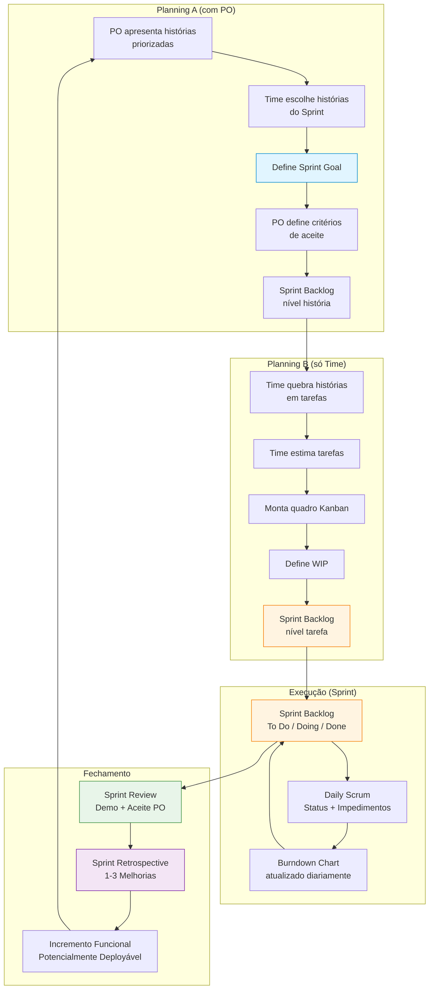
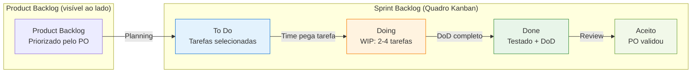
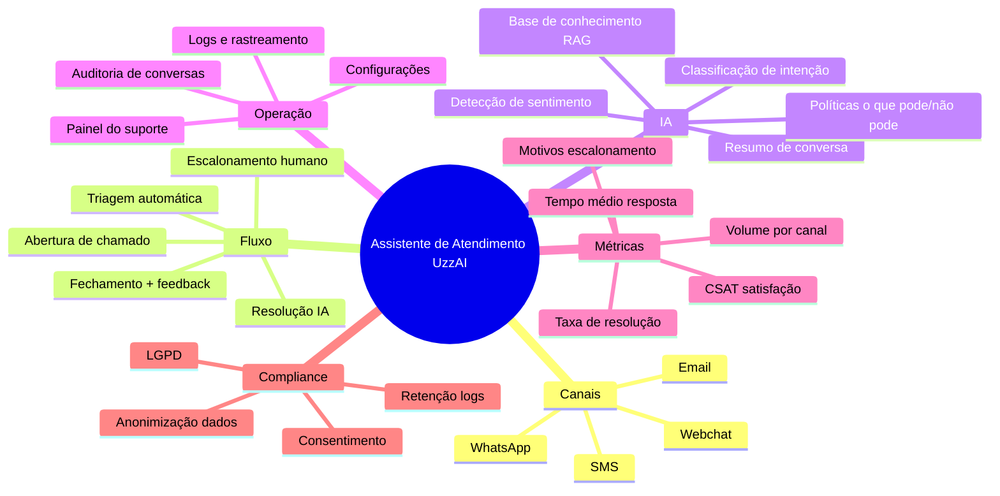
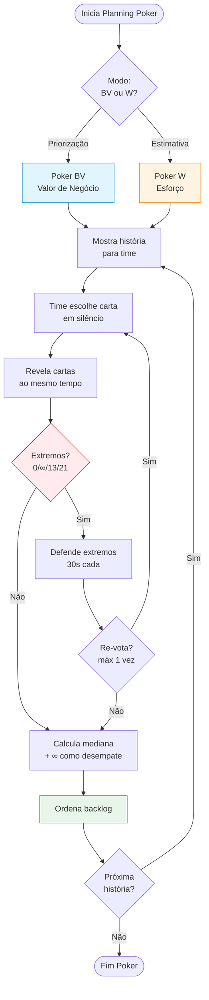
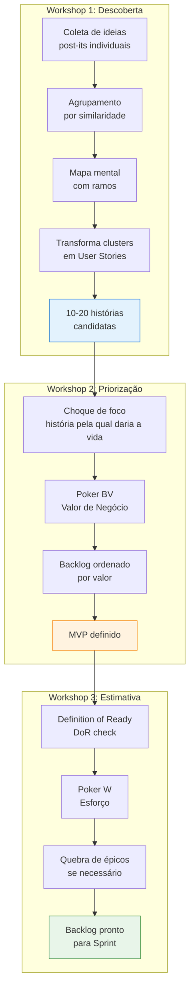
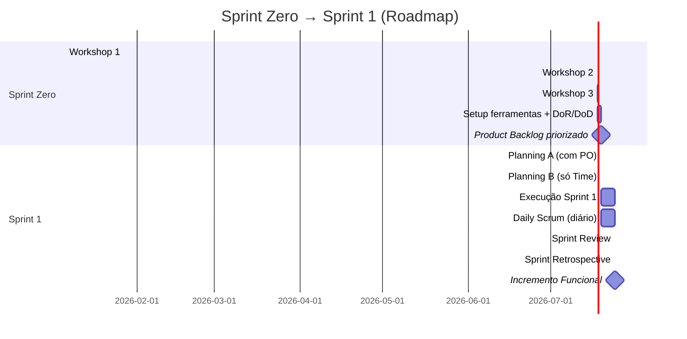
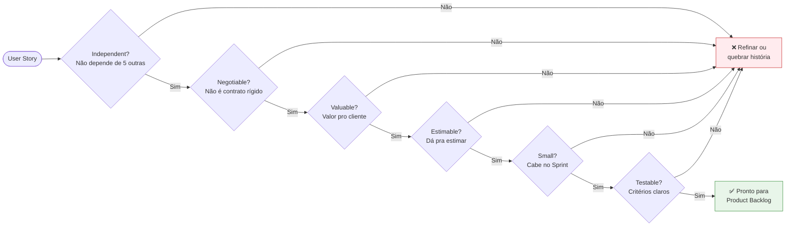
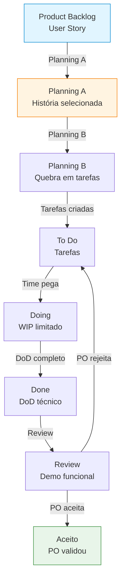
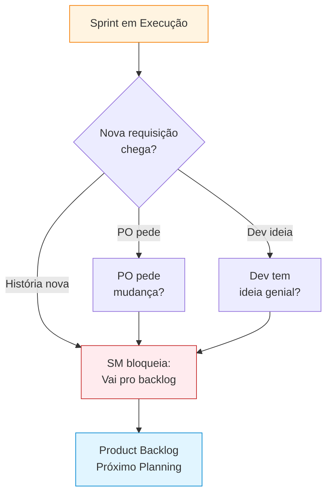
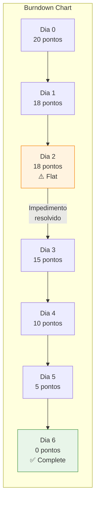

# DIAGRAMAS MERMAID — Capítulos 5 e 6

> **Diagramas prontos para colar no Obsidian**
> Use estes diagramas para visualizar processos, fluxos e estruturas dos Capítulos 5 e 6

---

## Índice

1. [Fluxo do Sprint (Planning A/B → Daily → Review → Retro)](#1-fluxo-do-sprint)
2. [Kanban/Scrum Board (Estrutura)](#2-kanbanscrum-board)
3. [Mindmap: Assistente de Atendimento UzzAI](#3-mindmap-assistente-de-atendimento-uzzai)
4. [Sequência do Planning Poker (Flowchart)](#4-sequência-do-planning-poker)
5. [Workshops: Descoberta → Priorização → Estimativa](#5-workshops-descoberta--priorização--estimativa)
6. [Sprint Zero → Sprint 1 (Roadmap)](#6-sprint-zero--sprint-1-roadmap)

---

## 1. Fluxo do Sprint

---

## 2. Kanban/Scrum Board

---

## 3. Mindmap: Assistente de Atendimento UzzAI

---

## 4. Sequência do Planning Poker

---

## 5. Workshops: Descoberta → Priorização → Estimativa

---

## 6. Sprint Zero → Sprint 1 (Roadmap)

---

## 7. INVEST: Checklist de Qualidade da História

---

## 8. Fluxo: História → Tarefas → Done → Aceito

---

## 9. Proteção do Sprint (Papel do SM)

---

## 10. Burndown Chart (Visualização)

---

**📊 Última Atualização:** 2026-01-05  
**👤 Autor:** UzzAI  
**📈 Versão:** 2.0  
**🔄 Uso:** Cole diretamente no Obsidian (suporte Mermaid nativo)

---

*Sistema: Diagramas Mermaid — Capítulos 5 e 6*  
*Framework: Visualizações Prontas para Uso*  
*Compatível com: Obsidian, GitHub, GitLab, Notion*
