# 🎨 Diagramas Mermaid — Scrum Cap. 7-8

## 📖 Como Usar Este Documento

Este arquivo contém **diagramas Mermaid prontos** para colar no Obsidian, Notion, ou qualquer ferramenta que suporte Mermaid.

**Formato**: todos os diagramas estão em **blocos de código mermaid**.

**Como usar no Obsidian:**
1. Copie o bloco de código
2. Cole em uma nota Obsidian
3. O diagrama renderiza automaticamente

**Como usar em outras ferramentas:**
- Notion: suporta Mermaid nativamente
- GitHub/GitLab: renderiza em Markdown
- Mermaid Live Editor: https://mermaid.live/ (editar e exportar PNG/SVG)

---

# 📍 DIAGRAMAS CAPÍTULO 7 — Cheiros do Scrum

## 📊 Diagrama 1: ScrumButt → Diagnóstico → Experimento → Melhoria

**Quando usar:** apresentar fluxo de correção contínua do Scrum.

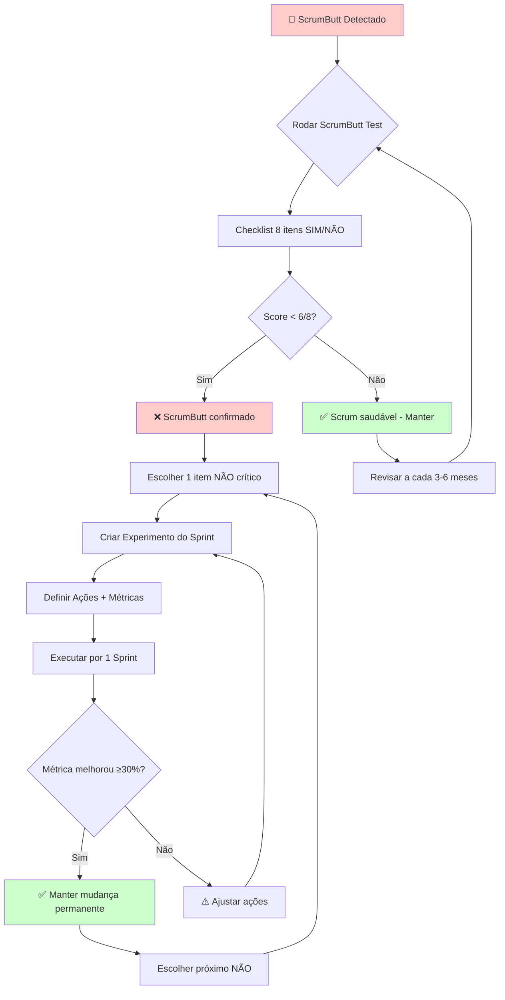

---

## 🦨 Diagrama 2: Fluxo de Detecção e Correção de Smells

**Quando usar:** Workshop "Nariz do Scrum" — mostrar fluxo da dinâmica.

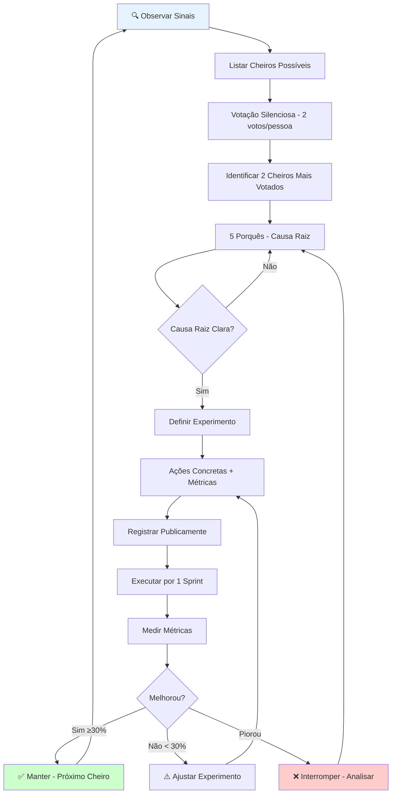

---

## 🐷🐔 Diagrama 3: Porcos vs Galinhas — Regras por Cerimônia

**Quando usar:** apresentar protocolo de participação.

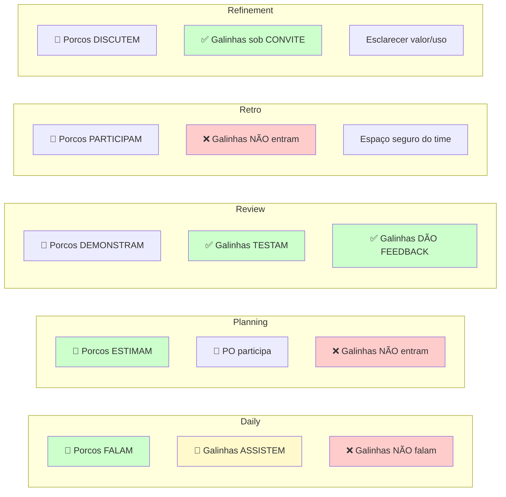

---

## 🔗 Diagrama 4: Mapa Smells → Impacto em Previsibilidade

**Quando usar:** mostrar conexão entre cheiros e dados fake.

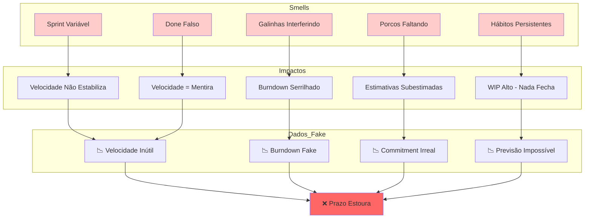

---

# 📊 DIAGRAMAS CAPÍTULO 8 — Estimativas e Velocidade

## 🃏 Diagrama 5: Fluxo Planning Poker Completo

**Quando usar:** treinar time em Planning Poker pela primeira vez.

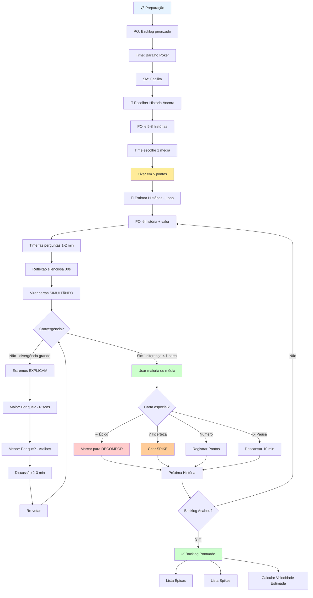

---

## 🏎️ Diagrama 6: Pontos → Velocidade → Prazo → Investimento

**Quando usar:** explicar fluxo de estimativa para patrocinador.

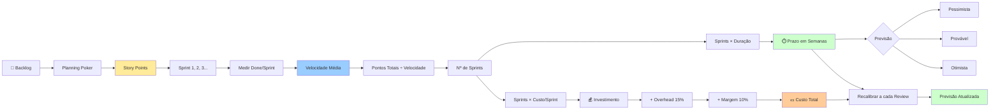

---

## 📈 Diagrama 7: Estabilização de Velocidade ao Longo dos Sprints

**Quando usar:** mostrar curva de aprendizado esperada.

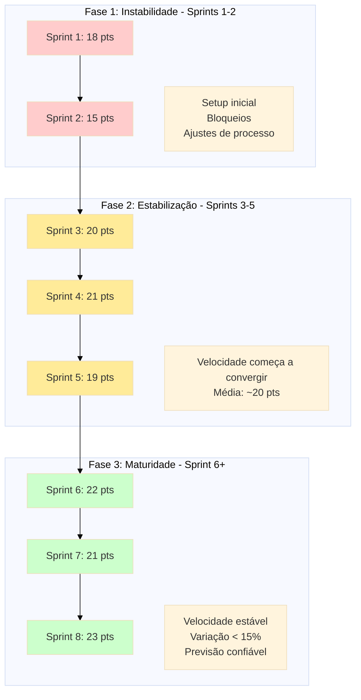

---

## 🔄 Diagrama 8: Ciclo de Recalibração de Previsão

**Quando usar:** Sprint Review — mostrar fluxo de atualização.

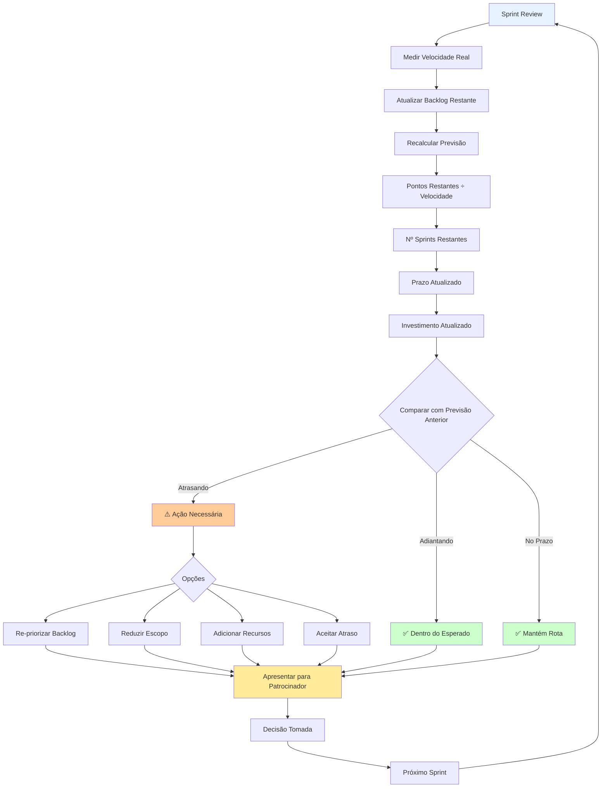

---

## 💰 Diagrama 9: Triângulo de Ferro — Trade-offs

**Quando usar:** negociar escopo/prazo/custo com patrocinador.

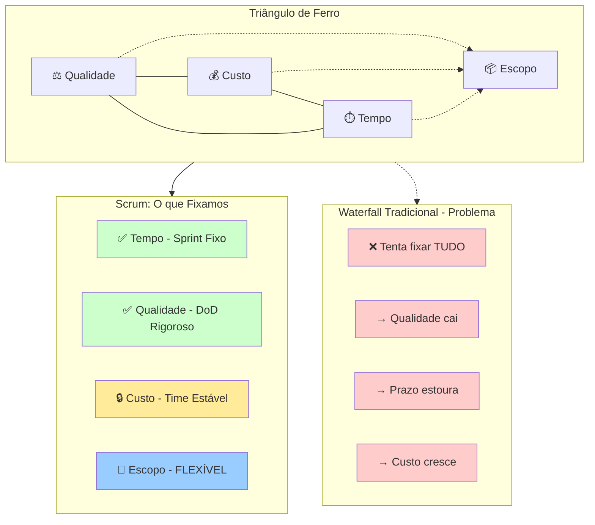

---

## 🎯 Diagrama 10: Decisão de Fechamento de Pontuação no Poker

**Quando usar:** treinar time em como fechar estimativa após divergência.

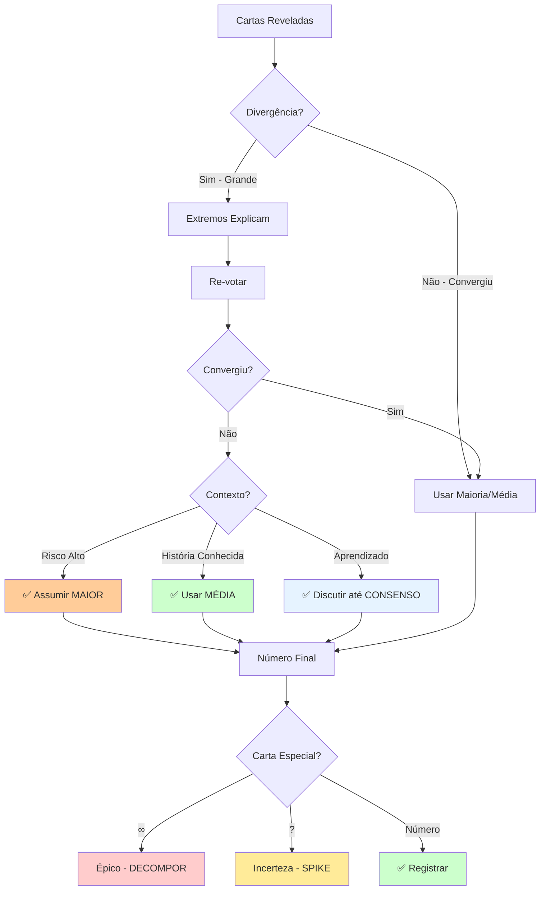

---

## 📊 Diagrama 11: Radar de Saúde do Scrum (Checklist Visual)

**Quando usar:** Retro ou Planning — avaliar saúde geral do Scrum.

```mermaid
flowchart TD
    subgraph Proteção_Sprint[✅ Proteção do Sprint]
        PS1[Sprint Fixo ≥ 3 ciclos?]
        PS2[% Interrupção < 10%?]
        PS3[PO Protege Time?]
    end

    subgraph Cerimônias[✅ Cerimônias Saudáveis]
        C1[Daily < 15 min?]
        C2[Planning: Time Estima?]
        C3[Review: Incremento Done?]
        C4[Retro: 1 Experimento?]
    end

    subgraph Transparência[✅ Transparência Real]
        T1[Burndown Atualizado?]
        T2[Velocidade Conhecida?]
        T3[Impedimentos Expostos?]
        T4[Board = Realidade?]
    end

    subgraph Auto_Org[✅ Time Auto-Organizado]
        AO1[Tarefas Pull System?]
        AO2[SM Facilita < 20% falas?]
        AO3[Time Resolve Problemas?]
        AO4[Zero Micro-gestão?]
    end

    subgraph Estimativas[✅ Estimativas Realistas]
        E1[Backlog Pontuado?]
        E2[Velocidade Estável?]
        E3[Previsão por Faixa?]
        E4[DoD Rigoroso?]
    end

    PS1 & PS2 & PS3 --> S1[Score Sprint]
    C1 & C2 & C3 & C4 --> S2[Score Cerimônias]
    T1 & T2 & T3 & T4 --> S3[Score Transparência]
    AO1 & AO2 & AO3 & AO4 --> S4[Score Auto-Org]
    E1 & E2 & E3 & E4 --> S5[Score Estimativas]

    S1 & S2 & S3 & S4 & S5 --> FINAL{Score Total}

    FINAL -->|> 80%|OK[✅ Scrum Saudável]
    FINAL -->|60-80%|MED[⚠️ Precisa Atenção]
    FINAL -->|< 60%|BAD[❌ Intervenção Urgente]

    style OK fill:#ccffcc
    style MED fill:#ffeb99
    style BAD fill:#ffcccc
```

---

## 🔄 Diagrama 12: Fluxo Completo Sprint (Cerimônias)

**Quando usar:** onboarding de novo membro do time.

```mermaid
flowchart LR
    subgraph Refinement[Refinement - Contínuo]
        R1[PO + Time]
        R2[Esclarecer Histórias]
        R3[Decompor Épicos]
        R4[Estimar Poker]
    end

    subgraph Planning[Sprint Planning - Início]
        P1[Definir Meta Sprint]
        P2[Selecionar Histórias]
        P3[Decompor em Tarefas]
        P4[Commitment]
    end

    subgraph Execução[Execução - Diária]
        D1[Daily 10-15 min]
        D2[Trabalho]
        D3[Update Board]
        D4[Colaboração]
    end

    subgraph Review[Sprint Review - Fim]
        RV1[Demonstrar Incremento]
        RV2[Feedback Stakeholders]
        RV3[Medir Velocidade]
        RV4[Recalibrar Previsão]
    end

    subgraph Retro[Sprint Retrospectiva - Fim]
        RT1[Inspecionar Processo]
        RT2[Adaptar]
        RT3[1 Experimento]
    end

    R1 --> R2 --> R3 --> R4
    R4 --> P1
    P1 --> P2 --> P3 --> P4
    P4 --> D1
    D1 --> D2 --> D3 --> D4
    D4 -.Sprint N dias.-> D1
    D4 --> RV1
    RV1 --> RV2 --> RV3 --> RV4
    RV4 --> RT1
    RT1 --> RT2 --> RT3
    RT3 --> R1

    style P4 fill:#ccffcc
    style D1 fill:#e6f3ff
    style RV1 fill:#ffeb99
    style RT3 fill:#ffcc99
```

---

## 🎓 Diagrama 13: Curva de Aprendizado — Scrum Smell → Melhoria

**Quando usar:** motivar time a persistir em experimentos.

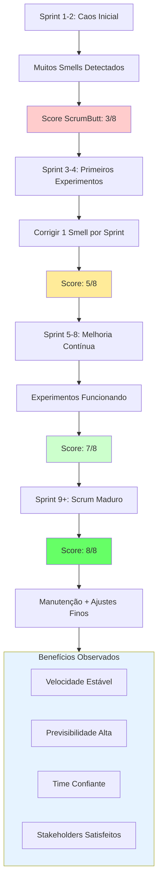

---

## 📋 Diagrama 14: Definition of Done — Fluxo de Validação

**Quando usar:** explicar DoD para novo membro ou quando retrabalho > 15%.

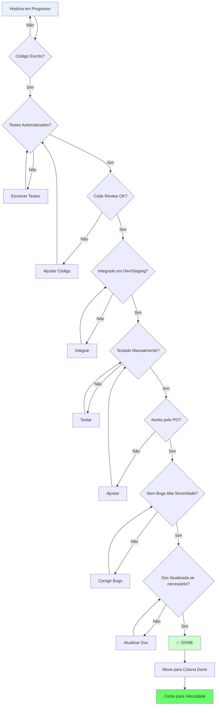

---

## 💡 Diagrama 15: Tipos de Intervenção por Smell (Mapa de Ação)

**Quando usar:** escolher intervenção adequada após detectar smell.

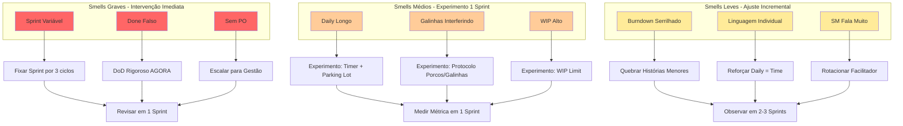

---

## 📦 Como Usar Estes Diagramas

### Workflow Recomendado

1. **Apresentações:**
   - Copiar diagrama desejado
   - Colar em Obsidian (renderiza automaticamente)
   - Exportar para slides (via plugin ou screenshot)

2. **Documentação:**
   - Incluir diagramas em wiki do time
   - Referenciar em guias e playbooks

3. **Workshops:**
   - Projetar diagrama durante dinâmica
   - Explicar fluxo passo a passo
   - Usar como referência visual

4. **Editar/Customizar:**
   - Copiar código Mermaid
   - Editar em https://mermaid.live/
   - Exportar PNG/SVG para usar em ferramentas que não suportam Mermaid

---

## 🎨 Legenda de Cores (padrão usado)

- 🟢 **Verde (#ccffcc, #66ff66)**: Status positivo, sucesso, "Done", ação recomendada
- 🟡 **Amarelo (#ffeb99)**: Atenção, decisão necessária, estado intermediário
- 🟠 **Laranja (#ffcc99)**: Alerta moderado, precisa intervenção
- 🔴 **Vermelho (#ffcccc, #ff6666)**: Problema grave, red flag, falha
- 🔵 **Azul (#e6f3ff, #99ccff)**: Informação, contexto, processo normal

---

## 📚 Diagramas por Contexto de Uso

### Para Onboarding (novo membro)
- Diagrama 12: Fluxo Completo Sprint
- Diagrama 14: Definition of Done
- Diagrama 3: Porcos vs Galinhas

### Para Apresentação a Patrocinador
- Diagrama 6: Pontos → Velocidade → Prazo
- Diagrama 9: Triângulo de Ferro
- Diagrama 8: Ciclo de Recalibração

### Para Retro/Melhoria de Processo
- Diagrama 1: ScrumButt → Experimento
- Diagrama 2: Detecção de Smells
- Diagrama 11: Radar de Saúde
- Diagrama 13: Curva de Aprendizado

### Para Training de Planning Poker
- Diagrama 5: Fluxo Planning Poker
- Diagrama 10: Decisão de Fechamento
- Diagrama 7: Estabilização de Velocidade

---

*Diagramas Mermaid criados para UzzAI — Material visual para facilitar compreensão e alinhamento em Scrum.*
