# 🎨 Diagramas Visuais Scrum — Cap. 9-12

## 📖 Como Usar Este Documento

Este arquivo contém **diagramas Mermaid** prontos para visualizar:
- Fluxo de Product Backlog Refinement (PBR)
- Ciclo de User Stories
- Evolução da Definition of Done
- Sprint Zero estruturado
- Métricas e Velocidade

**Instruções:**
- Copie os blocos de código Mermaid
- Cole em ferramentas compatíveis: Obsidian, Notion, GitHub, Miro, ou [Mermaid Live Editor](https://mermaid.live)
- Personalize cores, textos, e estrutura conforme seu projeto

---

# 📊 Diagrama 1 — Fluxo de Product Backlog Refinement (PBR)

## Visão Geral do Processo

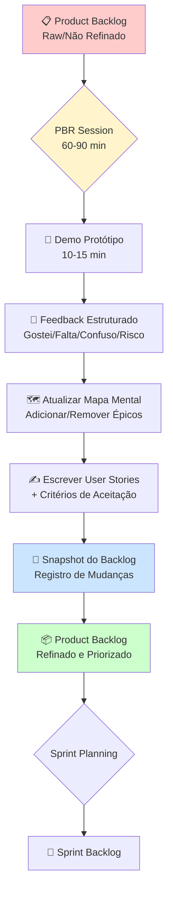

---

## Fluxo Detalhado com Decisões

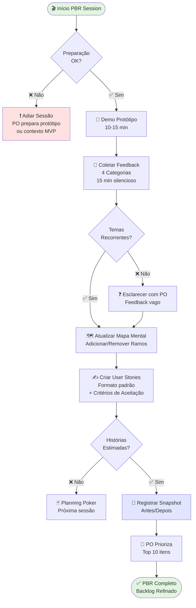

---

# 📝 Diagrama 2 — Ciclo de Vida de uma User Story

## Da Ideia ao Done

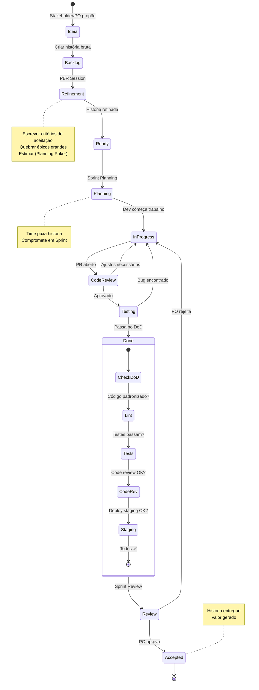

---

## Estados Simplificados (Kanban Style)

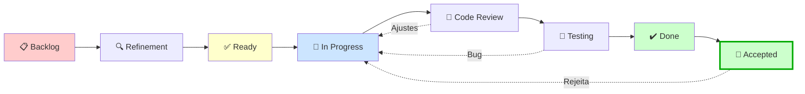

---

# 📐 Diagrama 3 — Evolução da Definition of Done (DoD)

## Três Níveis de Maturidade

```mermaid
graph TD
    subgraph DoD_v1["DoD v1.0 — Mínimo Viável<br/>(Sprint 0-3)"]
        v1_1[✅ Código padronizado]
        v1_2[✅ Code review 1 pessoa]
        v1_3[✅ Testes unitários ≥70%]
        v1_4[✅ Integrado em staging]
        v1_5[✅ PO aprovou]
    end

    subgraph DoD_v2["DoD v2.0 — Intermediário<br/>(Sprint 4-10)"]
        v2_1[✅ Código padronizado]
        v2_2[✅ Code review 1 pessoa]
        v2_3[✅ Testes unitários ≥80%]
        v2_4[✅ Testes E2E fluxo principal]
        v2_5[✅ Performance aceitável]
        v2_6[✅ Doc técnica atualizada]
        v2_7[✅ Integrado em staging]
        v2_8[✅ PO + Stakeholder aprovaram]
    end

    subgraph DoD_v3["DoD v3.0 — Maduro<br/>(Sprint 10+)"]
        v3_1[✅ Código padronizado]
        v3_2[✅ Code review 2 pessoas]
        v3_3[✅ Testes unitários ≥85%]
        v3_4[✅ Testes E2E completos]
        v3_5[✅ Performance + Stress test]
        v3_6[✅ Segurança validada OWASP]
        v3_7[✅ CI/CD pipeline passa]
        v3_8[✅ Doc técnica + usuário]
        v3_9[✅ Métricas de uso configuradas]
        v3_10[✅ PO + Stakeholder + Analytics]
    end

    DoD_v1 -->|PO rejeita história<br/>+3-5 Sprints| DoD_v2
    DoD_v2 -->|Time maduro<br/>+10 Sprints| DoD_v3

    style DoD_v1 fill:#ffffcc
    style DoD_v2 fill:#cce5ff
    style DoD_v3 fill:#ccffcc
```

---

## Gatilho de Evolução

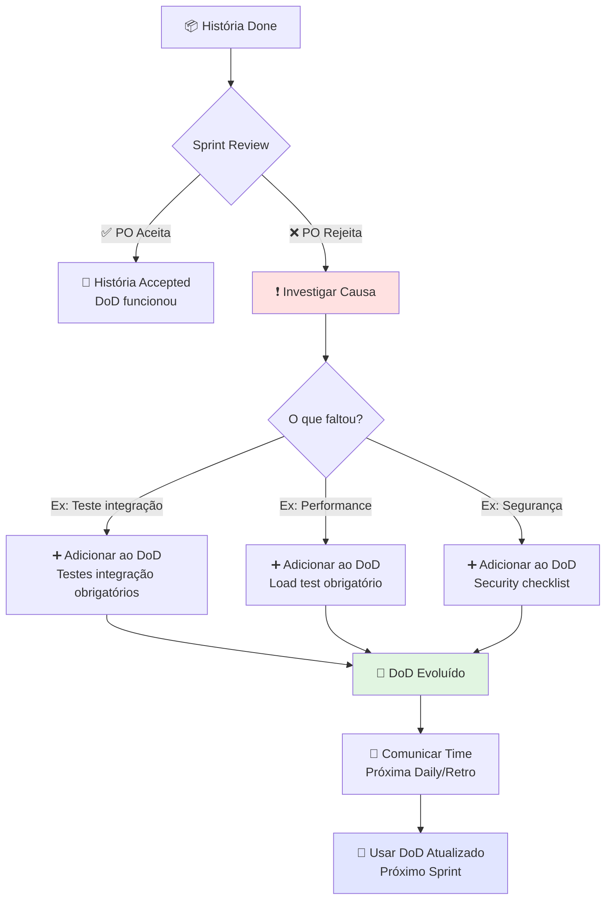

---

# 🚀 Diagrama 4 — Sprint Zero: 6 Buckets

## Estrutura do Sprint Zero

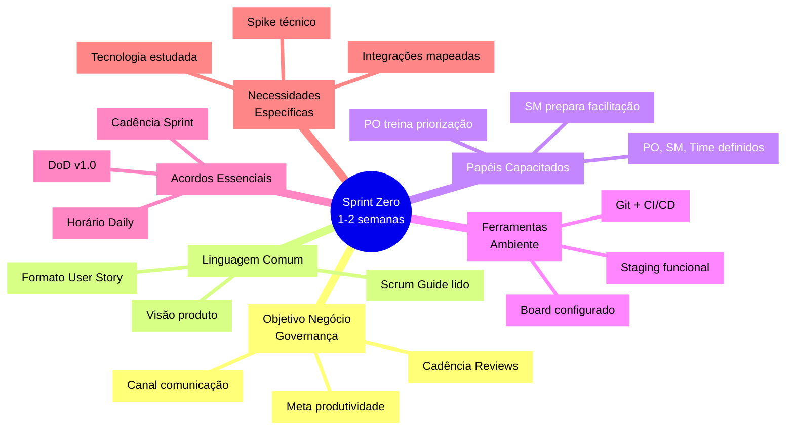

---

## Checklist de Saída do Sprint Zero

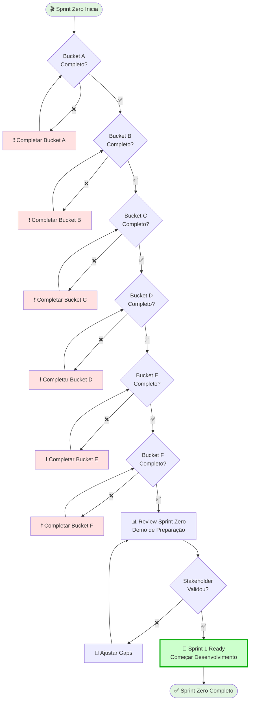

---

# 📈 Diagrama 5 — Velocidade e Previsão de Prazo

## Cálculo de Velocidade ao Longo dos Sprints

```mermaid
graph LR
    subgraph Sprint1["Sprint 1"]
        S1_C[Committed: 25 pts]
        S1_D[Done: 18 pts]
        S1_V[Velocidade: 18]
    end

    subgraph Sprint2["Sprint 2"]
        S2_C[Committed: 22 pts]
        S2_D[Done: 20 pts]
        S2_V[Velocidade: 20]
    end

    subgraph Sprint3["Sprint 3"]
        S3_C[Committed: 23 pts]
        S3_D[Done: 22 pts]
        S3_V[Velocidade: 22]
    end

    subgraph Sprint4["Sprint 4"]
        S4_C[Committed: 24 pts]
        S4_D[Done: 21 pts]
        S4_V[Velocidade: 21]
    end

    Sprint1 --> Sprint2
    Sprint2 --> Sprint3
    Sprint3 --> Sprint4

    Sprint4 --> Calc[📊 Velocidade Média<br/>últimos 3 Sprints:<br/>(22+21+20)/3 = 21 pts]

    Calc --> Forecast{Previsão de Prazo}

    Forecast --> Backlog[📦 Backlog Restante:<br/>126 pontos]
    Forecast --> VelMed[⚡ Velocidade Média:<br/>21 pts/Sprint]

    Backlog --> Sprints[🔢 Sprints Restantes:<br/>126 ÷ 21 = 6 Sprints]
    VelMed --> Sprints

    Sprints --> Weeks[📅 Prazo:<br/>6 Sprints × 2 sem = 12 semanas]

    style Calc fill:#e1e5ff
    style Weeks fill:#ccffcc,stroke:#00aa00,stroke-width:3px
```

---

## Previsão por Faixa (Pessimista/Provável/Otimista)

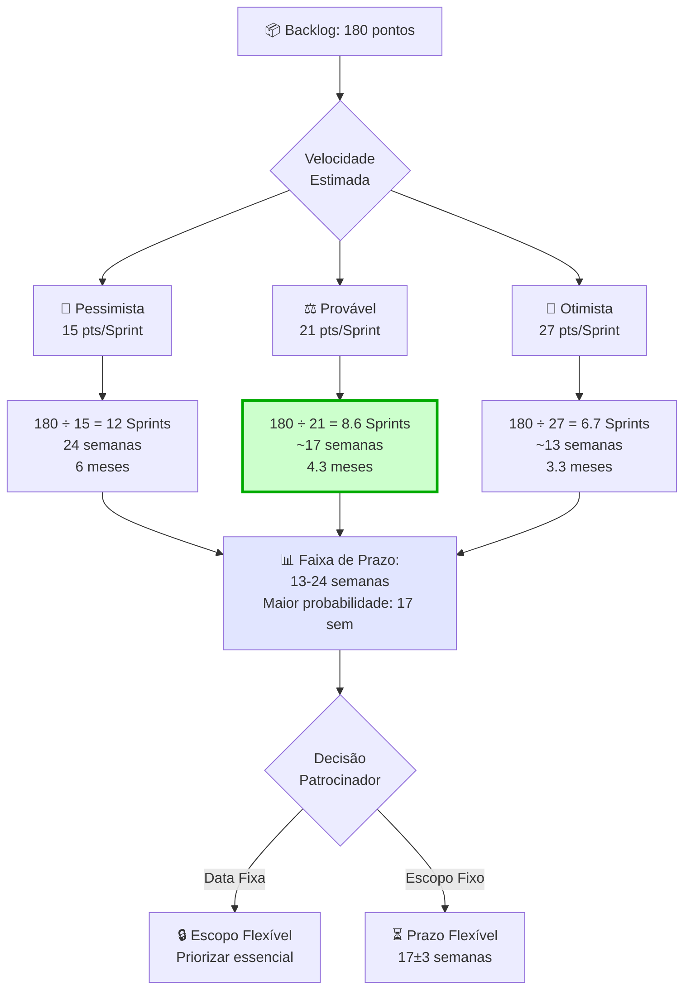

---

# 📊 Diagrama 6 — Scoreboard de Métricas (4 Categorias)

## Métricas ao Longo do Tempo

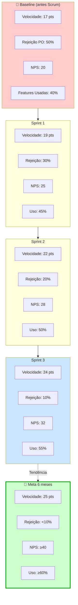

---

## Dashboard Simplificado (Status Visual)

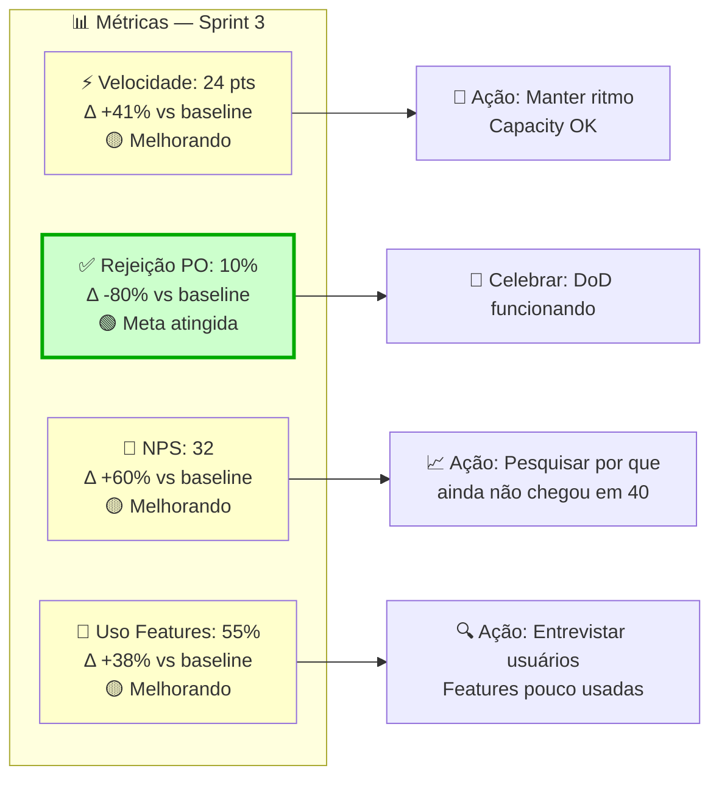

---

# 🔄 Diagrama 7 — Snapshot do Backlog (Antes/Depois)

## Transformação do Backlog após PBR

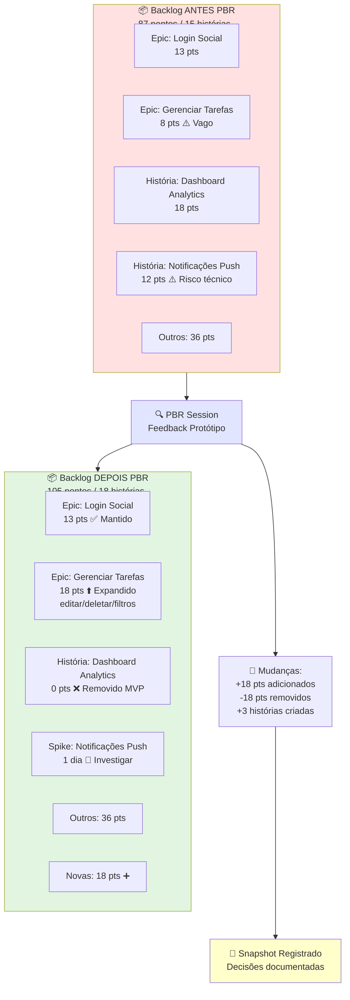

---

# 🧪 Diagrama 8 — Spike (Investigação Técnica)

## Fluxo de um Spike

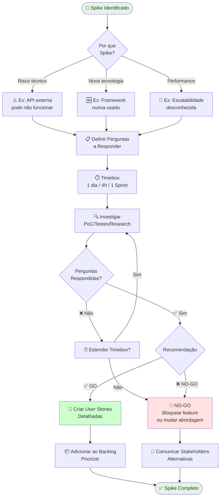

---

## Exemplo: Spike Notificações Push

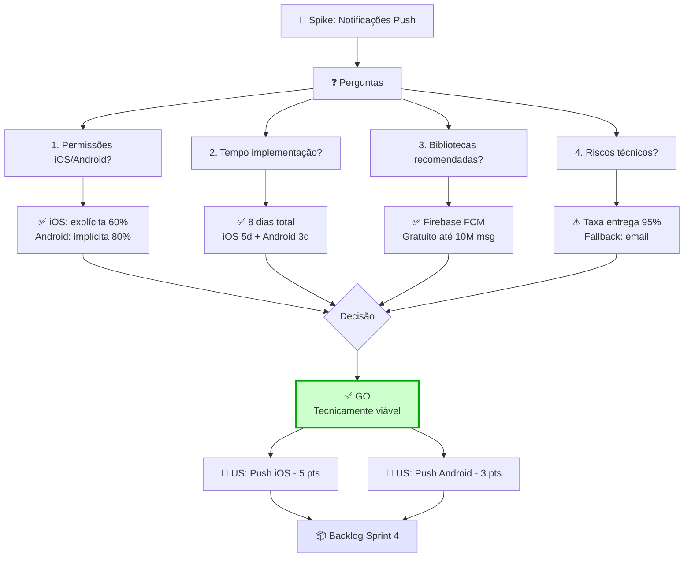

---

# 🎯 Diagrama 9 — Priorização de Backlog (MoSCoW)

## Método MoSCoW Aplicado

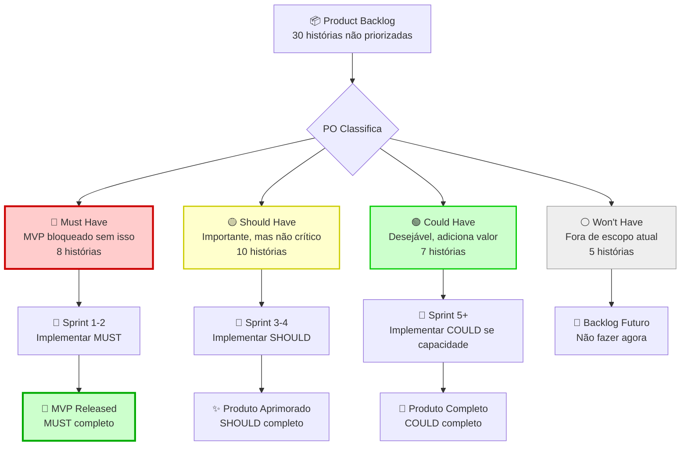

---

## Value vs Effort Matrix

```mermaid
quadrantChart
    title Priorização: Valor vs Esforço
    x-axis Baixo Esforço --> Alto Esforço
    y-axis Baixo Valor --> Alto Valor
    quadrant-1 Avaliar: Alto valor, alto esforço
    quadrant-2 Fazer Agora: Alto valor, baixo esforço
    quadrant-3 Evitar: Baixo valor, baixo esforço
    quadrant-4 Eliminar: Baixo valor, alto esforço
    Login Social: [0.3, 0.8]
    Notificações Push: [0.7, 0.7]
    Editar Tarefa: [0.2, 0.9]
    Dashboard Analytics: [0.8, 0.4]
    Filtros Avançados: [0.6, 0.5]
    Dark Mode: [0.4, 0.3]
    Exportar PDF: [0.7, 0.2]
```

---

# 🔁 Diagrama 10 — Retrospectiva Actions (Ciclo Kaizen)

## Ciclo de Melhoria Contínua

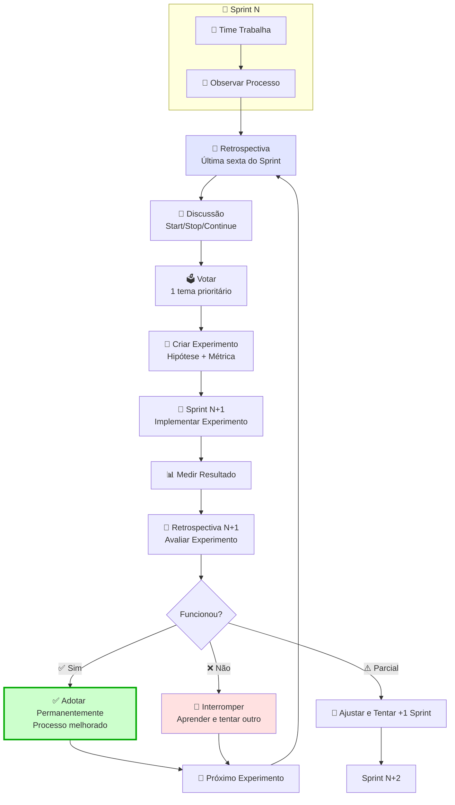

---

# 📚 Como Usar Estes Diagramas

## Workflow Recomendado

1. **Apresentações para Stakeholders:**
   - Usar Diagrama 1 (Fluxo PBR) para explicar processo
   - Usar Diagrama 5 (Velocidade) para mostrar previsões
   - Usar Diagrama 6 (Scoreboard) para reportar progresso

2. **Onboarding de Novos Membros:**
   - Usar Diagrama 2 (Ciclo User Story) para ensinar fluxo
   - Usar Diagrama 3 (Evolução DoD) para explicar qualidade
   - Usar Diagrama 4 (Sprint Zero) para preparação inicial

3. **Planejamento Técnico:**
   - Usar Diagrama 8 (Spike) para investigações
   - Usar Diagrama 9 (Priorização) para facilitar PO
   - Usar Diagrama 7 (Snapshot) para registrar mudanças

4. **Retrospectivas:**
   - Usar Diagrama 10 (Retro Actions) para ciclo Kaizen
   - Visualizar melhoria contínua para o time

---

## Ferramentas Compatíveis

### Renderização de Mermaid:

- **Obsidian:** Nativo (colar blocos `mermaid`)
- **GitHub/GitLab:** Nativo em Markdown files
- **Notion:** Via plugin ou [Mermaid Live](https://mermaid.live) → exportar imagem
- **Confluence:** Via plugin "Mermaid Diagrams"
- **VS Code:** Extension "Markdown Preview Mermaid"
- **Miro/Mural:** Exportar PNG/SVG e colar como imagem

### Editar e Personalizar:

1. Copiar bloco Mermaid
2. Colar em [Mermaid Live Editor](https://mermaid.live)
3. Editar cores, textos, estrutura
4. Exportar PNG/SVG ou copiar código atualizado

---

**Próximos passos:**
1. Ver `Guia_Scrum_Parte3_Cap9-12.md` para conceitos detalhados
2. Ver `Playbooks_Dinamicas_Cap9-12.md` para oficinas práticas
3. Ver `Templates_Operacionais_Cap9-12.md` para templates copiáveis

---

*Diagramas visuais criados para UzzAI — Facilitando compreensão de processos Scrum com visualização clara.*
